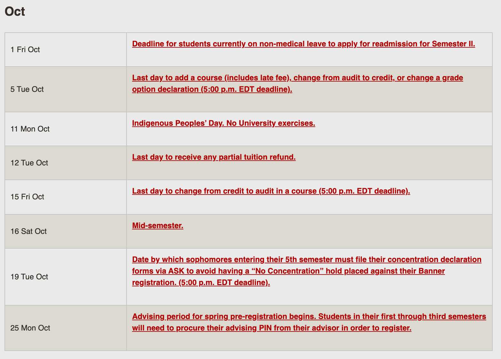
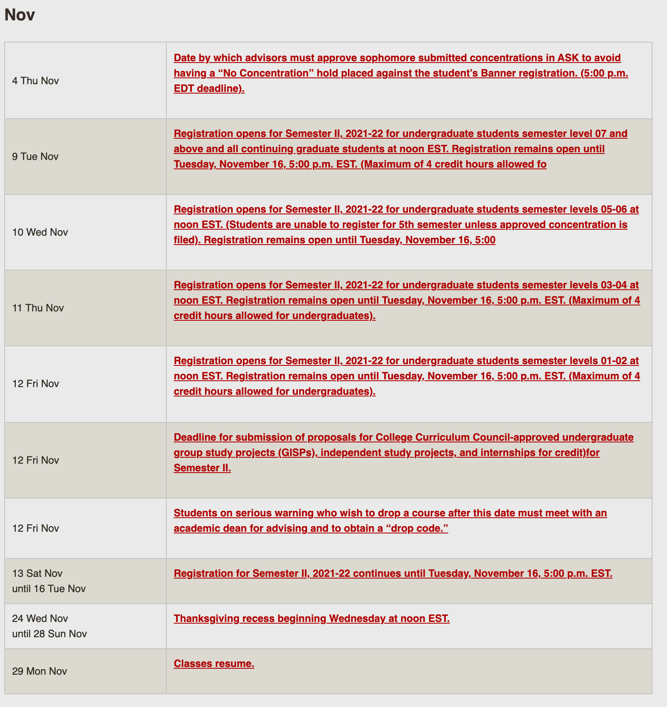
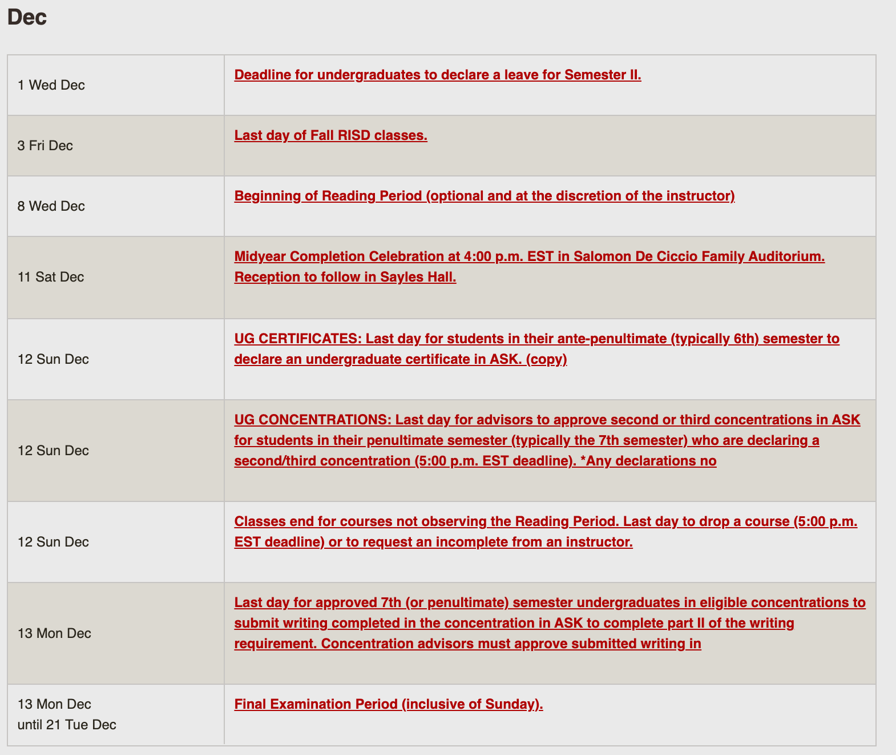

# Schedule 

## Important dates
 
**Reading period start date** : Dec 8th, Wednesday
Last day of classes: Dec 12, Sunday 
Midterm Date: Oct 22, Friday
Final Exam date: Dec 14, Tuesday (Online exam).
Final Exam period: Dec 13, Mon to Dec 21, Tue

### Breaks
Indigeneous people's dat: Oct 11, Monday
Thanksgiving break: Nov, 24th, Wednesday, starting at Noon) to Nov 28, Sunday. 

## Easy peasy calendar

## Brown official calendar

## September

## October

## November

## December

