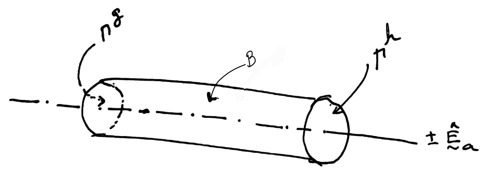
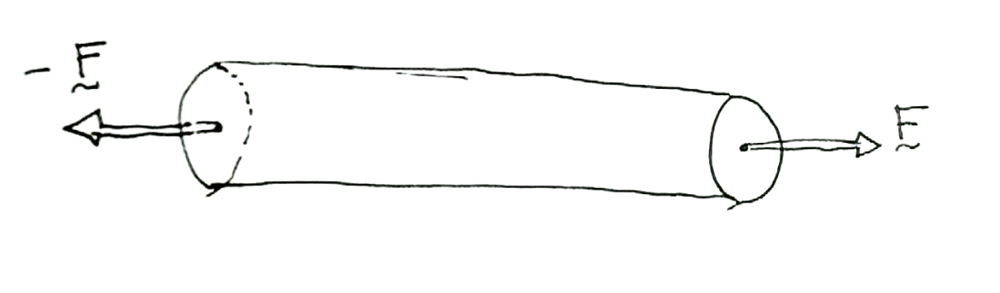
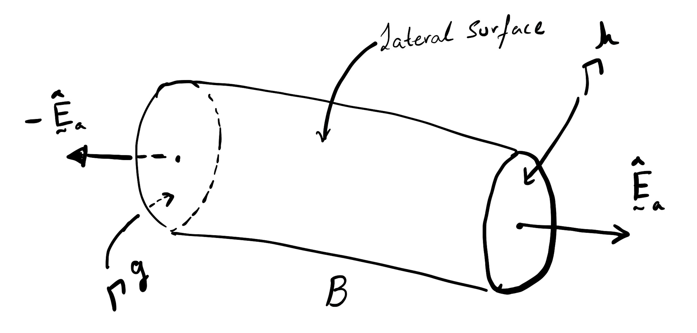
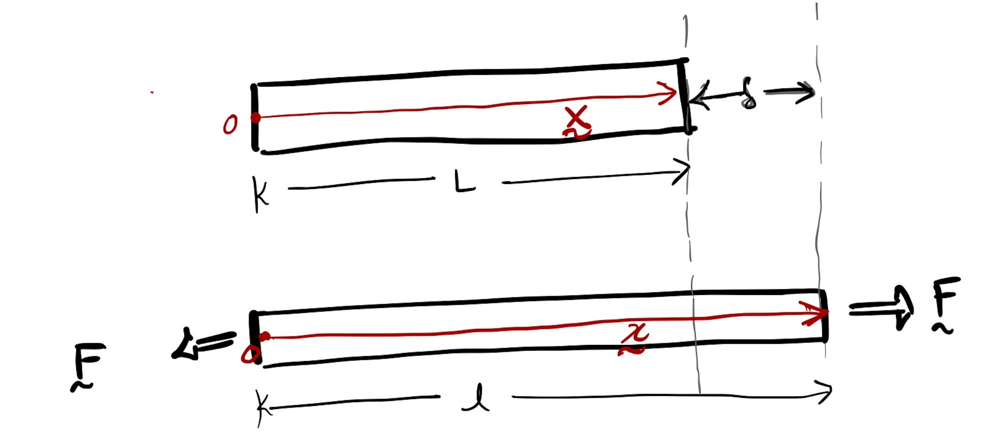




#### Bar definition

  A bar is a mechanical structure whose dimensions in one direction are typically much longer than its other dimensions. The directions of the bar's largest dimension are referred to as the bar's axial direction, or the bar's axis, $ \hat{\boldsymbol{E}}\_{\rm a}$.  The primary mechanical function of a bar is to transmit forces along its length, or its axis.

#### Axial force. Equilibrium, compression, tension.   

The forces on a bar, by its very definition, are parallel to its axis (see Figure _force_). Let the net force acting on the bar's right end face, $\Gamma^{\mathscr{h}}$, be $ \mathbf{F}\_{\rm a}=F \hat{\mathbf{E}}\_{a}$. From equilibrium it follows that the force acting on the bar's left face, $\Gamma^{\mathscr{g}}$, is $-\boldsymbol{F}\_{\rm a}$. When we $F>0$ we say the bar is under tension, and when $F<0$ we say that the bar is under compression.

#### Surfaces. End faces, Lateral surface. 
<ins>End faces </ins>: We refer to the bar as $\mathcal{B}$, to its left face as $\Gamma^{\mathscr{g}}$ and its right face as $\Gamma^{\mathscr{h}}$. The end faces are typically parallel to each other and perpendicular to the bar's axis. The vector $ \hat{\boldsymbol{E}}\_{\rm a}$ is the (outward) normal to $\Gamma^{\mathscr{h}}$. By normal we mean that $\hat{\boldsymbol{E}}\_{\rm a}$ is perpendicular to $\Gamma^{\mathscr{h}}$ and points away from $\mathcal{B}$'s internal matter (the atoms and molecules composing the Bar) towards the outside. Similarly, $-\hat{\boldsymbol{E}}\_{\rm a}$ is normal to $\Gamma^{\mathscr{g}}$, i.e., it is perpendicular to $\Gamma^{\mathscr{g}}$ and points away from the $\mathcal{B}$ internal matter and towards the outside.

Leaving the end faces the remainder of the surface of $\mathcal{B}$ is called the lateral surface.

<!-- _Tension and compression_
Let us cut the  $\mathcal{B}_0$, into two pieces, $^1\mathcal{B}$ and $^2\mathcal{B}$. Specifically, let us cut $\mathcal{B}$ with the $A$-$A'$ plane (see Figure), which is normal to the bar's axis $\pm \hat{\boldsymbol{e}}_a$.

We will call the  left piece $^1\mathcal{B}$ and the right piece  $^2\mathcal{B}$.

Let the  surface on $^1\mathcal{B}$ that is newly created be called $S^1$ and that that on  $^2\mathcal{B}$ that is newly created be called $S^2$. 

The vector $\hat{\boldsymbol{n}}^{1}$ is (outward) normal to $S^1$. By normal we mean that $\hat{\boldsymbol{n}}^{1}$ is perpendicular to $S^1$ and points away from the $^1\mathcal{B}$ internal matter (the atoms and molecules composing the Bar) towards the outside. Similarly, $\hat{\boldsymbol{n}}^{1}$ is normal to $S^2$, i.e., it is perpendicular to $S^2$ and points away from the $^2\mathcal{B}$ internal matter and towards the outside.

Note that $\hat{\boldsymbol{n}}^{1}=-\hat{\boldsymbol{n}}^{2}$ -->

#### Undeformed length, deformed length, extension, compression:

The bar's largest dimension is referred to as its length, $L$. This length is also referred to as the bar's unformed length. That will be the length we will measure when there are no forces acting on the bar.

Let the position vector of the $\Gamma^{\mathscr{h}}$'s centroid before any forces are applied to the bar be $\boldsymbol{X}$ (red arrow in the top panel of the below figure). On choosing the origin of the physical space $\mathcal{E}^3$ to be located at the centroid of the bar's left face, we get that $\boldsymbol{X}=L\hat{\boldsymbol{E}}\_{\rm a}$, and after the application of force the position vector of the centriod becomes $\boldsymbol{x}=l\hat{\boldsymbol{E}}\_{\rm a}$. The vector $\boldsymbol{u}=\boldsymbol{x}-\boldsymbol{X}$ is called the displacement of the bar's right face w.r.t to its left face, and $\boldsymbol{u}⋅ \hat{\boldsymbol{E}}\_{a}=: \delta$ is called the bar's change in length (length change). When $\delta>0$ we say that the bar has been stretched, and $\delta$ is called extension, and when  $\delta<0$ we say that the bar has been compressed, and $\delta$ is called compression.

##### Hooke's law for the bar. Young's modulus.
Let the area of the bar's cross section be $\mathcal{m}(\Gamma^{\mathscr{h}})=A$. 

It was experimentally found (Lab 1) that  when $\delta /L$ is "small"
$$
\begin{equation}
\frac{F L}{A \delta} 
\end{equation}
$$ 

 is approximately as constant. Mathematically speaking 
$$
\begin{equation}
\lim_{\delta/L\to 0}\frac{F L}{A \delta} =\text{constant}
\end{equation}
$$ 

The constant in the above limit depends on the material composing the bar and it called that materials Young's modulus.

<!-- 
TODO: The compression of the chair. 
TODO: The discussion of the stiffnesses of different materials.
TODO: The composite bar. 
TODO: The Timoshenko problem.  -->