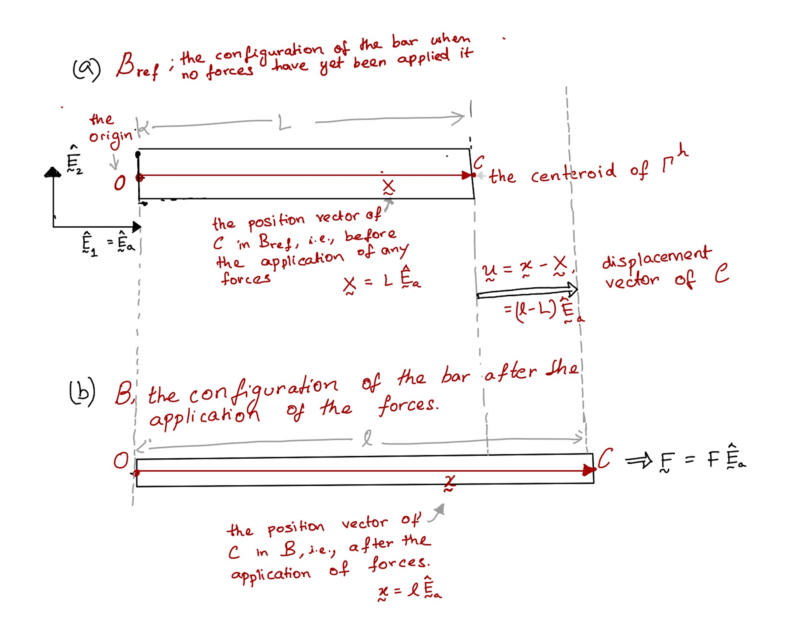
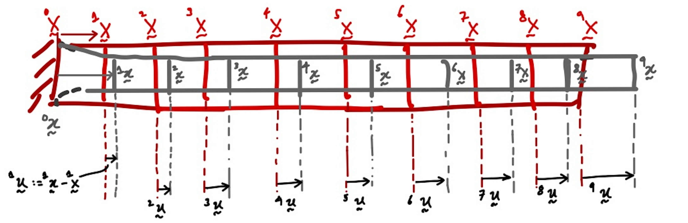




# Displacment field

We have been talking about the change in length $\delta$ as the difference between the final length, $l$, and initial length, $L$, i.e., $\delta=l-L$. However, the change in length can be defined in an alternate manner--a manner that is more abstract but that which can be generalized to more complicated cases, like torsion and bending. For that reason, we will explore that alternate means of defining $\delta$ below. 

Let the position vector of the $\Gamma^{\mathscr{h}}$'s centroid, $\mathcal{C}$, before any forces are applied to the bar be $\boldsymbol{X}(\mathcal{C})$ (red arrow in the top panel of the below figure). On choosing the origin of the physical space $\mathcal{E}^3$ to be located at the centroid of the bar's left face, we get that $\boldsymbol{X}(\mathcal{C})=L\hat{\boldsymbol{E}}\_{\rm a}$, and after the application of force the position vector of the centriod becomes $\boldsymbol{x}(\mathcal{C})=l\hat{\boldsymbol{E}}\_{\rm a}$. The vector $\boldsymbol{u}(\mathcal{C})=\boldsymbol{x}(\mathcal{C})-\boldsymbol{X}(\mathcal{C})$ is called the displacement of the bar's right face w.r.t to its left face. This displacement vector can be written as

$$
\begin{equation}
\boldsymbol{u}(\mathcal{C})=(l-L) \hat{\boldsymbol{E}}\_{\rm a}.
\label{eq:one}
\end{equation}
$$

We define $\delta$ to be
$$
\begin{equation}
\delta := \boldsymbol{u}(\mathcal{C})⋅ \hat{\boldsymbol{E}}\_{a},
\end{equation}
$$
where the dot in the above equation denotes the "dot product between vectors." It follows from the last two equations that
$$
\begin{equation}
\delta = l-L,
\label{eq:two}
\end{equation}
$$ 
which matches our rudimentary definition for $\delta$. 

#### Using the position vectors of particles when the solid is undeformed as their names, and as a means of referring to them

There are a lot more points on $\mathcal{B}\_{\rm ref}$ other then just $\mathcal{C}$. We will soon run of letters to name them all. Therefore we will use the following strategy to name all the material particles composing the solid $\mathcal{B}\_{\rm Ref}$. Since each of the materials particle  have a unique position vector when the bar is undeformed we can infact use those position vectors to refer to them. That is, say the particle $\mathcal{P}$ has the position vector $\boldsymbol{P}$ in the reference configuration $\mathcal{B}\_{\rm ref}$. Then instead of saying the material particle $\mathcal{P}$ we can just start saying the material particle $\boldsymbol{P}$.  Be prepared, as we are quickly going to be putting this naming convention to use.  

The material particle $\boldsymbol{X}$ (That is a material particle which when the bar is undeformed has the position vector $\boldsymbol{X}$) has the new position vector $\boldsymbol{x}(\boldsymbol{X})$ when the bar is deformed. We will call the vector 

$$
\begin{equation}
\boldsymbol{u}(\boldsymbol{X}):=\boldsymbol{x}(\boldsymbol{X})-\boldsymbol{X}
\end{equation}
$$
the displacement vector of $\boldsymbol{X}$, and the function $\boldsymbol{u} :\mathcal{B}\_{\rm Ref}\to \mathcal{B}$ the displacement field.

When the bar remains aligned with $\hat{\boldsymbol{E}}\_a$ before and after deformation, we can define the scalar dispplacement field $u:[0,L]\to [0,l]$ as,
$$
\begin{equation}
u(X):=\boldsymbol{u}(X\hat{\boldsymbol{E}}_a).\boldsymbol{E}_a
\end{equation}
$$

<!-- 
is called the bar's change in length (length change
). When $\delta>0$ we say that the bar has been stretched, and $\delta$ is called extension, and when  $\delta<0$ we say that the bar has been compressed, and $\delta$ is called compression.

As we can see from the above discussion the 
\begin{equation}
\delta=
\end{equation}

!

 -->