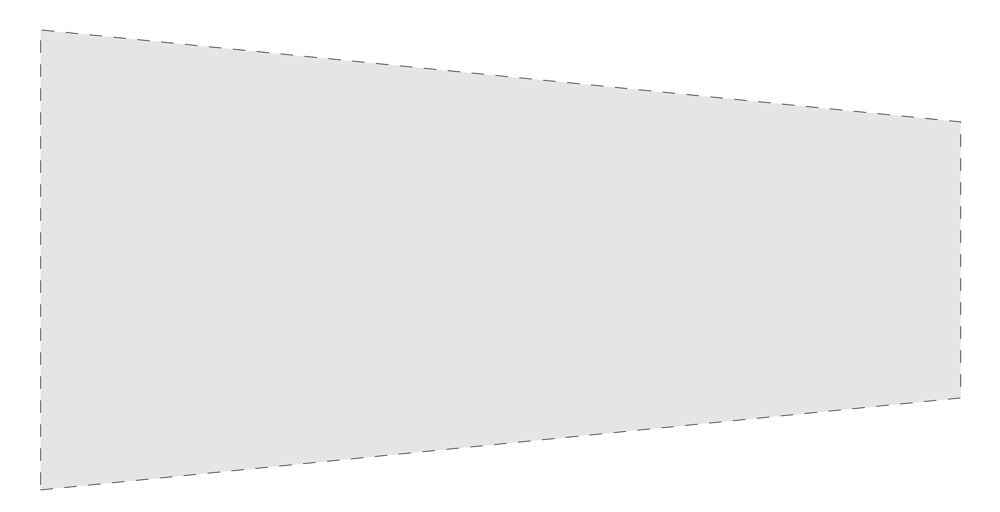




# Force-displacement law for the case of variable crossectional area

In this section we are going to determine the force-deflection law for a bar with a variable cross-sectional area.

#### Variable  cross-section bar

Consider the bar show below. Its cross-section area instead of remaining constant varies along its length. The cross-section area at the material particle $X$ is $A(X)~\rm m^2$, where $A: [0,L]\to \mathbb{R}$.

 

Let us partition the domain $[0,L]$ into say four equal pieces, i..e, $[^0\\!X,^1\\!X]$, $[^1\\!X,^2\\!X]$, $[^2\\!X,^3\\!X]$, and $[^3\\!X,^4\\!X]$. The cross-section areas of the four pieces are $A(^0 \\!X)$, $A(^1 \\!X)$, $A(^2 \\!X)$, $A(^3 \\!X)$. 

 
The original lengths of the four pieces are
$$
\begin{align}
 ^1\!\boldsymbol{L}&=^1\!\boldsymbol{X}-^0\!\boldsymbol{X},\\
 ^2\!\boldsymbol{L}&=^2\!\boldsymbol{X}-^1\!\boldsymbol{X},\\
 ^3\!\boldsymbol{L}&=^3\!\boldsymbol{X}-^2\!\boldsymbol{X},\\
 ^4\!\boldsymbol{L}&=^4\!\boldsymbol{X}-^3\!\boldsymbol{X}.
\end{align}
$$
Later we will be using the Einstein Summation Convention (ESC). So, this will be a good point to start introducing it. The above four equations can be written succintly as 

$$
^l\!\boldsymbol{L}=^l\!\boldsymbol{X}-\,^{l-1}\!\boldsymbol{X},\quad l=1,2,3,4.
$$

The current/deformed length vectors  of the four pieces are
$$
\begin{align}
 ^1\!\boldsymbol{l}&=^1\!\boldsymbol{x}-^0\!\boldsymbol{x}=(^1\!\boldsymbol{u}+^1\!\boldsymbol{X})-(^0\!\boldsymbol{u}+^0\!\boldsymbol{X}),\\
 ^2\!\boldsymbol{l}&=^2\!\boldsymbol{x}-^1\!\boldsymbol{x}=(^2\!\boldsymbol{u}+^2\!\boldsymbol{X})-(^1\!\boldsymbol{u}+^1\!\boldsymbol{X}),\\
 ^3\!\boldsymbol{l}&=^3\!\boldsymbol{x}-^2\!\boldsymbol{x}=(^3\!\boldsymbol{u}+^3\!\boldsymbol{X})-(^2\!\boldsymbol{u}+^2\!\boldsymbol{X}),\\
 ^4\!\boldsymbol{l}&=^4\!\boldsymbol{x}-^3\!\boldsymbol{x}=(^4\!\boldsymbol{u}+^4\!\boldsymbol{X})-(^3\!\boldsymbol{u}+^3\!\boldsymbol{X}).
\end{align}
$$
Again, in preparation for the ESC convention, the above four equations can be written as

$$
\begin{align}
^l\!\boldsymbol{l}&=^l\!\boldsymbol{x}-\,^{l-1}\!\boldsymbol{x}=(^l\!\boldsymbol{u}+^l\!\boldsymbol{X})-(\,^{l-1}\!\boldsymbol{u}+\,^{l-1}\!\boldsymbol{X}),
\quad l=1,2,3,4.
\end{align}
$$

The change in length vectors of the four pieces are
$$
\begin{align}
 ^1\!\boldsymbol{ \delta} &=^1\!\boldsymbol{l}-^1\!\boldsymbol{L}=^1\!\boldsymbol{u}-^0\!\boldsymbol{u},\\
 ^2\!\boldsymbol{\delta}&=^2\!\boldsymbol{l}-^2\!\boldsymbol{L}=^2\!\boldsymbol{u}-^1\!\boldsymbol{u},\\
 ^3\!\boldsymbol{\delta}&=^3\!\boldsymbol{l}-^3\!\boldsymbol{L}=^3\!\boldsymbol{u}-^2\!\boldsymbol{u},\\
 ^4\!\boldsymbol{\delta}&=^4\!\boldsymbol{l}-^4\!\boldsymbol{L}=^4\!\boldsymbol{u}-^3\!\boldsymbol{u}.
\end{align}
$$

The above four equations can be succintly written as

$$
\begin{align}
^l\!\boldsymbol{\delta}&=^l\!\boldsymbol{l}-^l\!\boldsymbol{L}=^l\!\boldsymbol{u}-\,^{l-1}\!\boldsymbol{u},
\quad l=1,2,3,4.
\end{align}
$$

Since there are no body forces here, the axial force vector on each of the pieces is $\u{F}$. Taking the length of each of the pieces to be $\Delta X$ and
applying the vector form of the Hook's law to each of the pieces we get 

$$
\begin{align}
\boldsymbol{F}&=\frac{EA (^0\!X)}{\Delta X}\boldsymbol{\delta}_1,\\
\boldsymbol{F}&=\frac{EA (^1\!X)}{\Delta X}\boldsymbol{\delta}_2,\\
\boldsymbol{F}&=\frac{EA (^2\!X)}{\Delta X}\boldsymbol{\delta}_3,\\
\boldsymbol{F}&=\frac{EA (^3\!X)}{\Delta X}\boldsymbol{\delta}_4.
\end{align}
$$

From the above four equations we get that
$$
\begin{align}
\boldsymbol{F}
\left(
\frac{\Delta X}{EA (^0\!X)}+
\frac{\Delta X}{EA (^1\!X)}+
\frac{\Delta X}{EA (^2\!X)}+
\frac{\Delta X}{EA (^3\!X)}\right)&=^4\!\boldsymbol{u}-^0\!\boldsymbol{u}
\label{eq:NetForce}
\end{align}
$$

The quantity $^4\\!\boldsymbol{u}-^0\\!\boldsymbol{u}$ is the deflection of the bar taken as a whole, $\boldsymbol{\delta}$. That is,

$$
\begin{equation}
\u{\delta}=^4\!\boldsymbol{u}-^0\!\boldsymbol{u}
\label{eq:NetDeflection}
\end{equation}
$$

To see this note that $\boldsymbol{\delta}:=\u{l}-\u{L}$, where $\u{l}:=^{4}\\!\u{x}-\,^{0}\\!\u{x}$, $\u{L}:=^{4}\\!\u{X}-\,^{0}\\!\u{X}$. Equation $\eqref{eq:NetDeflection}$ follows by replacing $^{4}\\!\u{x}$ with $^{4}\\!\u{X}+^{4}\\!\u{u}$, and $^{0}\\!\u{x}$ with $^{0}\\!\u{X}+^{0}\\!\u{u}$ in $\u{l}$, and $\u{\delta}$'s definitions. 

Replacing $\u{l}-\u{L}$ in $\eqref{eq:NetForce}$ with $\u{\delta}$ we get that

$$
\begin{align}
\boldsymbol{F}\sum_{i=0}^{3}\frac{\Delta X}{EA (^i\!X)}&=\boldsymbol{\delta}\\
\end{align}
$$

Instead of making four pieces say we had made 5 pieces, then we would instead of gotten

$$
\begin{align}
\boldsymbol{F}\left(\sum_{i=0}^{4}\frac{\Delta X}{EA (^i\!X)}\right)&=\boldsymbol{\delta},\quad \Delta X=L/5.
\end{align}
$$

So, on  considering $n+1$ pieces we  get
$$
\begin{align}
\boldsymbol{F}\left(\sum_{i=0}^{n}\frac{\Delta X}{EA (^i\!X)}\right)&=\boldsymbol{\delta},\quad \Delta X=L/(n+1).\\
\end{align}
$$
 
On taking the limit $n\to \infty$ we get
$$
\begin{align}
\lim_{n \to \infty}\boldsymbol{F}\left(\sum_{i=0}^{n}\frac{\Delta X}{EA (^i\!X)}\right)&=\boldsymbol{\delta}\\
\boldsymbol{F}\int_{0}^{L}\frac{dX}{E A(X)}&=\boldsymbol{\delta}
\end{align}
$$

In summary we get the bar's stiffness to be
$$
\begin{align}
\boldsymbol{F}&=
\left(
\int_{0}^{L}\frac{dX}{E A(X)}
\right)^{-1}
\boldsymbol{\delta}.
\end{align}
$$