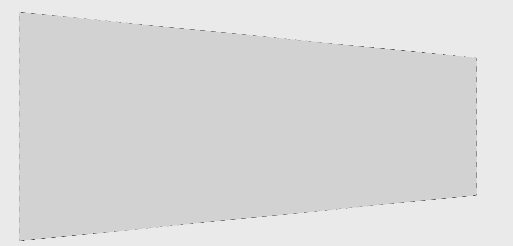
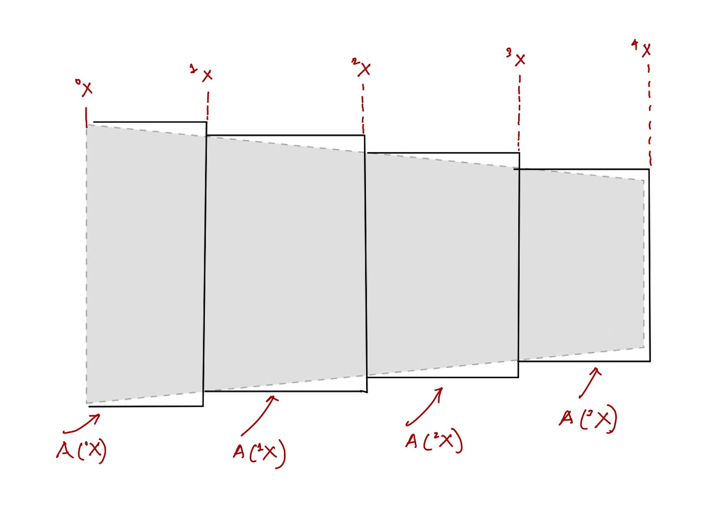




In this section we are going to determine the force-deflection law for a bar with variable cross-section.

Consider the bar show below. Its cross-section area instead of remaining constant varies along its length. The cross-section area at the material particle $X$ be $A(X)~\rm m^2$, where $A: [0,L]\to \mathbb{R}$.

Let us partition the domain [0,L] into say four pieces, i..e, $[^0\!X,^1\!X]$, $[^1\!X,^2\!X]$, $[^2\!X,^3\!X]$, and $[^3\!X,^4\!X]$. The cross-section area of the first piece is $A(^0 \!X)$, $A(^1 \!X)$, $A(^2 \!X)$, $A(^3 \!X)$. The length's of each of the bar's is $\Delta X$.  

The change in length's of each of these pices is $\boldsymbol{\delta}_1$, $\boldsymbol{\delta}_2$, $\boldsymbol{\delta}_3$, and $\boldsymbol{\delta}_4$. 
 
On applying the aplying the Hook's law to the first piece we get that 
$$
\begin{align}
\boldsymbol{F}&=\frac{EA (^0\!X)}{\Delta X}\boldsymbol{\delta}_1,\quad ^4\!\boldsymbol{\delta}=^4\!\boldsymbol{X}-^3\!\boldsymbol{X},\\
\boldsymbol{F}&=\frac{EA (^1\!X)}{\Delta X}\boldsymbol{\delta}_2,\quad ^3\!\boldsymbol{\delta}=^3\!\boldsymbol{X}-^2\!\boldsymbol{X},\\
\boldsymbol{F}&=\frac{EA (^2\!X)}{\Delta X}\boldsymbol{\delta}_3,\quad ^2\!\boldsymbol{\delta}=^2\!\boldsymbol{X}-^1\!\boldsymbol{X},\\
\boldsymbol{F}&=\frac{EA (^3\!X)}{\Delta X}\boldsymbol{\delta}_4,\quad ^1\!\boldsymbol{\delta}=^1\!\boldsymbol{X}-^0\!\boldsymbol{X},
\end{align}
$$

From the above four equations we get that
$$
\begin{align}
\boldsymbol{F}
\left(
\frac{\Delta X}{EA (^0\!X)}+
\frac{\Delta X}{EA (^1\!X)}+
\frac{\Delta X}{EA (^2\!X)}+
\frac{\Delta X}{EA (^3\!X)}\right)&=^4\!\boldsymbol{X}-^0\!\boldsymbol{X}\\
\boldsymbol{F}\sum_{i=0}^{3}\frac{\Delta X}{EA (^0\!X)}&=\boldsymbol{\delta}\\
\boldsymbol{F}&=\left(\sum_{i=0}^{3}\frac{\Delta X}{EA (^i\!X)}\right)^{-1}
\boldsymbol{\delta}
\end{align}
$$

Instead of making four pieces say we made 5 pieces, then we would instead be getting

$$
\begin{align}
\boldsymbol{F}\left(\sum_{i=0}^{4}\frac{\Delta X}{EA (^i\!X)}\right)&=\boldsymbol{\delta},\quad \Delta X=L/5
\end{align}
$$

Now let us consider $n+1$ pieces, then take the limit of $n$ going to infinity. 
$$
\begin{align}
\boldsymbol{F}\left(\sum_{i=0}^{n}\frac{\Delta X}{EA (^i\!X)}\right)&=\boldsymbol{\delta},\quad \Delta X=L/(n+1)\\
\lim_{n \to \infty}\boldsymbol{F}\left(\sum_{i=0}^{n}\frac{\Delta X}{EA (^i\!X)}\right)&=\boldsymbol{\delta}\\
\boldsymbol{F}\int_{0}^{L}\frac{dX}{E A(X)}&=\boldsymbol{\delta}
\end{align}
$$

In summry we get the bar's stiffness to be
$$
\begin{align}
\boldsymbol{F}&=
\left(
\int_{0}^{L}\frac{dX}{E A(X)}
\right)^{-1}
\boldsymbol{\delta}
\end{align}
$$