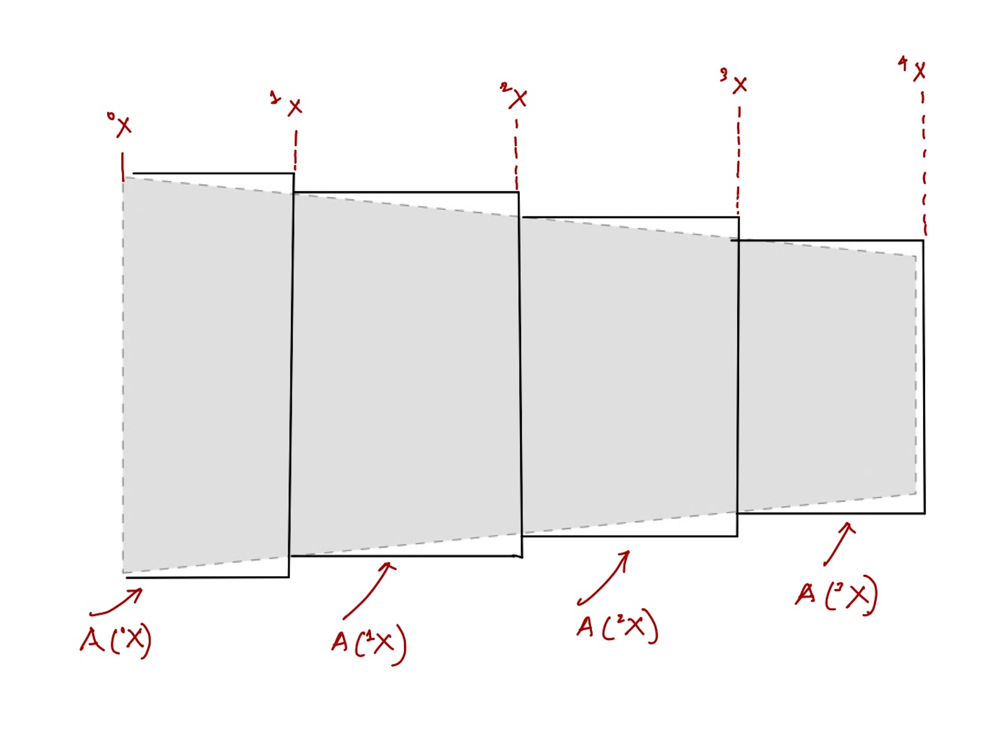




# Displacement field inside a bar of variable cross-section

Consider the bar show below. Its cross-section area instead of remaining constant varies along its length. The cross-section area at the material particle $X$ is $A(X)~\rm m^2$, where $A: [0,L]\to \mathbb{R}$.  Let us partition the domain $[0,L]$ into say four equal pieces, i..e, $[^0\\!X,^1\\!X]$, $[^1\\!X,^2\\!X]$, $[^2\\!X,^3\\!X]$, and $[^3\\!X,^4\\!X]$. The cross-section areas of the four pieces are $A(^0 \\!X)$, $A(^1 \\!X)$, $A(^2 \\!X)$, $A(^3 \\!X)$.  

Now, let us focus on one of the constant cross-sectional area segments. Let the position vector of the material particle on (the centeroid of) the left face of the piece  be $X \hat{\boldsymbol{E}}\_{a}$ and, the position vector of the material particle on (the centeroid of) the right face of the slice be  $(X+\Delta X) \hat{\boldsymbol{E}}\_{a}$. The reference length vector of the slice is, of course, $\Delta X \hat{\boldsymbol{E}}\_{a}$. Let the scalar displacement field in the bar be   $u$. Then the current position vector of the left particle is $(X+u(X))\hat{\boldsymbol{E}}\_{a}$ and of the right particle is $(X+\Delta X+u(X+\Delta X))\hat{\boldsymbol{E}}\_{a}$. Thus, the current length vector of the slice is $(\Delta X+u(X+\Delta X)-u(X))\hat{\boldsymbol{E}}\_{a}$. The change in length vector is $(u(X+\Delta X)-u(X))\hat{\boldsymbol{E}}\_{a}$

On applying the Hooke's law to the piece we have that the axial force vector on it is
$$
\begin{align}
\boldsymbol{F}=\frac{E A(X)}{\Delta X}(u(X+\Delta X)-u(X))\hat{\boldsymbol{E}}\_{a}
\end{align}
$$ 

From force equalibrium we know that the force vector on the righ face of the slice is the same as the force vector acting on the right face, $\Gamma^{\mathscr{h}}$, of the bar. Let the force on the right face of the bar of course is $F \hat{\boldsymbol{E}}\_a$. Combing this information with last displayed equation we get that
$$
\begin{align}
F \hat{\boldsymbol{E}}\_{a} &=\frac{E A(X)}{\Delta X}(u(X+\Delta X)-u(X))\hat{\boldsymbol{E}}\_{a}\\
 \frac{F}{E A(X)}&=\frac{u(X+\Delta X)-u(X)}{\Delta X}\\
 \lim_{\Delta X\to 0}\frac{F}{E A(X)}&=\lim_{\Delta X\to 0}\frac{u(X+\Delta X)-u(X)}{\Delta X}\\
 \frac{F}{E A(X)}&=u'(X)
\end{align}
$$

$$
u(X)=\int_{0}^{X} \frac{F\, d\, Y}{E A(Y)}
$$
