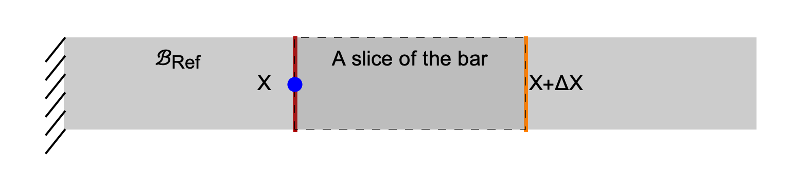




* Human bone
* Tendon

### Displacement field

$$
u(X)=F\int_{0}^{X} \frac{\, d\, Y}{E A(Y)}
$$

$$
u(X)=F\int_{0}^{X} \frac{\, d\, Y}{E(Y) A}
$$

$$
u(X)=F\int_{0}^{X} \frac{\, d\, Y}{E(Y) A(Y)}
$$

### A more fundamental Hooke's Law

Let $\boldsymbol{u}$ be the displacement field of a bar. In the [previous section](./Bars2.md) we learnt that $\boldsymbol{u}(\boldsymbol{X})$ is the displacement of the material particle $\boldsymbol{X}$. The displacement vector tells us by how much the material particle has moved  on the application of the force. Recall that we are referring to material particles by their position vectors in the reference configuration.  

In the following we focus our attention when the bar just streches along its own axis (with no rotation.) That is, we focus on the case in which  the bar remains aligned with $\hat{\boldsymbol{E}}\_{\rm a}$ before and after deformation. In this case, we can work with the scalar displacement field $u$, which is defined as 

$$
\begin{equation}
u(X):=\boldsymbol{u}(X\hat{\boldsymbol{E}}_{\rm a})⋅ \hat{\boldsymbol{E}}_{\rm a}
\end{equation}
$$

The scalar displacement field can be used as follows. Say the material particle $\boldsymbol{X}$ can be expressed as $\boldsymbol{X}=X \hat{\boldsymbol{E}}\_{a}$ then its  displacement can be computed as $u(X) \hat{\boldsymbol{E}}_{\rm a}$. 

$$
\begin{align}
F(X+\Delta X) \hat{\boldsymbol{E}}\_{a} &=\frac{E(X) A(X)}{\Delta X}(u(X+\Delta X)-u(X))\hat{\boldsymbol{E}}\_{a}\\
F(X+\Delta X) &=\frac{E(X) A(X)}{\Delta X}(u(X+\Delta X)-u(X))\\
 \frac{F(X+\Delta X)}{A(X)}&=E(X)\frac{u(X+\Delta X)-u(X)}{\Delta X}\\
 \lim_{\Delta X\to 0}
 \frac{F(X+\Delta X)}{A(X)} &=
 \lim_{\Delta X\to 0}
 E(X)\frac{u(X+\Delta X)-u(X)}{\Delta X}\\
 &=
 \\
\sigma_{11}(X)&=E u'(X)
\end{align}
$$

## Bar with body force

In the previous section we derived that 

$$
\begin{align}
F=
\end{align}
$$

## Torsion

The Hooke's Law for Torsion is 

$$
\begin{align}
\frac{T L}{J \theta}=\text{constant}=G
\end{align}
$$

<!-- 
HK_DONE: Need to explain what it means to say plane sections remain plane. Done in class. 

HK_DONE: Need to present the vector form of the Hook'e law.

Consider the following surface 
$$
\begin{equation}
\{X_2\hat{\boldsymbol{E}}_2+\}
\end{equation}
$$   -->
A more fundamental law. Derives from Linear elasticity. The law we had for Bar is surely. Consistent with the below law. 
$\sigma (X)= E(X)u'(X)$

$(E(X)A(X)u'(X))'+B(X)=0$

#### Force equilibrium

$-F(X)\u{E}_1$
$F(X+\Delta X)\u{E}_1$

$F(X+\Delta X)-F(X)\u{E}_1+\int_{Y=X}^{X+\Delta X}b(Y) \u{E}_1\, dY=0$

$$
\begin{align}
\frac{F(X+\Delta X)-F(X)}{\Delta X}+
\frac{1}{\Delta X}\int_{Y=X}^{X+\Delta X}b(Y) \, dY&=0\\
F'(X)+b(X)&=0
\end{align}
$$

$$
\begin{align}
(\sigma_{11}(X)A(X))'+b(X)&=0\\
(\sigma_{11}(X)A(X))'+b(X)&=0
\end{align}
$$

Now, let us focus on a small slice of the bar. Let the position vector of the material particle on (the centeroid of) the left face of the slice be $X \hat{\boldsymbol{E}}\_{a}$ and, the position vector of the material particle on (the centeroid of) the right face of the slice be  $(X+\Delta X) \hat{\boldsymbol{E}}\_{a}$. The reference length vector of the slice is, of course, $\Delta X \hat{\boldsymbol{E}}\_{a}$. Let the scalar displacement field in the bar be   $u$. Then the current position vector of the left particle is $(X+u(X))\hat{\boldsymbol{E}}\_{a}$ and of the right particle is $(X+\Delta X+u(X+\Delta X))\hat{\boldsymbol{E}}\_{a}$. Thus, the current length vector of the slice is $(\Delta X+u(X+\Delta X)-u(X))\hat{\boldsymbol{E}}\_{a}$. The change in length vector is $(u(X+\Delta X)-u(X))\hat{\boldsymbol{E}}\_{a}$

On applying the [vector form of the Hooke's law](VectorFormHookesLaw.md) to the slice we have that the force vector on the righ face of the slice is
$$
\begin{align}
\boldsymbol{F}=\frac{E A}{\Delta X}(u(X+\Delta X)-u(X))\hat{\boldsymbol{E}}\_{a}
\end{align}
$$ 

From force equilibrium we know that the force vector on the right face of the slice is the same as the force vector acting on the right face, $\Gamma^{\mathscr{h}}$, of the bar. The force on the right face of the bar, of course, is $F \hat{\boldsymbol{E}}\_a$, where $F= (E A/L) \delta$, and $\delta = l-L$. Combing this information with last displayed equation we get that

$$
\begin{align}
F \hat{\boldsymbol{E}}\_{a} &=\frac{E A}{\Delta X}(u(X+\Delta X)-u(X))\hat{\boldsymbol{E}}\_{a}\\
\frac{E A}{L} \delta&=\frac{E A}{\Delta X}(u(X+\Delta X)-u(X))\\
 \frac{\delta}{L}&=\frac{u(X+\Delta X)-u(X)}{\Delta X}\\
 \lim_{\Delta X\to 0}\frac{\delta}{L}&=\lim_{\Delta X\to 0}\frac{u(X+\Delta X)-u(X)}{\Delta X}\\
 \frac{\delta}{L}&=u'(X)
\end{align}
$$
