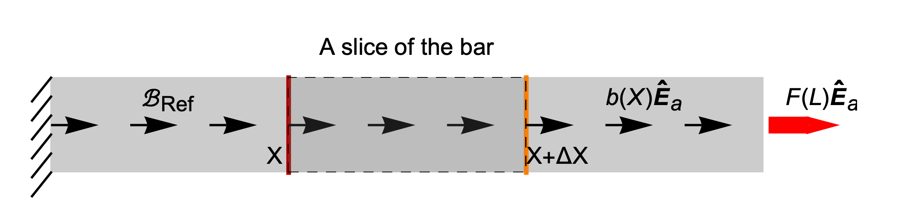




# General force equilibrium in 1D

In the [previous section](./BodyForce1.md), we presented that 

$$
\begin{align}
\sigma_{11}(X)=E(X)u'(X)
\label{eq:LinearElasticity1D}
\end{align}
$$

The equation $F =E A \delta/L$ can be shown to derive from $\eqref{eq:LinearElasticity1D}$. In that regards, $\eqref{eq:LinearElasticity1D}$ is a more fundamental law. Equation $\eqref{eq:LinearElasticity1D}$ itself derives from the constitutive equation of the the  linear theory of elasticity. 

#### Force equilibrium

When there are no body forces acting on the bar, we know that the force on any cross-section of the bar is the same. However, when there are body forces acting on the bar, the axial force can vary along the length of the bar.  We will now derive the ordinary differential equation that governs how the force varies along the bar. 

Let the axial force along the bar be $F(X)\uv{E}\_{\rm a}$, and the body force on the bar be $B(X)\uv{E}\_{\rm a}$. Consider a slice of block shown above. The block occupies the region $[X, X+\Delta X]$.
The force on the left face of the block is $-F(X)\uv{E}\_{\rm a}$. The force on the right face of the block is $F(X)\uv{E}\_{\rm a}$. The  body force field $b(X)\u{E}\_{\rm a}$ is defined such that the net force on the slice is 

$$
\int_{Y=X}^{X+\Delta X}b(Y) \, dY \uv{E}_{\rm a}. 
$$

Applying force equilibrium on the slice, we get that

$$
F(X+\Delta X)\uv{E}_{\rm a}-F(X)\uv{E}_{\rm a}+\int_{Y=X}^{X+\Delta X}b(Y) \uv{E}_{\rm a}\, dY=\u{0}
$$

Dividing the equation with the length of the slice $\Delta X$, we get

$$
\begin{align}
\frac{F(X+\Delta X)-F(X)}{\Delta X}+
\frac{1}{\Delta X}\int_{Y=X}^{X+\Delta X}b(Y) \, dY&=0\\
\end{align}
$$

On taking the limit $\Delta X$ going to zero, the term 

$$
(F(X+\Delta X)-F(X))/\Delta X
$$ 

converges to $F'(X)$, and the term  

$$
\frac{1}{\Delta X}\int_{Y=X}^{X+\Delta X}b(Y) \, dY
$$ 

converges to $b(X)$. For a proof of this latter statement, see [this](./Leibnitz.md) section. Thus, in the limit $\Delta X\to 0$, we get that

$$
\begin{align}
F'(X)+b(X)&=0.
\end{align}
$$

On integrating the above equation from $X$ to the end of the bar and defining 

$$
B(X)=\int_{Y=X}^{L}b(Y)\, dY
$$

we get that

$$
\begin{align}
F(L)-F(X)+B(X)&=0\\
F(X)&=F(L)+B(X)
\end{align}
$$

Knowing the axial force along the bar's length, we can find the displacement field using the constitutive equation $\eqref{eq:LinearElasticity1D}$

$$
\begin{align}
\sigma_{11}(X)&=E(X)u'(X)\\
F(X)/A(X)&=E(X)u'(X)\\
\end{align}
$$

Reversing the two sides of the equation and re-arranging, we get that

$$
\begin{align}
u'(X)&=\frac{F(X)}{E(X)A(X)}
\end{align}
$$

Integrating the last equation, we get

$$
\begin{align}
u(X)=\int_{Y=0}^{X}\frac{F(Y)\, dY}{E(Y)A(Y)}
\end{align}
$$
