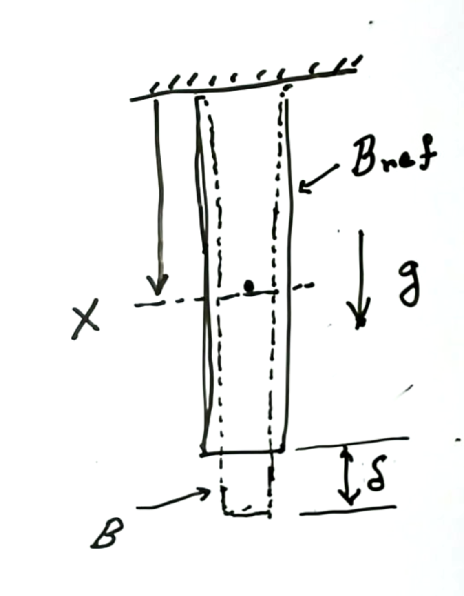
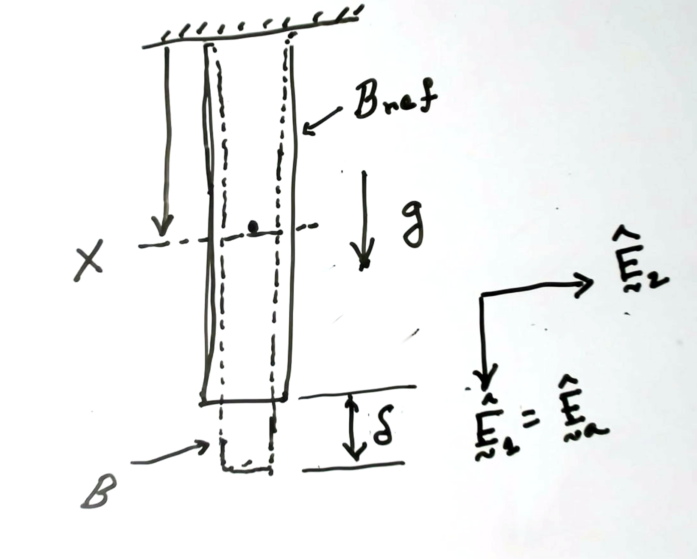




# Elongation of a free hanging bar

### Problem statement

A bar of cross-sectional area $A$ and Young's modulus $A$ is fixed on one of its end and hang's freely. Take the density of the bar to be $\rho$ and acceleration due to gravity to be $g$.

Q. What is the elongation of the bar due to its own weight.  

<!--  -->

<!--  -->
### Solution

We are going to solve this problem using the equations

$$
\begin{align}
u(X)&=\int_{Y=0}^{X}\frac{F(Y)}{E(Y)A(Y)}\, dY\label{eq:uX}
\end{align}
$$

and 

$$
\begin{align}
F(X)&=F(L)+B(X)\label{eq:FX}
\end{align}
$$

where,

$$
\begin{align}
B(X)=\int_{Y=X}^{L}b(Y)\, dY
\label{eq:BX}
\end{align}
$$

and $b(X)$ is defined such that 

$$
\int_{X}^{X+\Delta X}b(Y)\, dY\hat{\boldsymbol{E}}_a
$$

is the body force on the matter composing on the slice $[X, X+\Delta X]$. 

A volume element at the distance $X$ from the fixed end is $A(X)\, dX$. The mass of this element is $\rho(X)A(X)\, dX$. The force due to gravity on this mass element is

$$
\int_{X}^{X+\Delta X}
\rho(Y)A(Y)g(Y)\, dY\hat{\boldsymbol{E}}_a,
$$

which implies that

$$
\begin{align}
b(X)=\rho(Y)A(Y)g(Y).
\end{align}
$$

We will just consider the elementary case where the $\rho(X)=\rho$, $A(X)=A$, and $g(X)=g$. In this case we have that

$$
\begin{align}
b(X)&=\rho A g \\
\end{align}
$$

Substituting $b(X)$ from the last equation into $\eqref{eq:BX}$ we get that

$$
\begin{align}
B(X)&=\rho A g (L-X) \\
\end{align}
$$

Substituting $B(X)$ from the last equation into $\eqref{eq:FX}$ we get that

$$
\begin{align}
F(X)&=\rho A g (L-X) +F(L)\\
\end{align}
$$

There is no force on the lower face for bar. So, in the last equation $F(L)=0$. Thus, we get that 

$$
\begin{align}
F(X)&=\rho A g (L-X) \\
\end{align}
$$

Substituting $F(X)$ from the last equation into $\eqref{eq:uX}$ we get that

$$
\begin{align}
u(X)&=
\int_{Y=0}^{X}
\frac{\rho A g (L-X)}{EA}
\, dY
\\
&=\frac{\rho g}{E}(LX -X^2/2)
\end{align}
$$

Specifically the elongation of the bar is 

$$
\begin{align}
\delta=u(L)&=
\frac{\rho g L^2}{2E}
\end{align}
$$

