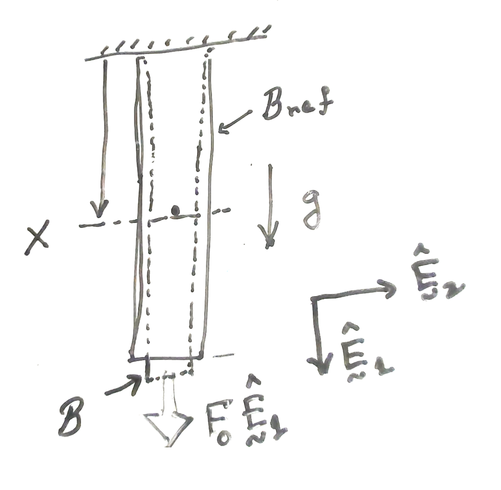




# Elongation of a free hanging bar with constant cross-sectional area and end force

### Problem statement

A bar of cross-sectional area $A$ and Young's modulus $E$ is fixed on one of its end and hangs freely. Take the density of the bar to be $\rho$ and acceleration due to gravity to be $g$. The bottom face of the bar is subject to the force $F_0 \uv{E}\_{\rm a}$.

<u> Q. What is the displacement field and elongation of the bar due to its own weight and the force acting on its bottom face?</u>

<!--  -->
### Solution

We are going to solve this problem using the equation

$$
\begin{align}
u(X)&=\int_{Y=0}^{X}\frac{F(Y)}{E(Y)A(Y)}\, dY,\\
\end{align}
$$

which, since the area and the modulus are constants, will simplify  to

$$
\begin{align}
u(X)&=\int_{Y=0}^{X}\frac{F(Y)}{EA} \, dY
\label{eq:uX}
\end{align}
$$

and 

$$
\begin{align}
F(X)&=F(L)+B(X),\label{eq:FX}
\end{align}
$$

where

$$
\begin{align}
B(X):=\int_{Y=X}^{L}b(Y)\, dY.
\label{eq:BX}
\end{align}
$$

The function $b(X)$ is defined such that 

$$
\int_{X}^{X+\Delta X}b(Y)\, dY\hat{\boldsymbol{E}}_{\rm a}
$$

is the body force acting on the matter in the  slice $[X, X+\Delta X]$. 

Now consider the gravity acting on this slice.
The volume of the  slice $[X, X+\Delta X]$ is $A \Delta X$, so the mass of slice is $\rho A \Delta X$ and the force due to gravity on this slice  is $\rho A \Delta X g$. 

This force can be written as

$$
\begin{align}
&=\rho A g\int_{X}^{X+\Delta X}\, dY\hat{\boldsymbol{E}}_{\rm a}\\
&=\int_{X}^{X+\Delta X}
\rho A g\, dY\hat{\boldsymbol{E}}_{\rm a},
\end{align}
$$. 

which implies that

$$
\begin{align}
b(X)=\rho A g.
\end{align}
$$

Substituting $b(X)$ from the last equation into $\eqref{eq:BX}$, we get that

$$
\begin{align}
B(X)&=\rho A g (L-X) \\
\end{align}
$$

Substituting $B(X)$ from the last equation into $\eqref{eq:FX}$, we get that

$$
\begin{align}
F(X)&=\rho A g (L-X) +F(L)\\
\end{align}
$$

The  force on the bottom face of the  bar is $F_0 \uv{E}\_a$. So, in the last equation, $F(L)=F_0$. Thus, we get that 

$$
\begin{align}
F(X)&=\rho A g (L-X)+F_0 \\
\end{align}
$$

Substituting $F(X)$ from the last equation into $\eqref{eq:uX}$, we get that

$$
\begin{align}
u(X)&=
\int_{Y=0}^{X}
\frac{\rho A g (L-Y)+F_0}{EA}
\, dY
\\
&=\frac{\rho g}{E}(LX -X^2/2)+\frac{F_0 X}{EA}
\end{align}
$$

Specifically, the elongation of the bar is 

$$
\begin{align}
\delta=u(L)&=
\frac{\rho g L^2}{2E}+\frac{F_0 L}{EA}
\end{align}
$$

