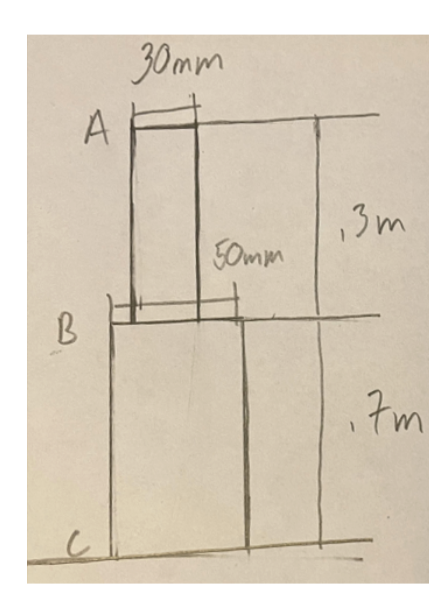




The top bar is made of steel, while the bottom bar is made of titanium.
Consider an upward $50~\rm{kN}$ force applied at A (see Homework 2, Problem 3).

We want the displacement.

[Mathematica File.](./SegmentedComposite.nb) 