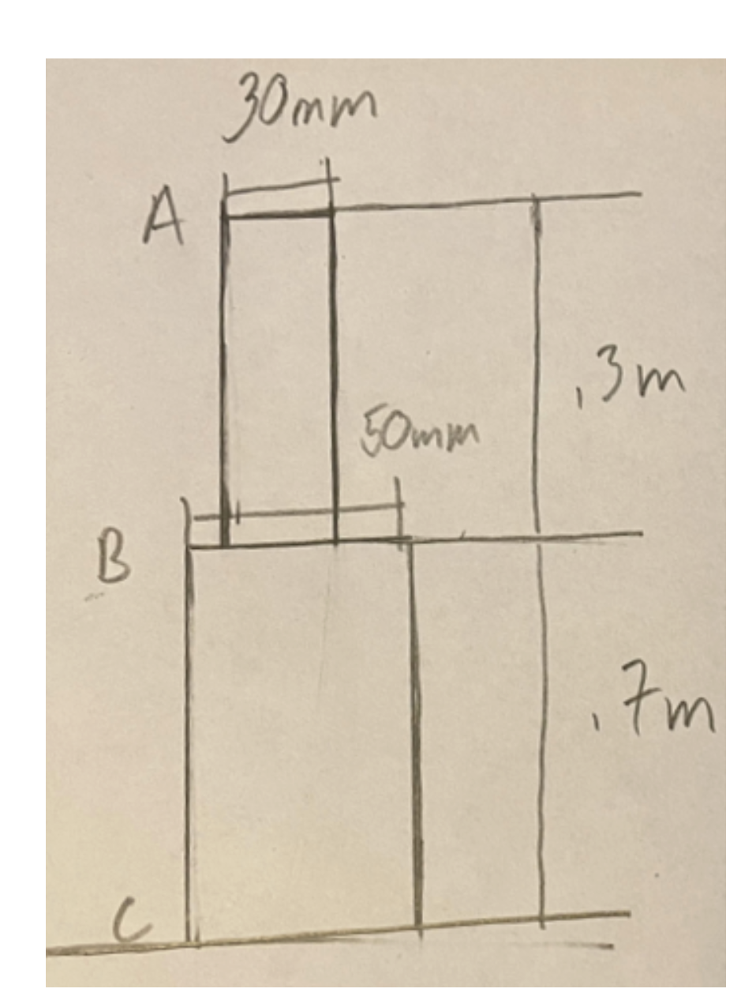




Consider an upward 50kN force applied at A, and some downward force applied at B (see Homework 2, Problem 3).

We want the 
* Axial force diagram 
* Axial normal traction diagram 
* The displacement diagram

for the case (i) both bars are made of steel, and (ii) top bar is made of steel, bottom bar is made of titanium.

[Mathematica File.](./SteppedCompositeTwoForces.nb) 