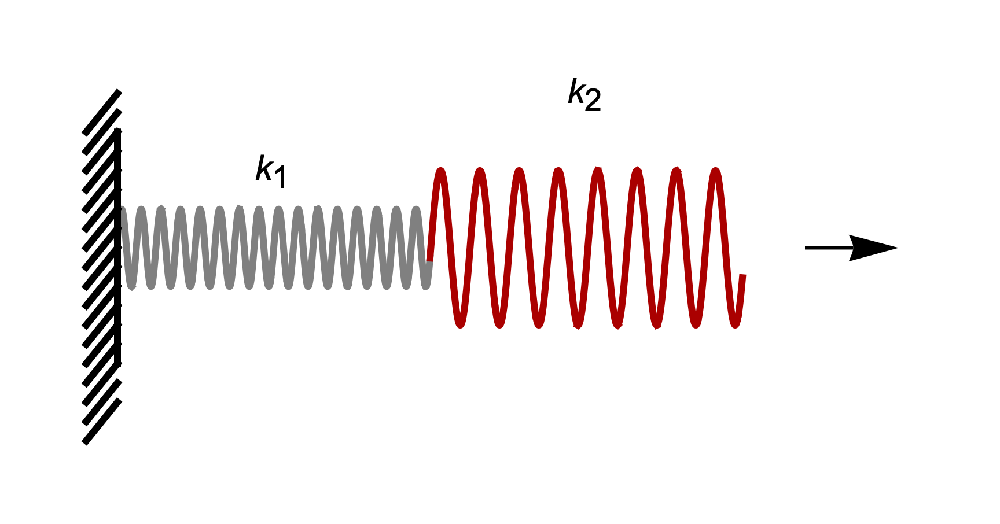




#### Prelude: Two springs in parallel. 

The ends of the first spring are at $^0\\!\boldsymbol{X}$, $^1\\!\boldsymbol{X}$, and that of the second spring are at $^1\\!\boldsymbol{X}$ and $^2\\!\boldsymbol{X}$. The initial length vectors are $^1\\!\boldsymbol{X}-^0\\!\boldsymbol{X}$ and $^2\\!\boldsymbol{X}-^1\\!\boldsymbol{X}$. After deformation, the springs ends are at $^0\\!\boldsymbol{x}$, $^1\\!\boldsymbol{x}$, and $^1\\!\boldsymbol{x}$, $^2\\!\boldsymbol{x}$, respectively. The final length vectors are $^1\\!\boldsymbol{x}-^0\\!\boldsymbol{x}$, and $^2\\!\boldsymbol{x}-^1\\!\boldsymbol{x}$. 

The change in length vectors are $^1\\!\boldsymbol{\delta}=^1\\!\boldsymbol{l}-^1\\!\boldsymbol{L}$, $^2\\!\boldsymbol{\delta}=^2\\!\boldsymbol{l}-^2\\!\boldsymbol{L}$. Applying the the vector form of the Hooke's law to each of the springs, we have that

$$
\begin{align}
^1\!\boldsymbol{F}&=k_1\, ^1\!\boldsymbol{\delta}\\
^2\!\boldsymbol{F}&=k_2\, ^2\!\boldsymbol{\delta}
\end{align}
$$

The forces on the right end of each of the springs are the same. Thus, setting $^1\\!\boldsymbol{F}=^2\\!\boldsymbol{F}=\boldsymbol{F}$ in the last two equations and diving both sides by the stiffness, we get that

$$
\begin{align}
\boldsymbol{F}/k_1&=(^1\!\boldsymbol{l}-^1\!\boldsymbol{L})\\
\boldsymbol{F}/k_2&=(^2\!\boldsymbol{l}-^2\!\boldsymbol{L})
\end{align}
$$

Adding the above two equations together, we get that

$$
\begin{align}
\boldsymbol{F}\left(1/k_1+1/k_2\right)&=(^1\!\boldsymbol{l}+^2\!\boldsymbol{l}-(^1\!\boldsymbol{L}+^2\!\boldsymbol{L}))\\
\end{align}
$$

Substituting $^i\\!\boldsymbol{l}$, $^i\\!\boldsymbol{L}$, $i=1,2$ with their values in terms of $^i\\!\boldsymbol{x}$, $^i\\!\boldsymbol{X}$, $i=0,1,2$ we get that

$$
\begin{align}
\boldsymbol{F}\left(1/k_1+1/k_2\right)&=((^2\!\boldsymbol{x}-^0\!\boldsymbol{x})-(^2\!\boldsymbol{X}-^0\!\boldsymbol{X}))\\
\end{align}
$$

Note that $(^2\\!\boldsymbol{x}-^0\\!\boldsymbol{x})$ is the final length vector of the spring assembly, which we will denote as $\boldsymbol{l}$,
and $(^2\\!\boldsymbol{X}-^0\\!\boldsymbol{X})$ is the initial length vector of the spring assembly, which we will denote as $\boldsymbol{L}$. In terms of these effective initial and final length vectors, we get that

$$
\begin{align}
\boldsymbol{F}\left(1/k_1+1/k_2\right)&=(\boldsymbol{l}-\boldsymbol{L})\\
\end{align}
$$

Moving the expression containing the stiffness to the other side and calling $(\boldsymbol{l}-\boldsymbol{L})$ the effective change in length vector of the spring assembly, $\boldsymbol{\delta}$, we get that

$$
\begin{align}
\boldsymbol{F}&=\left(1/k_1+1/k_2\right)^{-1}\boldsymbol{\delta}
\end{align}
$$

