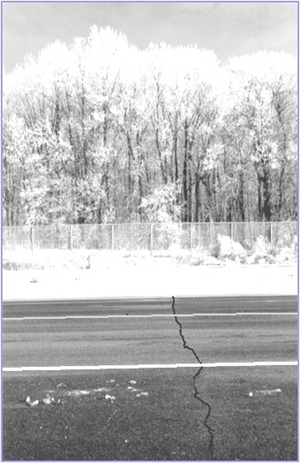
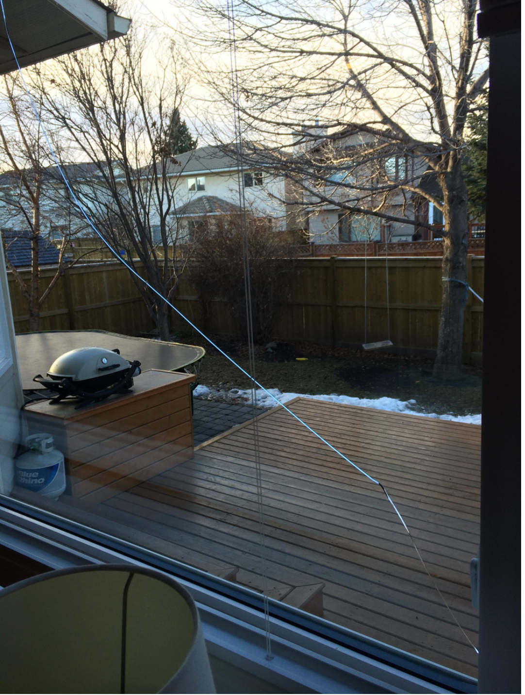




# Thermal stresses

|   |   |   |
|---|---|---|
|    |   | |
(pictures used without permission.)

|   |   | |
|---|---|---|
|   |   |  |

The vector form of the Hooke's law is

$$
\begin{align}
\u{F}
&=\frac{E A}{L}\u{\delta}\\
&=\frac{E A}{L}(\u{l}-\u{L})
\end{align}
$$

In the above equation, the implicit assumption is that when the  bar is of length $\u{L}$, all the atomic bonds are at their equilibrium values. That is, there can be no force at the bar's end, or more technically speaking, no internal stress, when the bar's length is $\u{L}$. Based on this premise,  the above law is a postulate that the force on the bar's end will be proportional to how much the bar's length will deviate from this $\u{L}$. However, when we heat the bar by a temperature increment of $\Delta T$,  then the length at which  all the atomic bonds are at their equilibrium values becomes $(1+\alpha \Delta T) \u{L}$. (Similarly, when the bar grows or swells due to flow of matter into it, some analogous expression can be used to express the length at which the atomic bonds are at their equilibrium values.) Thus, the force on the bar should be based on by how much the bar's current length is different from this internal-equilibrium, "stress free" length $(1+\alpha \Delta T) \u{L}$.

$$
\begin{align}
\u{F}
&=\frac{E A}{L}\u{\delta}\\
&=\frac{E A}{L}(\u{l}-(1+\alpha \Delta T)\u{L})
\end{align}
$$

Motivated by the above arguments, we can postulate that 

$$
\begin{align}
\sigma_{11}(X)
&=E(X) (u'(X)-\alpha \Delta T (X))
\end{align}
$$
