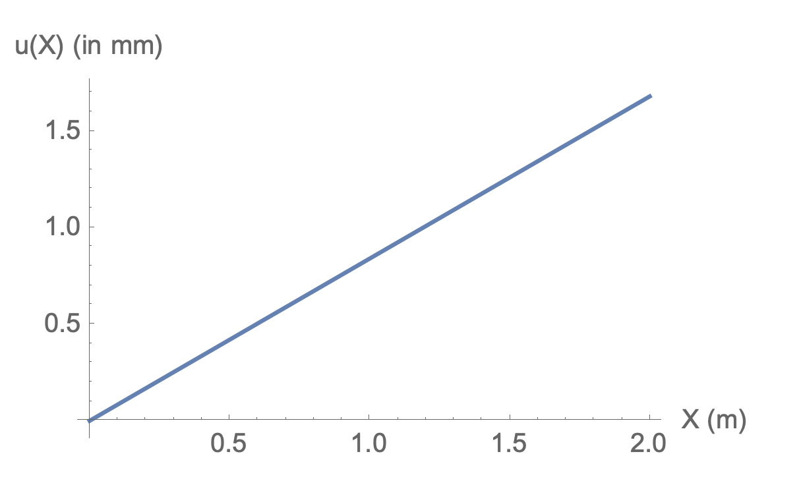




# Solved problem 2

### Problem statement

A rod 2 m long at a temperature of $10^\circ\,\rm C$. The temperature is raised to $80^\circ\,\rm C$. Take $E=1.0\times 10^5\rm MPa$ and $\alpha=12 \times 10^{-6}$.  The left end of the bar is fixed. Find the scalar displacement field in the bar. Plot the Axial displacement diagram.

### Solution

From the  [previous solved  problem](./ThermalStressesSP1.md) we have that 

$$
u'(Y)=\alpha \Delta T.
$$

Integrating the above equation from $Y=0$ to $Y=X$ and taking $u(0)=0$ we get

$$
\begin{align}
u(X)&=\alpha \Delta T\,  X.\\
&=0.00084\,  X
\end{align}
$$

The axial displacement diagram is shown below.

The MMA file for creating the above diagram is [here](ThermalStressesSP2.nb)

