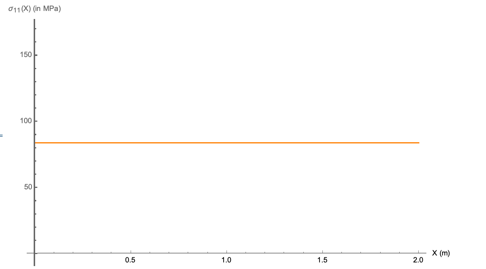




# Solved problem 3

### Problem statement

Here, we will be continuing the analysis of the  bar from Solved problems 1 and 2: Consider again a bar 2 m long at $^\circ\,\rm C$. The temperature is raised to $80^\circ\,\rm C$. Take $E=1.0\times 10^5\rm MPa$ and $\alpha=12 \times 10^{-6}$.  However, this time, both the left and the right ends of the bar are fixed. Find the scalar displacement field in the bar. Find the axial normal traction component ("axial stress") along the bar. Prepare the axial stress diagram. 

### Solution

From the  [solved  problem 1](./ThermalStressesSP1.md), we have that 

$$
\begin{equation}
F=EA(u'(X)-\alpha \Delta T).

\label{eq:Main}
\end{equation}
$$

In Solved problems 1 and 2, we took $F=0$. This was because 
* there was no body force acting on the bar, so that $F$ was constant along its length ($F(X)=F$)

and

* the right end of the face was free (i.e., no tractions were applied to it), so that it followed from force equilibrium that the axial force had to be naught throughout the bar's length. 

However, in the current case, both the left face and the right face of the bar are held fixed. Thus,  it <u>does not</u> follow from force equilibrium that $F$ is necessarily naught; we only know that $F$ is a constant because there is no body force.

Integrating the last equation from $0$ to $L$ and taking taking $u(0)=u(L)=0$ (from boundary conditions), we get that

$$
\begin{align}
FL&=-EA \alpha \Delta T L\\
F&=-EA \alpha \Delta T 
\end{align}
$$

For positive temperature increase $F$ is negative, which means that the "stress" $F/A$ (which, to be precise, should be called the  normal axial traction component) is also negative. When $\sigma_{11}(X)$ is negative, we say that bar is in compression at $X$. (Analogously, when $\sigma_{11}(X)$ is positive, we say that the bar is in tension at $X$.)

Substituting that $F=-EA \alpha \Delta T $ in $\eqref{eq:Main}$, we get that

$$
u'(Y)=0
$$

Integrating both sides of this equation from say $Y=0$ to $Y=X$, we get that
$
u(X)=0.
$

The $\sigma_{11}(X)$ along the bar is 

$$
\begin{align}
\sigma(X)&=F(X)/A(X)\\
\sigma(X)&=-E \alpha \Delta T 
\end{align}
$$

The "axial stress" plot is shown below. 

The MMA file for generating the above plot can be found [here](WFiles/ThermalStressesSP3.nb)