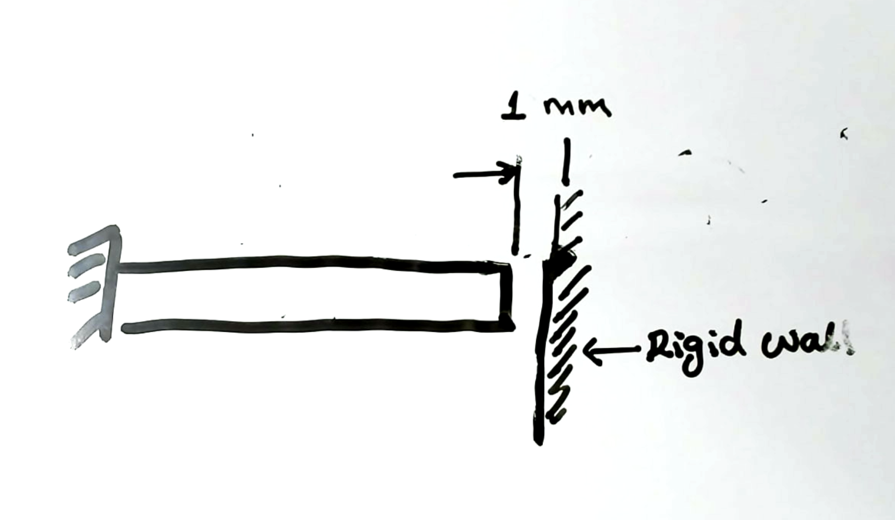




# Solved problem 4

A rod 2 m long at a temperature is heated raising its temperature from $10^\circ\,\rm C$ to $80^\circ\,\rm C$. There is a 1 mm gap between the right face of the bar and a rigid wall. Take $E=1.0\times 10^5\rm MPa$ and $\alpha=12 \times 10^{-6}$. What is the "axial stress" in the bar.

# Solution

From Solved pb 1 we know that if there was nothing opposing the expansion of the right face then the length of the bar would grow by 1.68 mm. However, there is only a gap of  1 mm between the right face of the wall and a rigid wall. So the bar will expand, make contact with right end when it expands by 1 mm, after which the displacement on the right face of bar will remain fixed at 1 mm. 

From the  [solved  problem 1](./ThermalStressesSP1.md) we have that 

$$
\begin{equation}
F(X)=EA(u'(X)-\alpha \Delta T).
\end{equation}
$$

Again from force equilibrium we know that the axial force in the bar is going to be a constant, we don't if it is naught, only that it is a constant. Thus, taking $F(X)=0$ and integrating the last equation from $0$ to $L$ we get that

$$
\begin{equation}
\frac{FL}{EA}=u(L)-u(0)- \alpha \Delta T L.
\end{equation}
$$

We know that left face is fixed, so $u(0)=0$, and that $u(L)=1~\rm mm=:u_0$. Thus, the above equation simplifies to

$$
\begin{align}
\frac{FL}{EA}=u_0- \alpha \Delta T L,
\end{align}
$$

from which it follows that 

$$
\begin{align}
\sigma_{11}(X)&=-\frac{E}{L}( \alpha \Delta T L-u_0).\\
&=-34\,\rm MPa
\end{align}
$$
