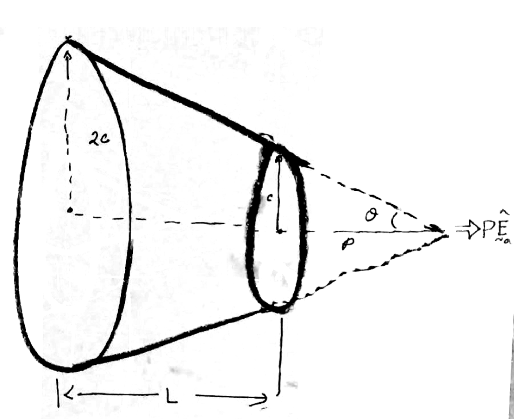
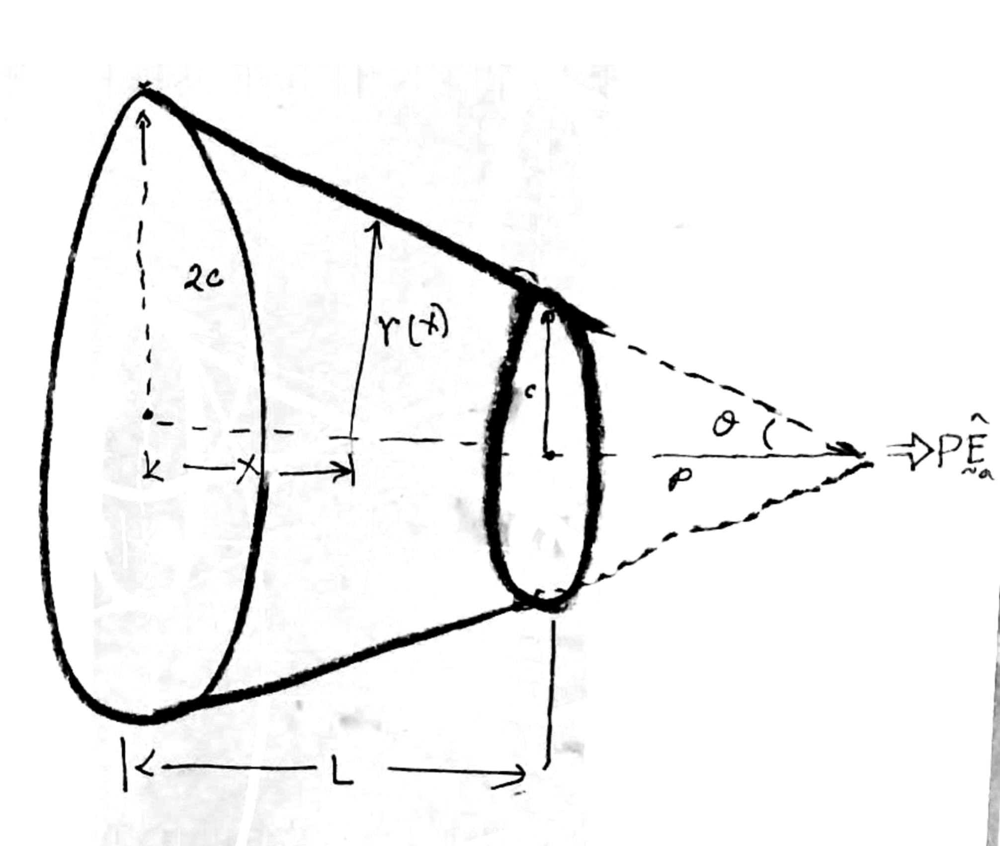




# Truncated cone

**Problem statement** 

A truncated cone is rigidly fixed to a wall on its left face. A force of $P\hat{\boldsymbol{E}}\_{\rm a}$ is acting on its right face. Its left face is the larger face and is of radius $2c$, and its right end face is of radius $c$. Take the Young's modulus of the cone to be $E$. 

**(a)** Find the elongation of the cone  
**(b)** Find the displacement field in the cone.  

**Solution**

We first determine how the cross-sectional area varies along the cone's length. 

In the figure

$$
\begin{align}
\tan(\theta)&=\frac{2c}{L+p}=\frac{c}{p}.
\end{align}
$$

From the above equation, we get that $p=L$.

Let $r(X)$ be the radius of the cone at material point $X$[^1] (see figure below). From the figure, we have that

$$
\begin{align}
\frac{2c}{L+p}&=\frac{c}{p}=\frac{r(X)}{L-X+p}.
\end{align}
$$

Substituting $p=L$,

$$
\frac{c}{L}=\frac{r(X)}{2L-X}
$$

Rearranging,

$$
r(X)=c(2-X/L)
$$

from which we get that

$$
A(X)=\pi c^2(2-X/L)^2
$$

**(a)** We get the elongation to be

$$
\begin{align}
\delta&=P\int_{0}^{L}\frac{dY}{E A(Y)}\\
&=\frac{P}{\pi E c^2}\int_{0}^{L}\frac{dY}{ (2-Y/L)^2}\\
\end{align}
$$

Evaluating the integral ([here is the MMA notebook for evaluating the integral](./SimpleIntegral.nb))

$$
\begin{align}
\delta&=\frac{P L}{2\pi E c^2}
\end{align}
$$

**(b)** We get the displacement field to be

$$
\begin{align}
u(X)&=P\int_{0}^{X}\frac{dY}{E A(X)}\\
&=\frac{P}{\pi E c^2}\int_{0}^{X}\frac{dY}{ (2-Y/L)^2}\\
&=\frac{P L}{2\pi E c^2}\frac{ X/L}{2 - X/L}
\end{align}
$$

[^1]: when we say the material point/particle $X$, we mean the material particle $X\uv{E}\_{\rm a}$.