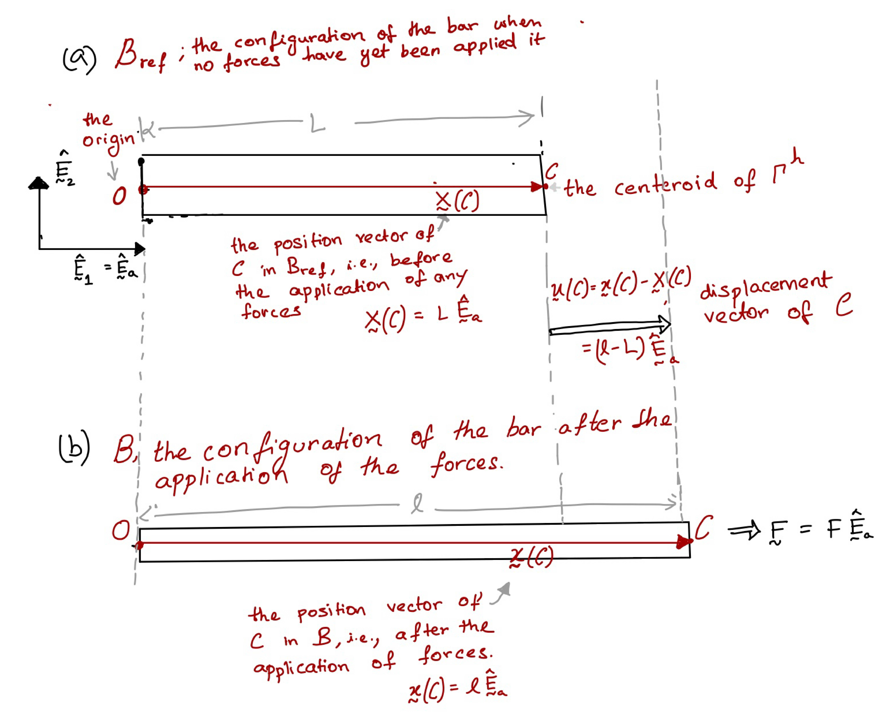




# Vector form of the Hooke's law for the bar

In the [introductory section on bars](Bars.md), we introduced the Hooke's law for the bar to be

$$
\begin{align}
\frac{F L}{A \delta}=E
\end{align}
$$

The above equation is a scalar equation. We would like write it in a vector form. 

In the following, we focus our attention on when the bar just stretches along its own axis (with no rotation.) That is, we focus on the case in which  the bar remains aligned with $\hat{\boldsymbol{E}}\_{\rm a}$ before and after deformation.

Let the position vector of the $\Gamma^{\mathscr{h}}$'s centroid, before any forces are applied to the bar, be $\boldsymbol{X}(\mathcal{C})$ (red arrow in the top panel of the below figure). The difference between the position vectors of the centroids of the right and left faces is called the length vector. 

When the position vectors considered are reference position vectors, then the length vector is called the <u>initial length vector</u>, or the <u>reference length vector</u>. When the position vectors considered are current position vectors, then the length vector is called the <u>deformed length vector</u>, or the <u>current length vector</u>.  

Say we choose the origin of the physical space $\mathcal{E}^3$ to be located at the centroid of the bar's left face. Then the reference position vector of the bar's left face is  simply the null vector $\boldsymbol{0}$. In this case, $\boldsymbol{X}(\mathcal{C})$ is also the initial (or reference) length vector. If the initial, undeformed length of the bar is $L$, then $\boldsymbol{X}(\mathcal{C})=L\hat{\boldsymbol{E}}\_{\rm a}$. Say that after  the application of force, the position vector of the centroid of the bar's right face is  $\boldsymbol{x}(\mathcal{C})$.  The centroid of its left face remains at the origin, thus its current position is $\boldsymbol{0}$.  Therefore, the deformed length is $\boldsymbol{x}(\mathcal{C})$. If the current (or deformed) length is $l$, then $\boldsymbol{x}(\mathcal{C})=l\hat{\boldsymbol{E}}\_{\rm a}$. The difference between the current and reference length vectors is called the change in length vector $\boldsymbol{\delta}$.   

For the current case, we have that

$$
\begin{equation}
\boldsymbol{\delta}=(l-L)\hat{\boldsymbol{E}}\_{\rm a}
\end{equation}
$$

Say the force on the bar's right face is $\boldsymbol{F}$. Then, Hooke's law states that

$$
\boldsymbol{F}=\frac{E A}{L} \boldsymbol{\delta}
$$ 

Since we focus on the case in which the bar just stretches along its own axis, we can write $\boldsymbol{F}=F\hat{\boldsymbol{E}}\_a$, and $\boldsymbol{\delta}=\delta\hat{\boldsymbol{E}}\_a$. Then it follows from the last displayed equation that

$$
F=\frac{E A}{L} \delta,
$$ 

which matches our earlier scalar version of the Hooke's law.

<!-- vector $\boldsymbol{u}(\mathcal{C})=\boldsymbol{x}(\mathcal{C})-\boldsymbol{X}(\mathcal{C})$ is called the displacement vector of $\mathcal{C}$. Since we don't talk about any other materials particles other the right face's centroid we write $\boldsymbol{x}(\mathcal{C})$, $\boldsymbol{X}(\mathcal{C})$, and $\boldsymbol{u}(\mathcal{C})$ simply as $\boldsymbol{x}$, $\boldsymbol{X}$, and $\boldsymbol{u}$, respectively. 

The vector  -->

<!-- HK_TODO: In the figure u(C) needs to be chnaged to bold \dekta -->

