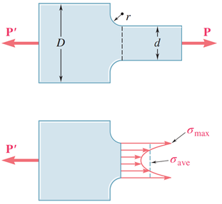
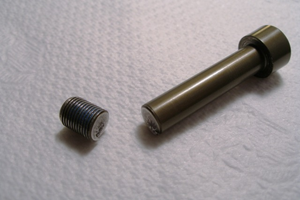
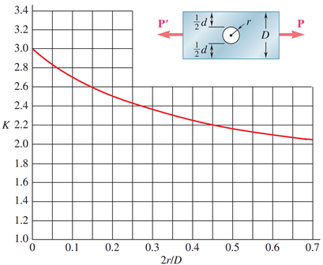

#### Stress Concentrators

Whenever there are external features on or inside a bar, such as fillets or holes, then the stress near the feature is going to be greater in the material near the feature. Take for example the bar in figure X above, which shows a bar with a fillet of radius r. If the bar is axially loaded, as seen in the figure, then clearly the stress must be larger in the section of the bar with diameter d compared to diameter D, as the cross-sectional area of the section of the bar with diameter d is smaller, creating a larger stress. However, this is not the entire story. The fillet itself causes the stress to increase around it. This result can be shown analytically but also makes sense intuitively. 

Notice in the picture of the sheared bolt above where the failure occurs, its right where the threading begins. The reason that this bolt would shear there as apposed to in the section that is not threaded is because the thread acts as a stress concentrator. Even if the effect is small the stress will be slightly higher in the threaded region of the bolt compared to the unthreaded region, so failure will occur in the threaded region. 

The analytical solutions for the case of a hole in the center of a bar and fillets on either side of a bar allow us to create graphs like the ones shown above, which describe the stress concentration factor K=σ_max/σ_avg  as a function of parameters in the problem. In this case σ_max is the maximum stress felt by the bar under an average applied stress of σ_avg. Notice something interesting in the graph showing the stress concentrator for a circular hole, as lim_(2r/D→0)⁡K=3, so as the size of the hole relative to the width of the bar gets arbitrarily close to zero the stress concentrator stays finite. This is not the case for the filler, where lim_(r/d→0)⁡K=∞ for all ratios D/d. Further reading on where the stress concentrator graph for the circular hole comes from can be found [here](https://www.fracturemechanics.org/hole.html) for those interested but is by no means required and will not be tested on. 