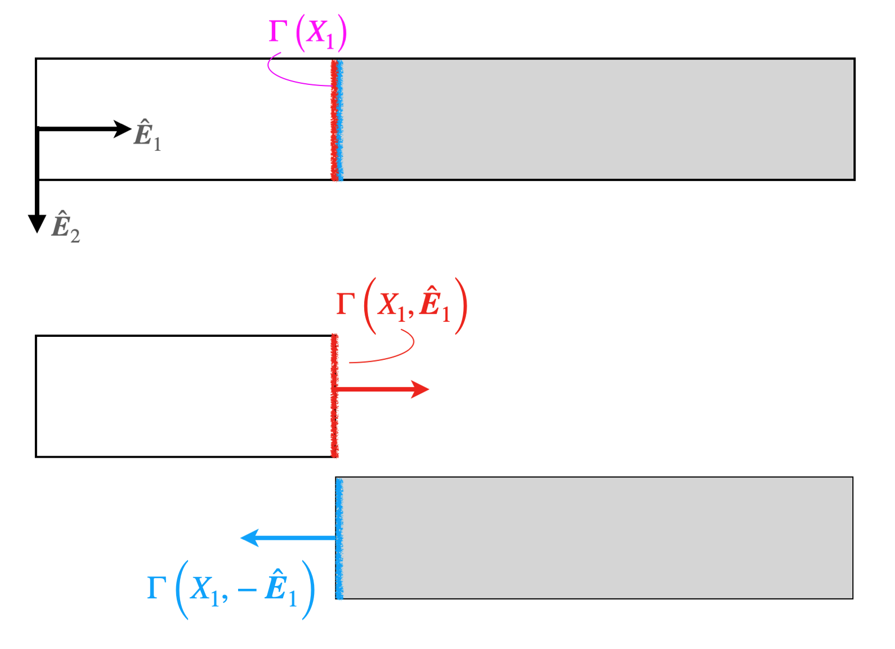




Going forward, it is necessary to properly understand which surface it is that is being referred to in the discussion. 

* $\Gamma(X_1)$ denotes the cross-section at $X_1$ (shown above in pink).
* $\Gamma(X_1, \hat{\boldsymbol{E}}_1)$ denotes the surface at $X_1$ whose outward normal is $\hat{\boldsymbol{E}}_1$ (shown above in red).
* $\Gamma(X_1, -\hat{\boldsymbol{E}}_1)$ denotes the surface at $X_1$ whose outward normal is $-\hat{\boldsymbol{E}}_1$ (shown above in blue).

