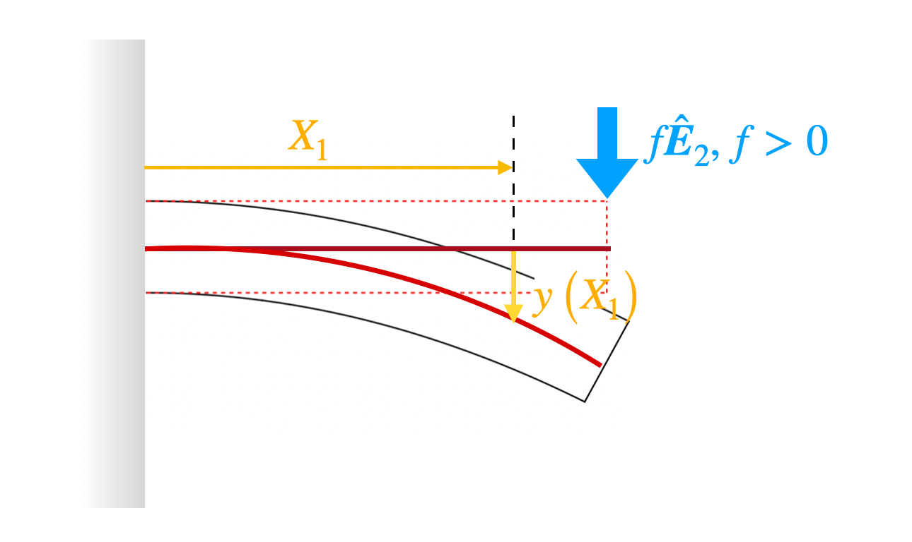
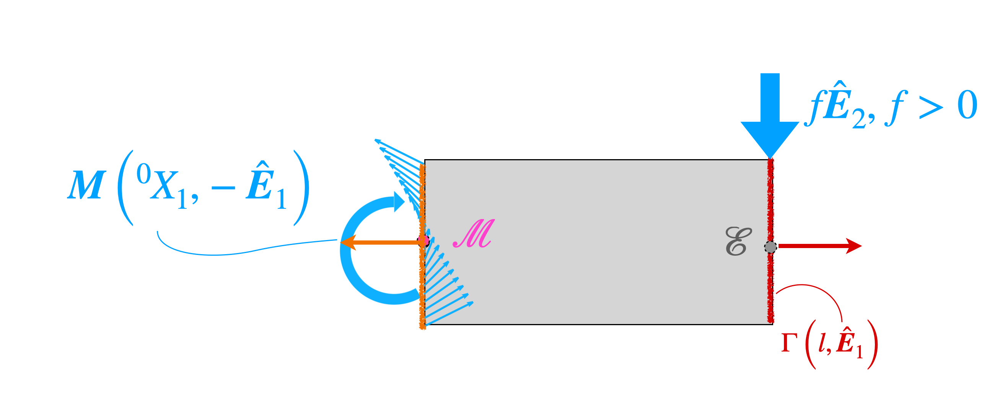




Consider the above shown cantilever of length $l$. We apply the force $f\hat{\boldsymbol{E}}_2$, where $f$ is a positive number, to its end. The moment on the cross-section at $^0 X_1$ due to the force is  $(l-^0 X_1)f \hat{\boldsymbol{E}}_3$. Let us a take closer look at how to derive this result. 

Consider the segment of the beam lying to the right of the cross-section at $^0 X_1$. This segment of the beam is shown in grey in the above figure. We denote the cross-section at $^0 X_1$ as $\Gamma(^0 X_1)$. The centroid of $\Gamma(^0 X_1)$ is $\mathcal{M}$. The position vector of $\mathcal{M}$ is, of course, $^0 X_1$. We determine how the bending moment varies along the length of beam by considering the equilibrium of the grey segment. Since the grey segment is in equilibrium we have that the moment of all the forces acting of segment about any point should vanish. Speciifically, we use the statement that  the   moment of all the forces acting about the point $\mathcal{M}$ should vanish. 

There are two sets of forces acting on the segment. The forces dues to the internal tractions on the surface $\Gamma(^0 X_1,-\hat{\boldsymbol{E}})$ and the force acting on the segement at the cantilever end point $\mathcal{E}$. The moment of the forces due to the tractions on the surface $\Gamma(^0 X_1,-\hat{\boldsymbol{E}})$ about the centroid of $\Gamma(^0 X_1)$ is by definition  the moment $\boldsymbol{M}(^0 X_1, -\hat{\boldsymbol{E}})$. The centroid of $\Gamma(^0 X_1)$, of courses, is $\mathcal{M}$. Therefore, moment of the forces due to the tractions on the surface $\Gamma(^0 X_1,-\hat{\boldsymbol{E}})$ about $\mathcal{M}$ is  $\boldsymbol{M}(^0 X_1, -\hat{\boldsymbol{E}})$. The moment due to the force $\boldsymbol{f}$ about $\mathcal{M}$ is  $(l-^ 0 X_1)\hat{\boldsymbol{E}}\_1\times f\hat{\boldsymbol{E}}\_2$. This expression simplifies to $(l-^ 0 X_1) \hat{\boldsymbol{E}}_3$. In summary,  sum of the moments due to all the  forces acting on the grey segment about the point $\mathcal{M}$ is 

$$
\begin{align}
\boldsymbol{M}(^0 X_1, -\hat{\boldsymbol{E}})+(l-^ 0 X_1) \hat{\boldsymbol{E}}_3&=\boldsymbol{0}.
\end{align}
$$
Using Newton's  third law we showed in [this section](./MomentsThirdLaw.md) that  $\boldsymbol{M}(^0 X_1, -\hat{\boldsymbol{E}})=-\boldsymbol{M}(^0 X_1, \hat{\boldsymbol{E}})$. So, in terms of $\boldsymbol{M}(^0 X_1, \hat{\boldsymbol{E}})$ the last displayed equation reads 

$$
\begin{align}
-\boldsymbol{M}(^0 X_1, \hat{\boldsymbol{E}})+(l-^ 0 X_1) \hat{\boldsymbol{E}}_3&=\boldsymbol{0}.
\end{align}
$$

Taking the dot product on both sides of the above equation with $\hat{\boldsymbol{E}}_3$ i8t follows that 

$$
\begin{align}
\boldsymbol{M}(^0 X_1, \hat{\boldsymbol{E}})\cdot \hat{\boldsymbol{E}}_3&=(l-^ 0 X_1) \hat{\boldsymbol{E}}_3.
\end{align}
$$

Recalling that $M(X_1)$ is defined to $\boldsymbol{M}(^0 X_1, \hat{\boldsymbol{E}})\cdot \hat{\boldsymbol{E}}_3$ it follows from the last equation that
$$
\begin{equation}
M(X_1)=(l-X_1)f
\end{equation}
$$

