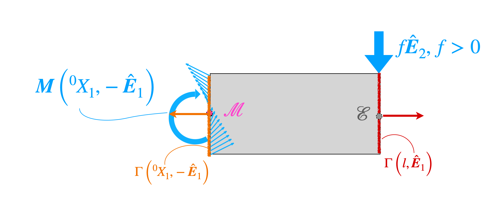




# End force loaded cantilever

Consider the above shown cantilever of length $l$. We apply the force $\boldsymbol{f}=f\hat{\boldsymbol{E}}_2$, where $f$ is a positive number, to its end. The moment on the cross-section at $^0\\! X_1$ due to the force is  $(l- ^0\\! X_1)f \hat{\boldsymbol{E}}_3$. Let us take a closer look at how to derive this result. 

Consider the segment of the beam lying to the right of the cross-section at $^0 X_1$. This segment of the beam is shown in gray in the above figure. We denote the cross-section at $^0 X_1$ as $\Gamma(^0 X_1)$. The centroid of $\Gamma(^0 X_1)$ is $\mathcal{M}$. The position vector of $\mathcal{M}$ is, of course, $^0 X_1\hat{\boldsymbol{E}}_1$. We determine how the bending moment varies along the length of beam by considering the equilibrium of the gray segment. Since the gray segment is in equilibrium, we have that the moment of all the forces acting on the segment about any point will be zero. Specifically, we use the statement that the moment of all the forces acting on the segment about the point $\mathcal{M}$ is zero. 

There are two sets of forces acting on the segment: the forces due to the internal tractions on the surface $\Gamma(^0 X_1,-\hat{\boldsymbol{E}})$ and the force acting on the segment at the cantilever end point $\mathcal{E}$. The moment of the forces due to the tractions on the surface $\Gamma(^0 X_1,-\hat{\boldsymbol{E}})$ about the centroid of $\Gamma(^0 X_1)$ is by definition  the moment $\boldsymbol{M}(^0 X_1, -\hat{\boldsymbol{E}})$. The centroid of $\Gamma(^0 X_1)$ is, of course, $\mathcal{M}$. Therefore, the moment of the forces due to the tractions on the surface $\Gamma(^0 X_1,-\hat{\boldsymbol{E}}_1)$ about $\mathcal{M}$ is  $\boldsymbol{M}(^0 X_1, -\hat{\boldsymbol{E}}_1)$. The moment due to the force $\boldsymbol{f}$ about $\mathcal{M}$ is  $(l-^0\\! X_1)\hat{\boldsymbol{E}}\_1\times f\hat{\boldsymbol{E}}\_2$. This expression simplifies to $(l-^0\\! X_1) \hat{\boldsymbol{E}}\_3$. In summary, the sum of the moments due to all the forces acting on the gray segment about the point $\mathcal{M}$ is 

$$
\begin{align}
\boldsymbol{M}(^0 X_1, -\hat{\boldsymbol{E}}_1)+(l-^0\! X_1)f \hat{\boldsymbol{E}}_3&=\boldsymbol{0}.
\end{align}
$$

Using Newton's  third law, we showed in [this section](./MomentsThirdLaw.md) that  

$$
\begin{align*}
\boldsymbol{M}(^0 X_1, -\hat{\boldsymbol{E}}\_1)=-\boldsymbol{M}(^0 X_1, \hat{\boldsymbol{E}}\_1).
\end{align*}
$$ 

So, in terms of $\boldsymbol{M}(^0 X_1, \hat{\boldsymbol{E}}\_1)$, the last displayed equation reads 

$$
\begin{align}
-\boldsymbol{M}(^0 X_1, \hat{\boldsymbol{E}}_1)+(l-^0\! X_1)f \hat{\boldsymbol{E}}_3&=\boldsymbol{0}.
\end{align}
$$

Taking the dot product on both sides of the above equation with $\hat{\boldsymbol{E}}_3$, it follows that 

$$
\begin{align}
\boldsymbol{M}(^0\! X_1, \hat{\boldsymbol{E}}_1)\cdot \hat{\boldsymbol{E}}_3&=(l-^0 \!X_1)f.
\end{align}
$$

Recalling that $M(X_1)$ is defined to be $\boldsymbol{M}(^0 \\!X_1, \hat{\boldsymbol{E}})\cdot \hat{\boldsymbol{E}}_3$, it follows from the last equation that

$$
\begin{equation}
M(X_1)=(l-X_1)f.
\end{equation}
$$

