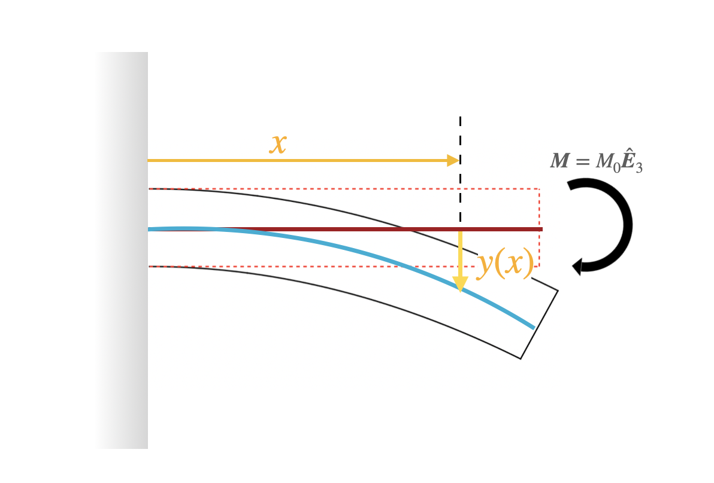




Say the end has the force $f\hat{\boldsymbol{E}}_2$. The moment on the cross-section $x$ is $(l-x)\hat{\boldsymbol{E}}_1\times f\hat{\boldsymbol{E}}_2=(l-x)f \hat{\boldsymbol{E}}_3$. Thus we have that 

$$
\begin{equation}
M(x)=(l-x)f
\end{equation}
$$

The constitutive equation for the beams is 
$$
\begin{equation}
E I y''(x)=M(x)
\end{equation}
$$

The term $E I$ is sometimes called the bending rigidity.

Integrating the constitutive equation two times we get 

$$
\begin{align}
E I y''(x)&=(l-x)f\\
y''(x)&=\frac{f}{E I}(l-x)\\
y'(x)&=\frac{f}{E I}(lx-\frac{x^2}{2})+c_1\\
y(x)&=\frac{f}{E I}(l\frac{x^2}{2}-\frac{x^3}{6})+c_1 x+c_2\\
\end{align}
$$

We next determine the contants $c_i$ by using the fact that $y(0)=0$ and $y'(0)=0$.
$y(0)=c_2$. Ths implies that $c_2=0$. $y'(0)=c_1$. This implies that $c_1=0$. 

$$
\begin{align}
y(x)&=\frac{f}{E I}\left(l\frac{x^2}{2}-\frac{x^3}{6}\right)\\
\end{align}
$$

let's find the end deflection of the cantilever.  

$$
\begin{align}
y(0)&=\frac{f}{E I}\left(\frac{l^3}{2}-\frac{l^3}{6}\right)\\
&=\frac{f}{E I}\left(\frac{l^3}{3}\right)\\
\end{align}
$$

The last result is typically written as 

$$
\begin{align}
\delta = \frac{f l^3}{3E I}
\end{align}
$$

## Simply supported beam 

Let's talks 