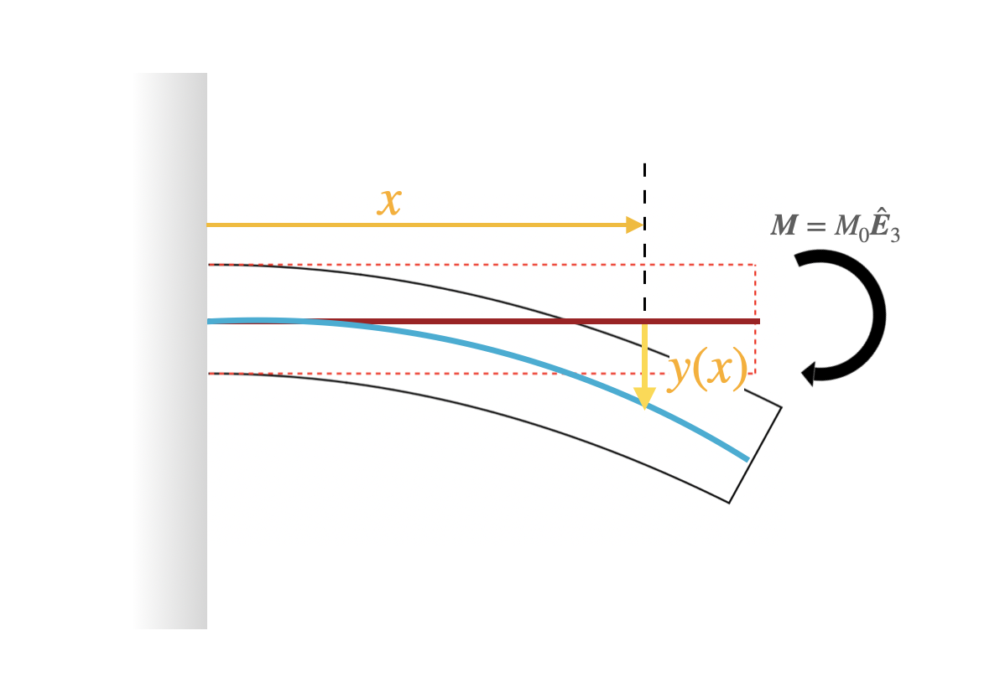
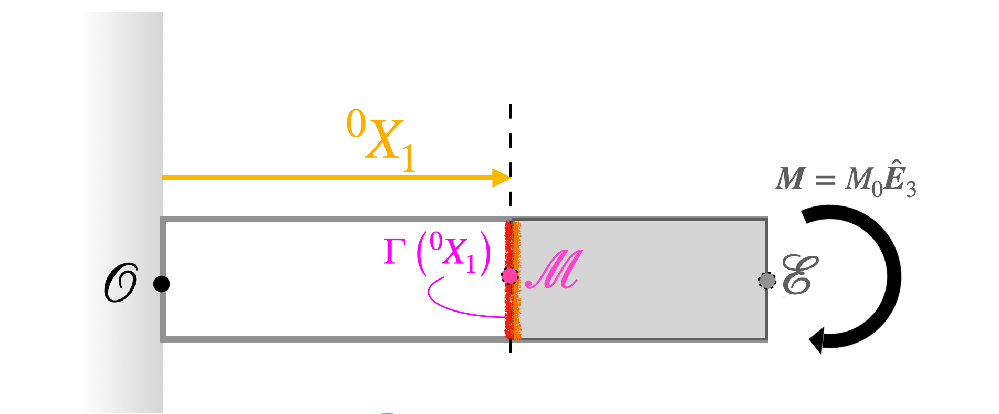
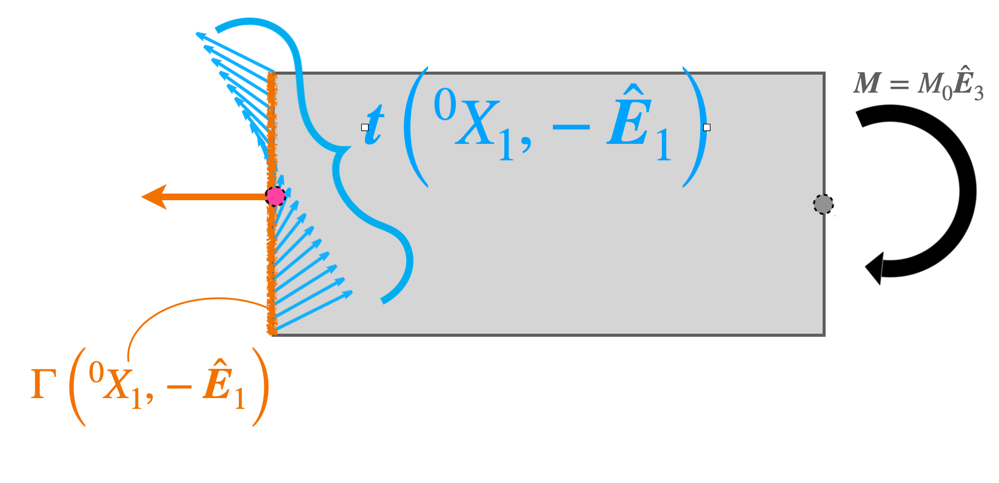
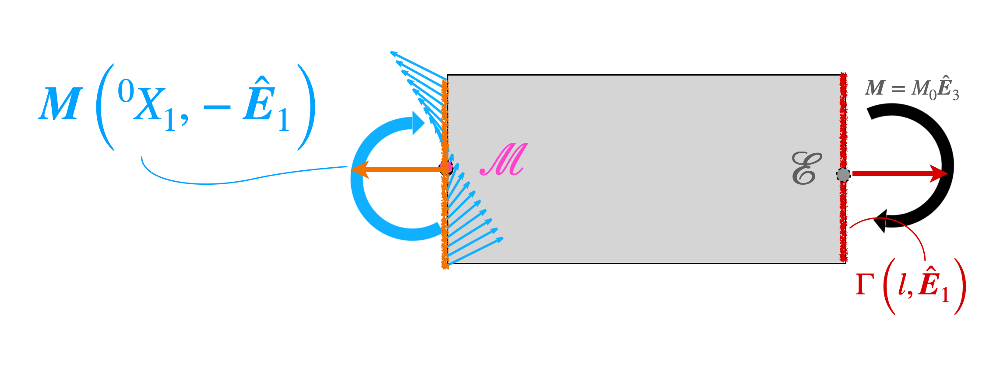




# End moment loaded cantilever

A bar is anchored on the left end and loaded on the right with a moment $M_0 \hat{\boldsymbol{E}}_3$, where $M_0$ is a positive real number. (A bar anchored on one of its end is called a cantilever.) In this section we will find the variation of the bending moment along the legth of the beam, and then deflected shape of the cantilever's neutral axis. 

### Calculation of the bending moment along the length of the beam

The bending moment at the cross-section $X_1$ is defined to be 

$$
\begin{align}
M(X_1)&= \boldsymbol{M}(X_1,\hat{\boldsymbol{E}}_1)\cdot \hat{\boldsymbol{E}}_3.
\end{align}
$$ 

The bending moment $\boldsymbol{M}(X_1,\hat{\boldsymbol{E}}_1)$ is the negative of the bending moment  $\boldsymbol{M}(X_1,-\hat{\boldsymbol{E}}_1)$. The bending moment $\boldsymbol{M}(X_1,-\hat{\boldsymbol{E}}_1)$ is the moment of the tractions acting on the surface $\Gamma({}^0 X_1, -\hat{\boldsymbol{E}}_1)$ about the centeroid  of the cross-section $\Gamma({}^0 X_1)$. The cross-section $\Gamma({}^0 X_1)$ is marked using a multi (orange and red) colored line in the below figure. The centeroid  of the cross-section $\Gamma({}^0 X_1)$ is marked as $\mathcal{M}$ in that same figure.

The segment of the beam lying between the material particles $\mathcal{M}$ and $\mathcal{E}$ is shown in the below figure. The material particle $\mathcal{E}$ is the centeroid of the right end face of the beam. The surface $\Gamma({}^0 X_1, -\hat{\boldsymbol{E}}_1)$ is represented by a orange vertical  line and a orange arrow. The tractions acting on $\Gamma({}^0 X_1, -\hat{\boldsymbol{E}}_1)$ are displayed using a arrays of blue arrows. They are values of the traction field $\boldsymbol{t}\left({}^0 X_1,-\hat{\boldsymbol{E}}_1\right)$ over the cross-section $\Gamma({}^0 X_1)$. 

#### Balance of bending moment

The entire beam is in equilibrium, which implies that each segment of the beam is also in equilibrium. More relevant to us the  gray segment of the beam shown in the above figure is in equilibrium. Equilibrium means that the net forces on the segment is zero, and the sum of the moments of those forces about any point is also zero. Let us use the fact that  the sum of the moments of all the forces acting on the gray segment about the point $\mathcal{M}$ are zero. 

There are two sets of forces acting on the gray segment. The first set of forces act on the surface $\Gamma({}^0 X_1, -\hat{\boldsymbol{E}}_1)$, and the second set of forces act on the right face of the cantilever.

The first set of forces are those due to the traction field $\boldsymbol{t}\left({}^0 X_1,-\hat{\boldsymbol{E}}_1\right)$ acting on the cross-section $\Gamma(^{0}X_1)$. By definition the moment of those forces about the point $\mathcal{M}$ is $\boldsymbol{M}\left({}^0 X_1,-\hat{\boldsymbol{E}}_1\right)$

The second set of forces are the applied set of forces on the right face of the cantilever. The right face of the cantilever is represented by a dark red vertical  line and a dark red arrow. It is marked at $\Gamma(l, \hat{\boldsymbol{E}}_1)$, where $l$ is the length of the cantilever. The forces acting on the surface  $\Gamma(l, \hat{\boldsymbol{E}}_1)$ are not shown explicitly. However, we know from the problem statement that those forces give rise to the moment $M_0 \hat{\boldsymbol{E}}_1)$ about the point $\mathcal{E}$. In thise  section that is a set of force give rise to so  
The second set of forces are the applied set of forces on the right face of the cantilever. The right face of the cantilever is represented by a dark red vertical  line and a dark red arrow. It is marked at $\Gamma(l, \hat{\boldsymbol{E}}_1)$, where $l$ is the length of the cantilever. The forces acting on the surface  $\Gamma(l, \hat{\boldsymbol{E}}_1)$ are not shown explicitly. However, we know from the problem statement that those forces give rise to the moment $M_0 \hat{\boldsymbol{E}}_1)$ about the point $\mathcal{E}$. It follows from the results of  a previous section that the moment of the forces acting on the surface  $\Gamma(l, \hat{\boldsymbol{E}}_1)$ about the point $\mathcal{M}$ is $M_0 \hat{\boldsymbol{E}}_1)$.

In summary, the sum of the moments of all the forces acting on the gray segment about $\mathcal{M}$ is 

$$
\begin{align}
\boldsymbol{M}\left({}^0 X_1,-\hat{\boldsymbol{E}}_1\right)+
M_0 \hat{\boldsymbol{E}}_3&=\boldsymbol{0}
\end{align}
$$

From the results of  a previous section $\boldsymbol{M}(X_1,-\hat{\boldsymbol{E}}_1)=-\boldsymbol{M}(X_1,\hat{\boldsymbol{E}}_1)$. Thus, it follows from the previous displayed equation that 

$$
\begin{align}
\boldsymbol{M}\left({}^0 X_1,\hat{\boldsymbol{E}}_1\right)
&=M_0 \hat{\boldsymbol{E}}_3\\
\boldsymbol{M}\left({}^0 X_1,\hat{\boldsymbol{E}}_1\right)\cdot \hat{\boldsymbol{E}}_3
&=M_0 \\
M(X_1)
&=M_0 
\end{align}
$$

In summary we have that the bending moment along the length of cantilever is constant, and is equal to the that applied to the cantilever's right face.