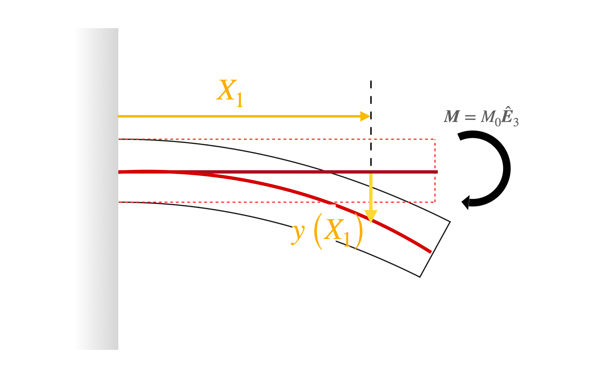




# End moment loaded cantilever

In this [previous section](EndMomentMoment.md), we found that for the above sketched problem, the moment along the beam's length is a constant. That is 

$$
\begin{align}
M(X_1)
&=M_0 
\end{align}
$$

In this section, we will determine the shape of the deformed beam by solving the
differential equation 

$$
\begin{align}
E I y''\left(X_1\right)= M(X_1)
\end{align}
$$

for the function $y(\cdot)$.

Integrating both sides of the differential equation once we get that

$$
\begin{align}
E I y'\left(X_1\right)= M_0 X_1+C_1, 
\end{align}
$$

where $C_1$, as of yet, is an unknown constant. We can determine $C_1$ by noting that the slope of the neutral axis has to vanish at $X_1=0$. Thus, by applying the condition $\left. y'\left(X_1\right)\right|_{X_1=0}=0$, we get that $C_1=0$. Hence the last equation can be simplified to read

$$
\begin{align}
E I y'\left(X_1\right)= M_0 X_1.
\end{align}
$$

Integrating both sides of the above differential equation once, we get that

$$
\begin{align}
E I y\left(X_1\right)= M_0 \frac{X_1^2}{2}+C_0,
\end{align}
$$

where $C_0$, as of yet, is an unknown constant. We can determine $C_0$ by noting that the value $y(0)$ has to vanish, since the cantilever is anchored on its left end and therefore the left end cannot move, i.e., have non-zero displacement. By applying the condition $y(0)=0$, we get that $C_0=0$. Hence the last equation can be simplified to read

$$
\begin{align}
E I y\left(X_1\right)= M_0 \frac{X_1^2}{2}.
\end{align}
$$
