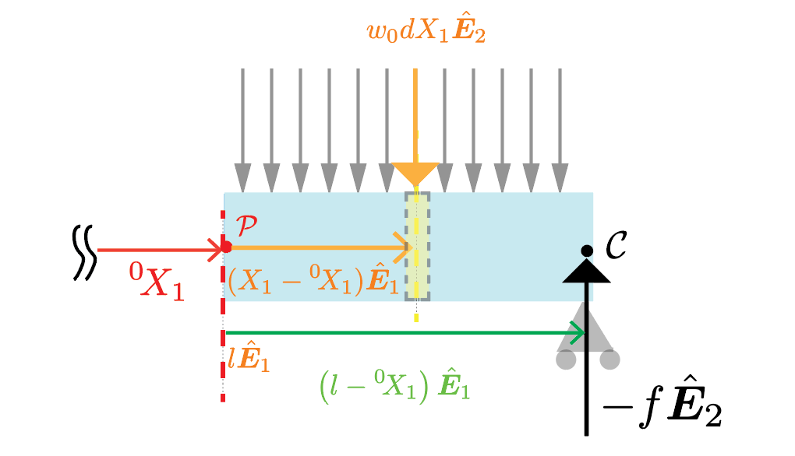




Let us compute the moment of all the forces acting over the infinitesimal rectangular material region centered around the materials particle $X_1$ and having a width $d X_1$, which we denote as $d\mathcal{R}$. The net force $d\boldsymbol{f}$ acting over this region is $w_0 d X_1\hat{\boldsymbol{E}}_2$. The moment arm of this infinitesimal force is $(X_1-{}^0\! X_1)\hat{\boldsymbol{E}}_1 $. Thus the net moment of the force acting over the region $d\mathcal{R}$ is $ d\boldsymbol{M}_3=(X_1-{}^0\! X_1)\hat{\boldsymbol{E}}_1 \times w_0 d X_1\hat{\boldsymbol{E}}_2$. This last quation simplifies to $ w_0(X_1-{}^0\! X_1) d X_1\hat{\boldsymbol{E}}_3$. From this last calculation it follows that the momemnt due to the forces acting over the entire  region is 

$$
\begin{align}
\boldsymbol{M}_3&=\int_{X_1={}^0\! X_1}^{X_1=l}w_0(X_1-{}^0\! X_1) d X_1\hat{\boldsymbol{E}}_3,\\
&= \frac{w_0}{2}(l-{}^0\! X_1)^2 \hat{\boldsymbol{E}}_3.
\end{align}
$$
