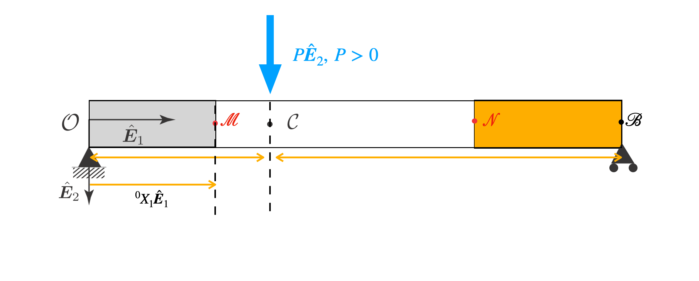




The reaction force at the left support is $\boldsymbol{f}_1=-f_1\hat{\boldsymbol{E}}_2$. The reaction force at the right support is $\boldsymbol{f}_2=-f_2\hat{\boldsymbol{E}}_2$.

The applied force is  $\boldsymbol{P}=P\hat{\boldsymbol{E}}_2$.

From balance of forces we get that 

$$
\begin{align}
\boldsymbol{P}+\boldsymbol{f}_1+\boldsymbol{f}_2&=\boldsymbol{0}\\
P\hat{\boldsymbol{E}}_2-f_1\hat{\boldsymbol{E}}_2-f_2\hat{\boldsymbol{E}}_2&=0\\
f_1+f_2&=P
\end{align}
$$

Let us compute the moment of all the forces acting the beam about the point $B$. The moment due to $\boldsymbol{f}_2$ vanishes. The moment due to $\boldsymbol{f}_1$ is $(-(a+b)\hat{\boldsymbol{E}}_1)\times (-f\_1\hat{\boldsymbol{E}}_2)$, which simplifies to $f_1(a+b)\hat{\boldsymbol{E}}_3$. The moment due to $\boldsymbol{P}$ is $(-b\hat{\boldsymbol{E}}_1)\times (P\hat{\boldsymbol{E}}_2)$, which simplifies to $-Pb\hat{\boldsymbol{E}}_3$.  Since the moment of all the forces acting on the segement should be zero about any point, we have that

$$
\begin{align}
f_1(a+b)\hat{\boldsymbol{E}}_3
-Pb\hat{\boldsymbol{E}}_3&=0\\
f_1=\frac{P b}{(a+b)}
\end{align}
$$

From the last two equations we get that 
$$
\begin{align}
f_1&=\frac{P b}{(a+b)}\\
f_2&=\frac{P a}{(a+b)}
\end{align}
$$

#### Moment along the beam

Consider the segment lying between the points $A$ and $P$. We will next compute the moment of all the foces acting on the segement about the point $P$. The moment of the tractions on the surface $\Gamma(X_1,\hat{\boldsymbol{E}}_1)$ about the centeroid of $\Gamma(X_1)$
is $\boldsymbol{M}(X_1,\hat{\boldsymbol{E}}_1)$. The only other forces acting on the segement is the left reaction force. The momemnt of this force is $(-X\_1\hat{\boldsymbol{E}}_1)\times (-f\_1\hat{\boldsymbol{E}}_2)$ which simplifies to $ P X_1  b/(a+b)\hat{\boldsymbol{E}}_3$. Since the moment of all the forces acting on the segement should be zero about any point, we have that 

$$
\begin{align}
\boldsymbol{M}(X_1,\hat{\boldsymbol{E}}_1)+P X_1  b/(a+b)\hat{\boldsymbol{E}}_3=\boldsymbol{0},
\end{align}
$$
from which it follows that 
$$
\begin{align}
M(X_1)&=-\frac{P b X_1 }{(a+b)}  \quad \forall X_1\in(0,a),
\end{align}
$$

Consider the segment lying between the points $Q$ and $B$. We will next compute the moment of all the foces acting on the segement about the point $Q$. The moment of the tractions on the surface $\Gamma(X_1,-\hat{\boldsymbol{E}}_1)$ about the centeroid of $\Gamma(X_1)$
is $\boldsymbol{M}(X_1,-\hat{\boldsymbol{E}}_1)$. The only other forces acting on the segement is the right reaction force. The momemnt of this force is $((a+b)-X\_1\hat{\boldsymbol{E}}_1)\times (-f\_2\hat{\boldsymbol{E}}_2)$ which simplifies to $ - P a((a+b)-X_1) /(a+b)\hat{\boldsymbol{E}}_3$. Since the moment of all the forces acting on the segement should be zero about any point, we have that 

$$
\begin{align}
\boldsymbol{M}(X_1,-\hat{\boldsymbol{E}}_1)-P a\left(1-\frac{X_1}{(a+b)}\right)  \hat{\boldsymbol{E}}_3&=\boldsymbol{0},\\
-\boldsymbol{M}(X_1,\hat{\boldsymbol{E}}_1)&=P a\left(1-\frac{X_1}{(a+b)}\right)  \hat{\boldsymbol{E}}_3\\
\boldsymbol{M}(X_1,\hat{\boldsymbol{E}}_1)\cdot \hat{\boldsymbol{E}}_3&=-P a\left(1-\frac{X_1}{(a+b)}\right)
\end{align}
$$
from which it follows that 
$$
\begin{align}
M(X_1)&=P a\left(\frac{X_1}{(a+b)}-1\right) \quad \forall X_1\in(a,a+b),
\end{align}
$$

Integrating the governing differential equation we get that

$$
\begin{align}
E I y'(X_1)&=-\frac{P b X_1^2 }{2(a+b)}+C_1,\quad \forall X_1\in(a,b)\\
E I y'(X_1)&=P a\left(\frac{X_1^2}{2(a+b)}-X_1\right)+B_1 \quad \forall X_1\in(a,a+b)
\end{align}
$$

We know that 
$$
\begin{align}
\lim_{X_1\to a^-}y'(X_1)&=\lim_{X_1\to a^+}y'(X_1)\\
-\frac{P b a^2 }{2(a+b)}+C_1&=P a\left(\frac{a^2}{2(a+b)}-a\right)+B_1\\
-\frac{P b a^2 }{2(a+b)}+C_1&=\frac{P a^3}{2(a+b)}-P a^2+B_1\\
C_1&=\frac{P a^2}{2(a+b)}\left(a-2(a+b)+b\right)+B_1\\
C_1&=-\frac{P a^2}{2}+B_1
\end{align}
$$

Integrating $y'(\cdot)$ once we get

$$
\begin{align}
E I y(X_1)&=-\frac{P b X_1^3 }{6(a+b)}+C_1 X_1 +C_0,\quad \forall X_1\in(a,b)\\
E I y(X_1)&=P a\left(\frac{X_1^3}{6(a+b)}-\frac{X_1^2}{2}\right)+B_1 X_1+B_0 \quad \forall X_1\in(a,a+b)
\end{align}
$$

#### Setting $y(0)=0$ 

We have that $C_0=0$. 

#### Setting $\lim_{X_1\to a^-}y(X_1)=\lim_{X_1\to a^+}y(X_1)$
$$
\begin{align}
\lim_{X_1\to a^-}y(X_1)&=\lim_{X_1\to a^+}y(X_1)\\
-\frac{P b a^3 }{6(a+b)}+C_1 a&= P a\left(\frac{a^3}{6(a+b)}-\frac{a^2}{2}\right)+B_1 X_1+B_0\\
-\frac{P b a^3 }{6(a+b)}+C_1 a&= \frac{P a^4}{6(a+b)}-\frac{P a^3}{2}+B_1 a+B_0\\
-\frac{P b a^3 }{6(a+b)}-\frac{P a^3}{2}+B_1 a&= \frac{P a^4}{6(a+b)}-\frac{P a^3}{2}+B_1 a+B_0\\
-\frac{P b a^3 }{6(a+b)}&= \frac{P a^4}{6(a+b)}+B_0\\
-\frac{P b a^3 }{6(a+b)}-\frac{P a^4}{6(a+b)}&= B_0\\
B_0&=-\frac{P a^3}{6(a+b)} \left ( b+a\right)\\
B_0&=-\frac{P a^3}{6} 
\end{align}
$$

#### Setting $y(a+b)=0$

$$
\begin{align}
P a\left(\frac{(a+b)^3}{6(a+b)}-\frac{(a+b)^2}{2}\right)+B_1 (a+b)+B_0&=0\\
P a\left(\frac{(a+b)^2}{6}-\frac{(a+b)^2}{2}\right)+B_1 (a+b)-\frac{P a^3}{6} &=0\\
-P a \frac{(a+b)^2}{3}+B_1 (a+b)-\frac{P a^3}{6} &=0\\
B_1 (a+b)&=\frac{P a}{6} \left(2(a+b)^2+a^2\right) 
\end{align}
$$

#### C_1

$$
\begin{align}
C_1&=-\frac{P a^2}{2}+B_1\\
&=-\frac{P a^2}{2}+\frac{P a}{6 L } \left(2(a+b)^2+a^2\right) \\
&=-\frac{P a^2}{2}+\frac{P a}{6 L } \left(3a^2 +2b^2+4ab\right)\\
&=\frac{P a}{6 L}\left(-3 aL + 3a^2 +2b^2+4ab \right)\\
&=\frac{P a}{6 L}\left(-3 a^2-3ab + 3a^2 +2b^2+4ab \right)\\
&=\frac{P a b}{6 L}\left( 2b+a \right)
\end{align}
$$

Thus the deflection for is 

$$
\begin{align}
E I y(X_1)&=-\frac{P b X_1^3 }{6(a+b)}+\frac{P a b}{6 L}\left( 2b+a \right) X_1 ,\quad \forall X_1\in(a,b)\\
E I y(X_1)&=P a\left(\frac{X_1^3}{6(a+b)}-\frac{X_1^2}{2}\right)+\frac{P a}{6 L} \left(2(a+b)^2+a^2\right) X_1-\frac{P a^3}{6}  \quad \forall X_1\in(a,a+b)
\end{align}
$$