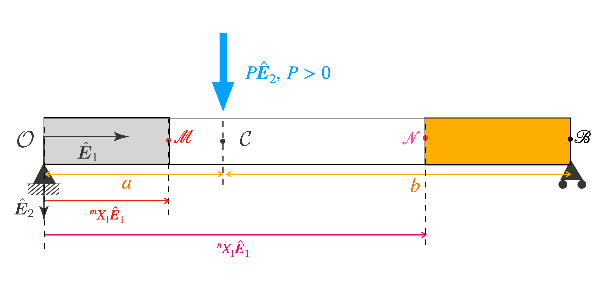




In this section, we will solve for the bending moment along the length of a beam supported and loaded as shown in the below figure. 

Let the reaction force at the left support be $\boldsymbol{f}_1=-f_1\hat{\boldsymbol{E}}_2$, and let the reaction force at the right support be $\boldsymbol{f}_2=-f_2\hat{\boldsymbol{E}}_2$. The applied force is  $\boldsymbol{P}=P\hat{\boldsymbol{E}}_2$.

From balance of forces,  we get that 

$$
\begin{align}
\boldsymbol{P}+\boldsymbol{f}_1+\boldsymbol{f}_2&=\boldsymbol{0}\notag\\
P\hat{\boldsymbol{E}}_2-f_1\hat{\boldsymbol{E}}_2-f_2\hat{\boldsymbol{E}}_2&=0\notag\\
f_1+f_2&=P
\end{align}
$$

Let us compute the moment of all the forces acting the beam about the point $\mathcal{B}$. The moment due to $\boldsymbol{f}_2$ vanishes. The moment due to $\boldsymbol{f}_1$ is $(-(a+b)\hat{\boldsymbol{E}}_1)\times (-f\_1\hat{\boldsymbol{E}}_2)$, which simplifies to $f_1(a+b)\hat{\boldsymbol{E}}_3$. The moment due to $\boldsymbol{P}$ is $(-b\hat{\boldsymbol{E}}_1)\times (P\hat{\boldsymbol{E}}_2)$, which simplifies to $-Pb\hat{\boldsymbol{E}}_3$.  Since the moment of all the forces acting on the beam should be zero about any point, we have that

$$
\begin{align}
f_1(a+b)\hat{\boldsymbol{E}}_3
-Pb\hat{\boldsymbol{E}}_3&=0\nonumber\\
f_1=\frac{P b}{(a+b)}
\end{align}
$$

It follows from the last two numbered equations that 
$$
\begin{align}
f_1&=\frac{P b}{(a+b)},\\
f_2&=\frac{P a}{(a+b)}.
\end{align}
$$

#### Moment along the beam

Let $\mathcal{M}$ be some material particle between the points $\mathcal{O}$ and $\mathcal{C}$, where  $\mathcal{C}$ is the material particle upon which the applied force $\boldsymbol{P}$ acts. 
Consider the segment lying between the points $\mathcal{O}$ and $\mathcal{M}$ (shown in grey in the figure). We will next compute the moment of all the foces acting on the segment about the point $\mathcal{M}$. The position vector of $\mathcal{M}$ is ${}^m\\! X_1\hat{\boldsymbol{E}}_1$.  The moment of the tractions on the surface $\Gamma({}^m\\! X_1,\hat{\boldsymbol{E}}_1)$ about the centroid  of the surface $\Gamma({}^m\\! X_1)$, which is the point $\mathcal{M}$, is, by definition, $\boldsymbol{M}({}^m\\!X_1,\hat{\boldsymbol{E}}_1)$. The only other force acting on the segment is the left reaction force. The moment of this force is $(-{}^m\\! X\_1\hat{\boldsymbol{E}}_1)\times (-f\_1\hat{\boldsymbol{E}}_2)$ which simplifies to $ P X_1  b/(a+b)\hat{\boldsymbol{E}}_3$. Since the moment of all the forces acting on the segement should be zero about any point, we have that 

$$
\begin{align}
\boldsymbol{M}({}^m\!X_1,\hat{\boldsymbol{E}}_1)+\frac{P b}{(a+b)}{}^m\! X_1\hat{\boldsymbol{E}}_3=\boldsymbol{0},
\end{align}
$$
from which it follows that 
$$
\begin{align}
M(X_1)&=-\frac{P b X_1 }{(a+b)}  \quad \forall X_1\in(0,a).
\end{align}
$$

Let $\mathcal{N}$ be some material particle between the points $\mathcal{C}$ and $\mathcal{B}$, where the material particle $\mathcal{B}$ is on the right face of the beam. Now consider the segment lying between the points $\mathcal{N}$ and $B$. This segment is shown in orange in the figure. Let the position vector of $\mathcal{N}$ be ${}^n\\! X_1\hat{\boldsymbol{E}}_1$. We will next compute the moment of all the forces acting on the segment about the point $\mathcal{N}$. The moment of the tractions on the surface $\Gamma({}^n\\!X_1,-\hat{\boldsymbol{E}}_1)$ about the centroid of $\Gamma({}^n\\!X_1)$, which is nothing but the point $\mathcal{N}$, is, by definition, $\boldsymbol{M}({}^n\\!X_1,-\hat{\boldsymbol{E}}_1)$. The only other forces acting on the segment is the right reaction force. The moment of this force is $((a+b)-{}^n\\!X\_1)\hat{\boldsymbol{E}}_1)\times (-f\_2\hat{\boldsymbol{E}}_2)$, which simplifies to $ - P a((a+b)-{}^n\\!X_1) /(a+b)\hat{\boldsymbol{E}}_3$. Since the moment of all the forces acting on the segment should be zero about any point, we have that 

$$
\begin{align}
\boldsymbol{M}({}^n\!X_1,-\hat{\boldsymbol{E}}_1)-P a\left(1-\frac{ ^n\!X_1}{(a+b)}\right)  \hat{\boldsymbol{E}}_3&=\boldsymbol{0},\\
-\boldsymbol{M}({}^n\!X_1,\hat{\boldsymbol{E}}_1)&=P a\left(1-\frac{ ^n\!X_1}{(a+b)}\right)  \hat{\boldsymbol{E}}_3\\
\boldsymbol{M}({}^n\!X_1,\hat{\boldsymbol{E}}_1)\cdot \hat{\boldsymbol{E}}_3&=-P a\left(1-\frac{ ^n\!X_1}{(a+b)}\right)
\end{align}
$$
from which it follows that 
$$
\begin{align}
M(X_1)&=P a\left(\frac{X_1}{(a+b)}-1\right) \quad \forall X_1\in(a,a+b),
\end{align}
$$

Integrating the governing differential equations (6) and (9), we get that

$$
\begin{align}
E I y'(X_1)&=-\frac{P b X_1^2 }{2(a+b)}+C_1,\quad \forall X_1\in(0, a)\\
E I y'(X_1)&=P a\left(\frac{X_1^2}{2(a+b)}-X_1\right)+B_1 \quad \forall X_1\in(a,a+b)
\end{align}
$$

#### Setting $\lim_{X_1\to a^-}y'(X_1)=\lim_{X_1\to a^+}y'(X_1)$ we get $C_1$ in terms of $B_1$
We know that 
$$
\begin{align}
\lim_{X_1\to a^-}y'(X_1)&=\lim_{X_1\to a^+}y'(X_1)\\
-\frac{P b a^2 }{2(a+b)}+C_1&=P a\left(\frac{a^2}{2(a+b)}-a\right)+B_1\\
-\frac{P b a^2 }{2(a+b)}+C_1&=\frac{P a^3}{2(a+b)}-P a^2+B_1\\
C_1&=\frac{P a^2}{2(a+b)}\left(a-2(a+b)+b\right)+B_1\\
C_1&=-\frac{P a^2}{2}+B_1
\end{align}
$$

#### Second integration
Taking (11) and (12) and integrating $y'(\cdot)$ once, we get

$$
\begin{align}
E I y(X_1)&=-\frac{P b X_1^3 }{6(a+b)}+C_1 X_1 +C_0,\quad \forall X_1\in(0, a)\\
E I y(X_1)&=P a\left(\frac{X_1^3}{6(a+b)}-\frac{X_1^2}{2}\right)+B_1 X_1+B_0 \quad \forall X_1\in(a,a+b)
\end{align}
$$

#### Setting $y(0)=0$ we get $C_0$

We have that $C_0=0$. 

#### Setting $\lim_{X_1\to a^-}y(X_1)=\lim_{X_1\to a^+}y(X_1)$ we get $B_0$
$$
\begin{align}
\lim_{X_1\to a^-}y(X_1)&=\lim_{X_1\to a^+}y(X_1)\\
-\frac{P b a^3 }{6(a+b)}+C_1 a&= P a\left(\frac{a^3}{6(a+b)}-\frac{a^2}{2}\right)+B_1 X_1+B_0\\
-\frac{P b a^3 }{6(a+b)}+C_1 a&= \frac{P a^4}{6(a+b)}-\frac{P a^3}{2}+B_1 a+B_0\\
-\frac{P b a^3 }{6(a+b)}-\frac{P a^3}{2}+B_1 a&= \frac{P a^4}{6(a+b)}-\frac{P a^3}{2}+B_1 a+B_0\\
-\frac{P b a^3 }{6(a+b)}&= \frac{P a^4}{6(a+b)}+B_0\\
-\frac{P b a^3 }{6(a+b)}-\frac{P a^4}{6(a+b)}&= B_0\\
B_0&=-\frac{P a^3}{6(a+b)} \left ( b+a\right)\\
B_0&=-\frac{P a^3}{6} 
\end{align}
$$

#### Setting $y(a+b)=0$ we get $B_1$

$$
\begin{align}
P a\left(\frac{(a+b)^3}{6(a+b)}-\frac{(a+b)^2}{2}\right)+B_1 (a+b)+B_0&=0\\
P a\left(\frac{(a+b)^2}{6}-\frac{(a+b)^2}{2}\right)+B_1 (a+b)-\frac{P a^3}{6} &=0\\
-P a \frac{(a+b)^2}{3}+B_1 (a+b)-\frac{P a^3}{6} &=0\\
B_1 (a+b)&=\frac{P a}{6} \left(2(a+b)^2+a^2\right) \\
B_1&=\frac{P a}{6(a+b)} \left(2(a+b)^2+a^2\right) 
\end{align}
$$

#### Explicit form of $C_1$

$$
\begin{align}
C_1&=-\frac{P a^2}{2}+B_1\\
&=-\frac{P a^2}{2}+\frac{P a}{6 (a+b) } \left(2(a+b)^2+a^2\right) \\
&=-\frac{P a^2}{2}+\frac{P a}{6 (a+b) } \left(3a^2 +2b^2+4ab\right)\\
&=\frac{P a}{6 (a+b)}\left(-3 aL + 3a^2 +2b^2+4ab \right)\\
&=\frac{P a}{6 (a+b)}\left(-3 a^2-3ab + 3a^2 +2b^2+4ab \right)\\
&=\frac{P a b}{6 (a+b)}\left( 2b+a \right)
\end{align}
$$

Thus the beam's deflection is  

$$
\begin{align}
E I y(X_1)&=-\frac{P b X_1^3 }{6(a+b)}+\frac{P a b}{6 (a+b)}\left( 2b+a \right) X_1 ,\quad \forall X_1\in(a,b)\\
E I y(X_1)&=P a\left(\frac{X_1^3}{6(a+b)}-\frac{X_1^2}{2}\right)+\frac{P a}{6 (a+b)} \left(2(a+b)^2+a^2\right) X_1-\frac{P a^3}{6}  \quad \forall X_1\in(a,a+b)
\end{align}
$$