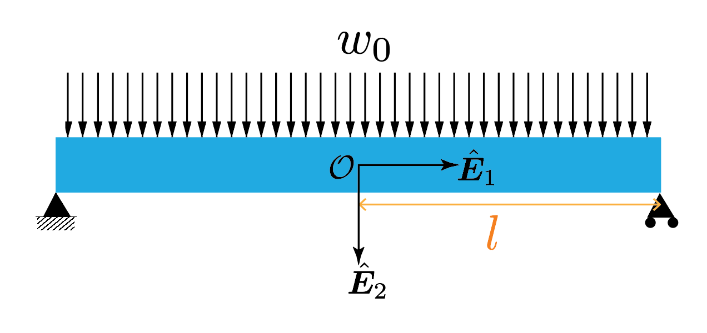




In this section we will determine the shape of the neutral axis after deformation for the below beam problem. 

The beam is simply supported at both ends. The external loading on the beam is such that each segement of the beam of length $\Delta X_1$ experiences an external force of $w_0 \Delta X_1 \hat{\boldsymbol{E}}\_1$ irrespective of where it is located.  

Recall, that in order to get the the shape of the neutral axis after deformation we need to solve the differential equation

$$ 
\begin{align}
E I y''\left(X_1\right)&= M(X_1)\\
M(X_1)&:=\boldsymbol{M}(X_1,\hat{\boldsymbol{E}}_1)\cdot \hat{\boldsymbol{E}}_3
\end{align}
$$

Before proceeding forward we need to find the reaction forces at the two supports. From symmetry to postulate that the reaction forces are equal to one another. We denote the reaction force at each support as $-f\hat{\boldsymbol{E}}_2$.

From the translational equailibrium of the entire beam in the $\hat{\boldsymbol{E}}_2$ direction we have that 

$$
\begin{align}
-2f\hat{\boldsymbol{E}}_2+w_0 L \hat{\boldsymbol{E}}_2 &=0\\
f &=w_0 L,\\
 &=w_0 l,
\end{align}
$$
where to get the last equation we set $L=2l$ in the second to last equation. 

From the balance of moment around the point ${}^0\! X_1$ we have that
$$
\begin{align}
\boldsymbol{M}({}^0\! X_1,-\hat{\boldsymbol{E}}_1)+(l-{}^0\! X_1)\hat{\boldsymbol{E}}_1 \times -f \hat{\boldsymbol{E}}_2+\int_{\xi=0}^{\xi=l-{}^0\! X_1}\xi \hat{\boldsymbol{E}}_1\times w_0 \, d\xi \hat{\boldsymbol{E}}_2&=0\\
\boldsymbol{M}({}^0\! X_1,-\hat{\boldsymbol{E}}_1)-(l-{}^0\! X_1) f \hat{\boldsymbol{E}}_3+\frac{w_0}{2}(l-{}^0\! X_1)^2&=0\\
\boldsymbol{M}({}^0\! X_1,-\hat{\boldsymbol{E}}_1) \cdot \hat{\boldsymbol{E}}_3&=(l-{}^0\! X_1) w_0 l -\frac{w_0}{2}(l-{}^0\! X_1)^2\\
&=\frac{w_0}{2}(l-{}^0\! X_1)(l+{}^0\! X_1)  \\
&=\frac{w_0}{2}(l^2-\left({}^0\! X_1\right)^2)
\end{align}
$$

Noting that $\boldsymbol{M}({}^0\! X_1,-\hat{\boldsymbol{E}}_1)=-\boldsymbol{M}({}^0\! X_1,\hat{\boldsymbol{E}}_1)$ in the last equation we 
$$
\begin{align}
\boldsymbol{M}({}^0\! X_1,\hat{\boldsymbol{E}}_1)\cdot \hat{\boldsymbol{E}}_3&=-\frac{w_0}{2}(l^2-\left({}^0\! X_1\right)^2)
\end{align}
$$

$$
\begin{align}
M(X_1)&=-\frac{w_0}{2}(l^2- X_1^2)
\end{align}
$$
