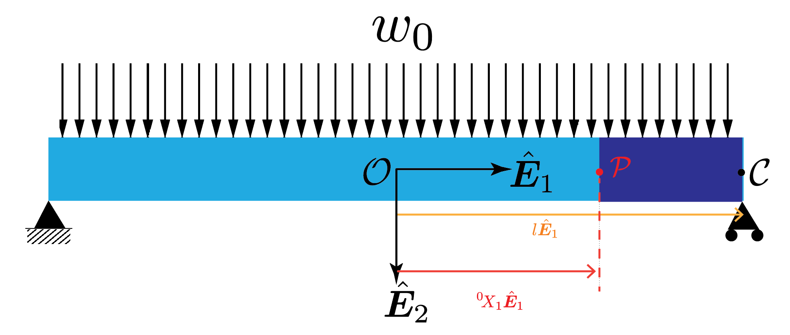
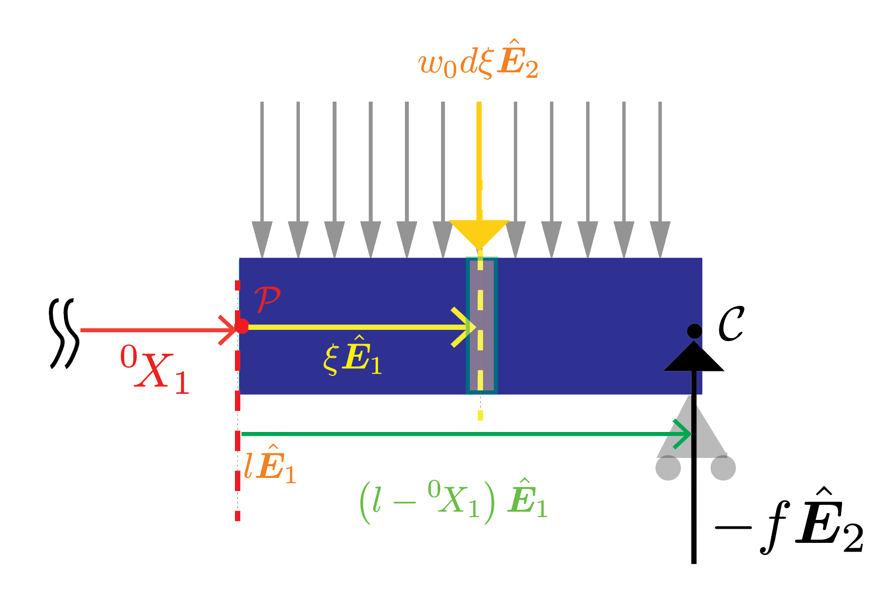




In this section we will determine the shape of the neutral axis after deformation for the below beam problem. 

The beam is simply supported at both ends. The external loading on the beam is such that each segment of the beam of length $\Delta X_1$ experiences an external force of $w_0 \Delta X_1 \hat{\boldsymbol{E}}\_2$ irrespective of where it is located.  

Note that the geometry and the loading is symmetric about plane located midway between the supports. Thus,  we choose the origin to be the centeroid of the beam's cross-section that is located midway between the supports,  and solve only for the deflected shape of the neutral axis lying to the right of the origin. We denote the that deflected shape using the function $y(\cdot)$.

Recall, that in order to get the the $y(\cdot)$ we need to solve the differential equation

$$ 
\begin{align}
E I y''\left(X_1\right)&= M(X_1)
\end{align}
$$
where
$$ 
\begin{align}
M(X_1)&:=\boldsymbol{M}(X_1,\hat{\boldsymbol{E}}_1)\cdot \hat{\boldsymbol{E}}_3.
\end{align}
$$

In order solve the above equation we need to determine the function $M(\cdot)$, for doing which we first need to determine the reaction force at the right support. 
 

#### Calculation of bending moment along the length of the beam

From symmetry we postulate that the reaction forces at the twpo supports are equal to one another. We denote the reaction force at each support as $-f\hat{\boldsymbol{E}}_2$.

From the translational equilibrium of the entire beam in the $\hat{\boldsymbol{E}}_2$ direction we get that 

$$
\begin{align}
-2f\hat{\boldsymbol{E}}_2+w_0 2 l \hat{\boldsymbol{E}}_2 &=0\\
% f &=w_0 L,\\
 f&=w_0 l.
\end{align}
$$

#### Calculation of $M(X_1)$
<!--  -->

Consider the material particle^[2] $\mathcal{P}$ whose position vector is ${}^0\! X_1\hat{\boldsymbol{E}}_1$. The moment of about the point $\mathcal{P}$ of all the forces acting on the segement of the beam shown in purple will consist of the following three parts. 

$\boldsymbol{M}_1$: The moment about the point $\mathcal{P}$ due to the tractions on the surface $\Gamma({}^0\!X_1, -\hat{\boldsymbol{E}}_1)$. As per the discussion in a previous section, we denote this moment as $\boldsymbol{M}({}^0\! X_1,-\hat{\boldsymbol{E}}_1)$.

$\boldsymbol{M}_2$: The moment about the point $\mathcal{P}$ due to the reaction force at the support under the material particle $\mathcal{C}$. In the previous section we found that this reaction force is $-w_0 l \hat{\boldsymbol{E}}_2$. The moment of arm of this force about the point $\mathcal{P}$ is $(l-{}^0\! X_1)\hat{\boldsymbol{E}}_1 $. Thus, this second part equals $(l-{}^0\! X_1)\hat{\boldsymbol{E}}_1 \times \left(-w_0 l \hat{\boldsymbol{E}}_2\right)$, which simplifies to  $-w_0 l(l-{}^0\! X_1) \hat{\boldsymbol{E}}_3$. 

$\boldsymbol{M}_3$: The moment about the point $\mathcal{P}$ of the surface tractions actiong on the puple segment of the beam. There are multiple ways to compute this contribution. Below we compute this contribution by introducing the variable $\xi$. For a derivation that does not involve the variable $\xi$ please see [this section](MomentDistributedForce.md). 

The variable $\xi$ is relative co-ordinate of the materials particle $X_1$. That is $\xi$ os the material particle $X_1$ is
$$
\xi=X_1-{}^0\! X_1.
$$
The $\boldsymbol{M}_3$ will consist of contributions from the tractions acting on each material particle lying in the purple segment of the beam. Consider an arbitrary material particle $X_1$ lying in the purple segment of the beams. This material particle is marked using a yellow dashed line in the below figure.  

<!--  -->

Let us compute the moment of all the forces acting over the infinitesimal rectangular material region centered around the materials particle $X_1$ and having a width $d X_1$, which we denote as $d\mathcal{R}$. The net force $d\boldsymbol{f}$ acting over this region is $w_0 d X_1\hat{\boldsymbol{E}}_2$. The momemnt arm of this infinitesimal force is $(X_1-{}^0\! X_1)\hat{\boldsymbol{E}}_1 $. Thus the net moment of the force acting over the region $d\mathcal{R}$ is $ d\boldsymbol{M}_3=(X_1-{}^0\! X_1)\hat{\boldsymbol{E}}_1 \times w_0 d X_1\hat{\boldsymbol{E}}_2$. This last quation simplifies to $ w_0(X_1-{}^0\! X_1) d X_1\hat{\boldsymbol{E}}_3$. From this last calculation it follows that the momemnt due to the forces acting over the entire  region is 

$$
\begin{align}
\boldsymbol{M}_3&=\int_{X_1={}^0\! X_1}^{X_1=l}w_0(X_1-{}^0\! X_1) d X_1\hat{\boldsymbol{E}}_3,\\
&= \frac{w_0}{2}(l-{}^0\! X_1)^2 \hat{\boldsymbol{E}}_3.
\end{align}
$$

From the balance of moment around the point $\mathcal{P}$ we have that
$$
\begin{align}
\boldsymbol{M}_1+\boldsymbol{M}_2+\boldsymbol{M}_3&=\boldsymbol{0}\\
\boldsymbol{M}({}^0\! X_1,-\hat{\boldsymbol{E}}_1)-w_0 l(l-{}^0\! X_1) \hat{\boldsymbol{E}}_3+\frac{w_0}{2}(l-{}^0\! X_1)^2 \hat{\boldsymbol{E}}_3&=\boldsymbol{0}\\
\end{align}
$$

Taking the dot product on both sides with the $\hat{\boldsymbol{E}}_3$ vector we get that
$$
\begin{align}
\boldsymbol{M}({}^0\! X_1,-\hat{\boldsymbol{E}}_1)\cdot \hat{\boldsymbol{E}}_3-w_0 l(l-{}^0\! X_1) +\frac{w_0}{2}(l-{}^0\! X_1)^2 &=0
\end{align}
$$

Noting that $\boldsymbol{M}({}^0\! X_1,-\hat{\boldsymbol{E}}_1)=-\boldsymbol{M}({}^0\! X_1,\hat{\boldsymbol{E}}_1)$ in the last equation we 
$$
\begin{align}
\boldsymbol{M}({}^0\! X_1,\hat{\boldsymbol{E}}_1)\cdot \hat{\boldsymbol{E}}_3&=-\frac{w_0}{2}(l^2-\left({}^0\! X_1\right)^2),\\
M({}^0\! X_1)&=-\frac{w_0}{2}(l^2- \left({}^0\! X_1\right)^2)
\end{align}
$$
where the second equation follows on noting that $\boldsymbol{M}({}^0\! X_1,\hat{\boldsymbol{E}}_1)\cdot \hat{\boldsymbol{E}}_3$ is in fact $M({}^0\! X_1)$. 

In summary we have that
$$
\begin{align}
M(X_1)&=-\frac{w_0}{2}(l^2-  X_1^2)
\end{align}
$$

#### Solution of the differential equation. 

Integrating both side of the governing differential equation once we get that
$$
E I y'(X_1)=-\frac{w_0}{2}(l^2 X_1-  X_1^3/3)+C_1
$$ 

From symmetry we know that the slope of the deflected shape, i.e., the dereivative of the function $y(\cdot)$ has to vanish at $X_1=0$. From this boundary condition we get that $C_1=0$, and

$$
E I y'(X_1)=-\frac{w_0}{2}(l^2 X_1-  X_1^3/3).
$$ 

Integrating both side of the last differential equation once we get that

$$
E I y(X_1)=-\frac{w_0}{2}\left(l^2 \frac{X_1^2}{2}-  \frac{X_1^4}{12}\right)+C_0.
$$ 

Since the beam is simply supported at $X_1=l$ we know that $y(l)=0$. Applying this boundary condition we get that

$$
\begin{align}
-\frac{w_0}{2}\left( \frac{l^4}{2}-  \frac{l^4}{12}\right)+C_0&=0.\\
-\frac{5 w_0 l^4}{24}+C_0&=0,\\
C_0&=\frac{5 w_0 l^4}{24}
\end{align}
$$

Thus, we have the deflected shape to be

$$
\begin{align}
E I y(X_1)&=-\frac{w_0}{2}\left(l^2 \frac{X_1^2}{2}-  \frac{X_1^4}{12}\right)+\frac{5 w_0 l^4}{24},\\
&=-\frac{w_0}{2}\left(l^2 \frac{X_1^2}{2}-  \frac{X_1^4}{12}-\frac{5 l^4}{12}\right)\\
&=-\frac{w_0}{24}\left(6 l^2 X_1^2-  X_1^4-5 l^4\right)
\end{align}
$$ 
i.e., 
$$
y(X_1)=\frac{w_0}{24 E I}\left(5 l^4+  X_1^4-6 l^2 X_1^2\right)
$$

[2]: Or to be technically more correct the material cross-section 