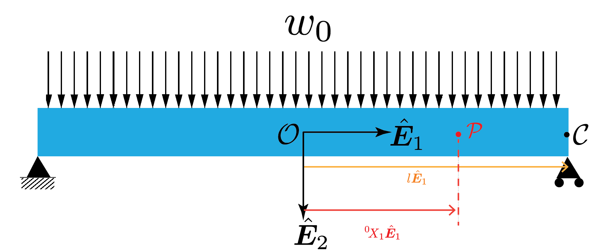




In this section we will determine the shape of the neutral axis after deformation for the below beam problem. 

The beam is simply supported at both ends. The external loading on the beam is such that each segment of the beam of length $\Delta X_1$ experiences an external force of $w_0 \Delta X_1 \hat{\boldsymbol{E}}\_2$ irrespective of where it is located.  

Note that the geometry and the loading is symmetric about plane located midway between the supports. Thus,  we choose the origin to be the centeroid of the beam's cross-section that is located midway between the supports,  and solve only for the deflected shape of the neutral axis lying to the right of the origin. We denote the that deflected shape using the function $y(\cdot)$.

Recall, that in order to get the the $y(\cdot)$ we need to solve the differential equation

$$ 
\begin{align}
E I y''\left(X_1\right)&= M(X_1)
\end{align}
$$
where
$$ 
\begin{align}
M(X_1)&:=\boldsymbol{M}(X_1,\hat{\boldsymbol{E}}_1)\cdot \hat{\boldsymbol{E}}_3.
\end{align}
$$

In order solve the above equation we need to determine the function $M(\cdot)$, for doing which we first need to determine the reaction force at the right support. 
 

#### Calculation of bending moment along the length of the beam

From symmetry we postulate that the reaction forces at the twpo supports are equal to one another. We denote the reaction force at each support as $-f\hat{\boldsymbol{E}}_2$.

From the translational equilibrium of the entire beam in the $\hat{\boldsymbol{E}}_2$ direction we get that 

$$
\begin{align}
-2f\hat{\boldsymbol{E}}_2+w_0 2 l \hat{\boldsymbol{E}}_2 &=0\\
% f &=w_0 L,\\
 f&=w_0 l.
\end{align}
$$

#### Calculation of $M(X_1)$
<!--  -->

<!--  -->

Consider the material particle^[2] $\mathcal{P}$ whose position vector is ${}^0\! X_1\hat{\boldsymbol{E}}_1$. The moment about the point $\mathcal{P}$ due to the tractions 

From the balance of moment around the point $\mathcal{P}$ we have that
$$
\begin{align}
\boldsymbol{M}({}^0\! X_1,-\hat{\boldsymbol{E}}_1)+(l-{}^0\! X_1)\hat{\boldsymbol{E}}_1 \times -f \hat{\boldsymbol{E}}_2+\int_{\xi=0}^{\xi=l-{}^0\! X_1}\xi \hat{\boldsymbol{E}}_1\times w_0 \, d\xi \hat{\boldsymbol{E}}_2&=0\\
\boldsymbol{M}({}^0\! X_1,-\hat{\boldsymbol{E}}_1)-(l-{}^0\! X_1) f \hat{\boldsymbol{E}}_3+\frac{w_0}{2}(l-{}^0\! X_1)^2&=0\\
\boldsymbol{M}({}^0\! X_1,-\hat{\boldsymbol{E}}_1) \cdot \hat{\boldsymbol{E}}_3&=(l-{}^0\! X_1) w_0 l -\frac{w_0}{2}(l-{}^0\! X_1)^2\\
&=\frac{w_0}{2}(l-{}^0\! X_1)(l+{}^0\! X_1)  \\
&=\frac{w_0}{2}(l^2-\left({}^0\! X_1\right)^2)
\end{align}
$$

Noting that $\boldsymbol{M}({}^0\! X_1,-\hat{\boldsymbol{E}}_1)=-\boldsymbol{M}({}^0\! X_1,\hat{\boldsymbol{E}}_1)$ in the last equation we 
$$
\begin{align}
\boldsymbol{M}({}^0\! X_1,\hat{\boldsymbol{E}}_1)\cdot \hat{\boldsymbol{E}}_3&=-\frac{w_0}{2}(l^2-\left({}^0\! X_1\right)^2)
\end{align}
$$

$$
\begin{align}
M(X_1)&=-\frac{w_0}{2}(l^2- X_1^2)
\end{align}
$$

[2]: Or to be technically more correct the material cross-section 