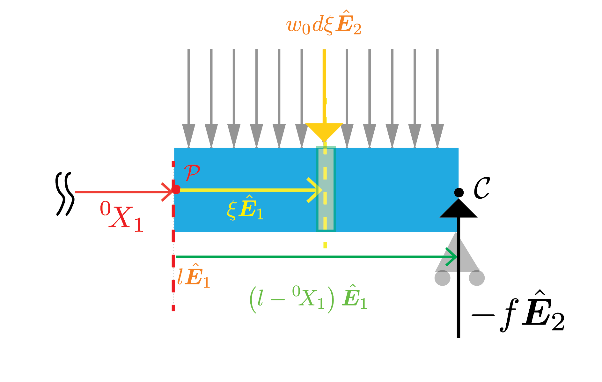




In this section, we will determine the shape of the neutral axis after deformation for the beam problem below. 

The beam is simply supported at both ends. The external loading on the beam is such that each segment of the beam of length $\Delta X_1$ experiences an external force of $w_0 \Delta X_1 \hat{\boldsymbol{E}}\_2$ irrespective of where it is located.  

Note that the geometry and the loading is symmetric about the plane located midway between the supports. Thus,  we choose the origin to be the centroid of the beam's cross-section that is located midway between the supports,  and solve only for the deflected shape of the neutral axis lying to the right of the origin. We denote the  deflected shape using the function $y(\cdot)$.

Recall that in order to get  $y(\cdot)$, we need to solve the differential equation

$$ 
\begin{align}
E I y''\left(X_1\right)&= M(X_1)
\end{align}
$$

where

$$ 
\begin{align}
M(X_1)&:=\boldsymbol{M}(X_1,\hat{\boldsymbol{E}}_1)\cdot \hat{\boldsymbol{E}}_3.
\end{align}
$$

The moment $\boldsymbol{M}(X_1,\hat{\boldsymbol{E}}_1)$ is defined in [this previous section](./MomentsOnCrosssection.md).

In order solve the above equation, we need to determine the function $M(\cdot)$; to do so, we first need to determine the reaction force at the right support. 
 

#### Calculation of reaction forces at the supports

From symmetry, we postulate that the reaction forces at the two supports are equal to one another. We denote the reaction force at each support as $-f\hat{\boldsymbol{E}}_2$.

From the translational equilibrium of the entire beam in the $\hat{\boldsymbol{E}}_2$ direction, we get that 

$$
\begin{align}
-2f\hat{\boldsymbol{E}}_2+w_0 2 l \hat{\boldsymbol{E}}_2 &=0\\
% f &=w_0 L,\\
 f&=w_0 l.
\end{align}
$$

#### Calculation of $M(\cdot)$
<!--  -->

Consider the material particle [^2] $\mathcal{P}$ whose position vector is ${}^0\\! X_1\hat{\boldsymbol{E}}_1$. The moment about the point $\mathcal{P}$ of all the forces acting on the segment of the beam shown in light blue will consist of the following three parts. 

$\boldsymbol{M}_1$: The moment about point $\mathcal{P}$ due to the tractions on the surface $\Gamma({}^0\\!X_1, -\hat{\boldsymbol{E}}_1)$ (the definition of the surface $\Gamma({}^0\\!X_1, -\hat{\boldsymbol{E}}_1)$ is given in [this section](./CrossSectiosnSurfacesDef.md)). As per the discussion in a [previous section](./MomentsOnCrosssection.md), we denote this moment as $\boldsymbol{M}({}^0\\! X_1,-\hat{\boldsymbol{E}}_1)$.

$\boldsymbol{M}_2$: The moment about point $\mathcal{P}$ due to the reaction force at the support under the material particle $\mathcal{C}$. In the previous section, we found that this reaction force is $-w_0 l \hat{\boldsymbol{E}}_2$. The moment due to this force about point $\mathcal{P}$ is $(l-{}^0\\! X_1)\hat{\boldsymbol{E}}_1 $. Thus, this second part equals $(l-{}^0\\! X_1)\hat{\boldsymbol{E}}_1 \times \left(-w_0 l \hat{\boldsymbol{E}}_2\right)$, which simplifies to  $-w_0 l(l-{}^0\\! X_1) \hat{\boldsymbol{E}}_3$. 

<!-- Let us imagine that the blue segment is divided into non-overlapping rectangles of width $\Delta \xi$ and centered around the points $\xi_i=\Delta \xi/2, 3 \Delta \xi/2, ...(2n-1)\Delta \xi/2$ -->

$\boldsymbol{M}_3$: The moment about point $\mathcal{P}$ due to the surface tractions acting on the light blue segment of the beam.   There are multiple ways to compute this contribution. Below, we compute this contribution by introducing the relative coordinate of a material particle w.r.t $\mathcal{P}$ in the $\hat{\boldsymbol{E}}\_1$ direction. For a derivation that does not involve relative coordinates, please see [this section](MomentDistributedForce.md). 

We introduce the variable $\xi$ to be the relative coordinate of the material particle $X_1$. That is, 

$$
\xi=X_1-{}^0\! X_1.
$$

Consider an arbitrary material particle $\mathcal{Q}$ with the relative coordinate $\xi$ lying in the light blue segment of the beam. This material particle is marked using a yellow dashed line in the below figure.  Consider a　rectangle centered around $\mathcal{Q}$ of infinitesimal thickness $d\xi$. We denote this region as $d\mathcal{R}(\xi)$. The force acting over $d\mathcal{R}(\xi)$ is  $w_0d\xi \hat{\boldsymbol{E}}\_2$. The moment arm of this force about $\mathcal{P}$ is $\xi \hat{\boldsymbol{E}}_1$. Thus the moment of the force acting over $d\mathcal{R}(\xi)$ is $d\boldsymbol{M}_3=\xi  \hat{\boldsymbol{E}}\_1 \times w_0d\xi \hat{\boldsymbol{E}}\_2$. The last equation simplifies to $w_0\xi  d\xi \hat{\boldsymbol{E}}\_3$. The sum of moments due to the forces acting over the entire blue segment is therefore, 

$$
\begin{align}
\boldsymbol{M}_3
&=\int_{\xi=0}^{l-{}^0\!X_1}w_0\xi  d\xi \hat{\boldsymbol{E}}_3\\
&=\frac{w_0}{2}(l-{}^0\!X_1)^2  \hat{\boldsymbol{E}}_3
\end{align}
$$ 

<!--  -->

From the balance of moment around point $\mathcal{P}$, we have that

$$
\begin{align}
\boldsymbol{M}_1+\boldsymbol{M}_2+\boldsymbol{M}_3&=\boldsymbol{0}\\
\boldsymbol{M}({}^0\! X_1,-\hat{\boldsymbol{E}}_1)-w_0 l(l-{}^0\! X_1) \hat{\boldsymbol{E}}_3+\frac{w_0}{2}(l-{}^0\! X_1)^2 \hat{\boldsymbol{E}}_3&=\boldsymbol{0}\\
\end{align}
$$

Taking the dot product on both sides with the $\hat{\boldsymbol{E}}_3$ vector, we get that

$$
\begin{align}
\boldsymbol{M}({}^0\! X_1,-\hat{\boldsymbol{E}}_1)\cdot \hat{\boldsymbol{E}}_3-w_0 l(l-{}^0\! X_1) +\frac{w_0}{2}(l-{}^0\! X_1)^2 &=0\\
\boldsymbol{M}({}^0\! X_1,-\hat{\boldsymbol{E}}_1)\cdot \hat{\boldsymbol{E}}_3&=\frac{w_0}{2}(l^2- \left({}^0\! X_1\right)^2)
\end{align}
$$

In [this previous section](./MomentsThirdLaw.md), we showed that $\boldsymbol{M}({}^0\\! X_1,-\hat{\boldsymbol{E}}_1)=-\boldsymbol{M}({}^0\\! X_1,\hat{\boldsymbol{E}}_1)$. Using this result in the last equation, we get that

$$
\begin{align}
-\boldsymbol{M}({}^0\! X_1,\hat{\boldsymbol{E}}_1)\cdot \hat{\boldsymbol{E}}_3&=\frac{w_0}{2}(l^2-\left({}^0\! X_1\right)^2),\\
M({}^0\! X_1)&=-\frac{w_0}{2}(l^2- \left({}^0\! X_1\right)^2)
\end{align}
$$

where the second equation follows by multiplying both sides of the previous equation with negative one and then noting that $\boldsymbol{M}({}^0\\! X_1,\hat{\boldsymbol{E}}_1)\cdot \hat{\boldsymbol{E}}_3$ is in fact $M({}^0\\! X_1)$. 

In summary, we have that

$$
\begin{align}
M(X_1)&=-\frac{w_0}{2}(l^2-  X_1^2)
\end{align}
$$

#### Solution of the differential equation. 

Integrating both side of the governing differential equation once, we get that

$$
\begin{equation}
E I y'(X_1)=-\frac{w_0}{2}\left(l^2 X_1- \frac{X_1^3}{3}\right)+C_1
\end{equation}
$$ 

From symmetry, we know that the slope of the deflected shape, i.e., the derivative of the function $y(\cdot)$ has to vanish at $X_1=0$. From this boundary condition, we get that $C_1=0$, and

$$
E I y'(X_1)=-\frac{w_0}{2}\left(l^2 X_1- \frac{X_1^3}{3}\right).
$$ 

Integrating both side of the last differential equation once we get that

$$
E I y(X_1)=-\frac{w_0}{2}\left(l^2 \frac{X_1^2}{2}-  \frac{X_1^4}{12}\right)+C_0.
$$ 

Since the beam is simply supported at $X_1=l$, we know that $y(l)=0$. Applying this boundary condition we get that

$$
\begin{align}
-\frac{w_0}{2}\left( \frac{l^4}{2}-  \frac{l^4}{12}\right)+C_0&=0.\\
-\frac{5 w_0 l^4}{24}+C_0&=0,\\
C_0&=\frac{5 w_0 l^4}{24}
\end{align}
$$

Thus, we have the deflected shape to be

$$
\begin{align}
E I y(X_1)&=-\frac{w_0}{2}\left(l^2 \frac{X_1^2}{2}-  \frac{X_1^4}{12}\right)+\frac{5 w_0 l^4}{24},\\
&=-\frac{w_0}{2}\left(l^2 \frac{X_1^2}{2}-  \frac{X_1^4}{12}-\frac{5 l^4}{12}\right)\\
&=-\frac{w_0}{24}\left(6 l^2 X_1^2-  X_1^4-5 l^4\right)
\end{align}
$$ 

i.e., 

$$
y(X_1)=\frac{w_0}{24 E I}\left(5 l^4+  X_1^4-6 l^2 X_1^2\right)
$$

The Mathematica file for this problem is [here](./WFiles/SSBDistributedLoad.nb)

[^2]: Or to be technically more correct the material cross-section 