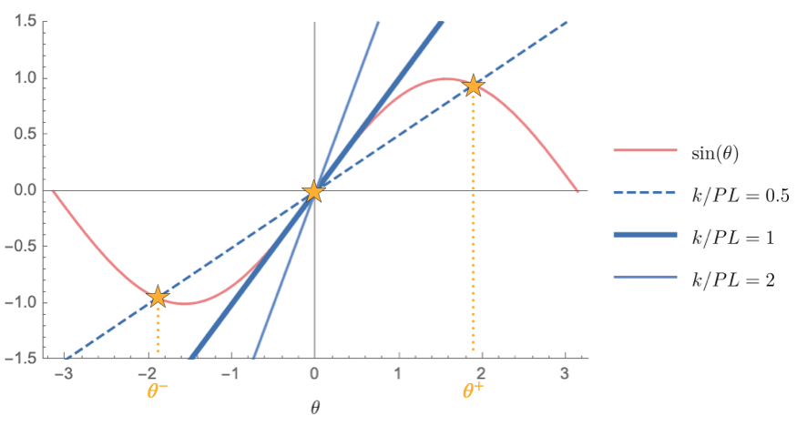




Consider a rigid column attached to a torsional spring of stiffness $k$ at its base.
 
    

     
    

 

 The torsional spring provides a moment of $-k \theta\hat{\boldsymbol{E}}_3$ (in $\rm{N \cdot m}$). Say that after the column has rotated, we apply a force of $P \hat{\boldsymbol{E}}_2$ at the top of the column. Then, we have that the moment due to the applied force about $\mathcal{O}$ and the moment due to the torsional spring are, respectively,

<!-- Say that after the column has rotated. Applied moment of the  -->

$$
\begin{align*}
\boldsymbol{M}_{\mathcal{O}-P}&=
\left(l\sin(\theta)\hat{\boldsymbol{E}}_1-l \cos(\theta) \hat{\boldsymbol{E}}_2\right)\times P  \hat{\boldsymbol{E}}_2\\
&=P l \sin(\theta) \hat{\boldsymbol{E}}_3\\
\boldsymbol{M}_{\mathcal{O}-k}&=-k \theta\hat{\boldsymbol{E}}_3
\end{align*}
$$

From the balance of moment about the point $\mathcal{O}$, we get that

$$
\begin{align*}
P l \sin(\theta) \hat{\boldsymbol{E}}_3-k \theta\hat{\boldsymbol{E}}_3&=\boldsymbol{0},\\
\sin(\theta)=\frac{k}{P L}\theta
\end{align*}
$$

A necessary condition for instability is the existence of more than one equilibrium state. 
We can interpret the above result by considering the following plot of $\sin{(\theta)}$ and $\dfrac{k}{PL}\theta$.

 
    

     
    
 
 

Consider the case when (i) $k/PL>1$:

The equilibrium state is at $\theta=0$. We can see that this is a stable case by noticing that for any slight perturbation to $\theta$, it always holds that

$$
\left|\dfrac{k}{PL}\theta\right|>\left|\sin{(\theta)}\right|,
$$

Physically, this means that the moment provided by the torsional spring will always resist that by the applied load $P$.

Now consider the case when (ii) $k/PL<1$:

We see that there are three possible equilibrium states (denoted with stars). The system can be in equilibrium at $\theta=0$, as with case (i). However, notice that when $\theta$ is perturbed slightly to a non-zero value, it holds that between $0<\theta<\theta^+$,

$$
\dfrac{k}{PL}\theta<\sin{(\theta)}.
$$

Physically, this means that when $0<\theta<\theta^+$, the moment by the applied load $P$ is greater than that provided by the torsional spring. Hence, the column will keep rotating until at $\theta=\theta^+$, the next equilibrium state is attained. In other words, slight perturbation to of $\theta$ to a positive value will cause the column to suddenly "jump" from $\theta=0$ to $\theta=\theta^+$ (instability). 

The same argument can be repeated for $\theta^-<\theta<0$.

<!-- Notice further that the column will oscillate around $\theta^+$. This is because the slight perturbation of $\theta$ to the right will be resisted by the torsional spring, which drives the column to rotate counter clockwise, while the perturbation of $\theta$ to the right will be resisted by $P$, such that it drives the column to rotate clockwise. -->

(iii) At $k/PL=1$:

$\dfrac{k}{PL}\theta$ is tangent to $\sin{\theta}$ at $\theta=0$. This is when the system transitions from a stable to unstable behavior.

Let's now consider a pinned joint. 

 
    

     
    

 
 

Moment arm between $\mathcal{M}$ and $P$ is $l\hat{\boldsymbol{E}}_1-(X_1\hat{\boldsymbol{E}}_1+y(X_1)\hat{\boldsymbol{E}}_2)$. This comes out to be $(l-X_1)\hat{\boldsymbol{E}}_1-y(X_1)\hat{\boldsymbol{E}}_2$. Then, the moment balance on the region to the right of $P$ is

<!-- The force in vector form is of course $-P \hat{\boldsymbol{E}}_1$. The moment is now -->

$$
\begin{align*}
\boldsymbol{M}(X_1,-\hat{\boldsymbol{E}}_1)+
((l-X_1)\hat{\boldsymbol{E}}_1-y(X_1)\hat{\boldsymbol{E}}_2)
\times (-P \hat{\boldsymbol{E}}_1)&=\boldsymbol{0}\\
-\boldsymbol{M}(X_1,\hat{\boldsymbol{E}}_1)+
y(X_1)\hat{\boldsymbol{E}}_2
\times P \hat{\boldsymbol{E}}_1&=\boldsymbol{0}\\
-\boldsymbol{M}(X_1,\hat{\boldsymbol{E}}_1)-
y(X_1)
 P \hat{\boldsymbol{E}}_3&=\boldsymbol{0}\\
\boldsymbol{M}(X_1,\hat{\boldsymbol{E}}_1)\cdot \hat{\boldsymbol{E}}_3+
y(X_1)
 P &=0\\
M(X_1)+
y(X_1)
 P&=0\\
E I y''(X_1)+
y(X_1)
 P&=0\\
 y''(X_1)+
y(X_1)
\frac{P}{E I}&=0\\
 y''(X_1)+
\lambda^2 y(X_1)&=0
 \end{align*}
$$

where $\lambda^2=P/EI$.
Noticing that this is a simple harmonic motion equation, the solution is given by

$$
y(X_1)=A \cos(\lambda X_1)+B \sin(\lambda X_1)
$$

We can now apply the boundary conditions to solve for $A$ and $B$. 

From $y(0)=0$, we get 

$$
A=0
$$

and from $y(L)=0$, we get 

$$
\begin{align*}
B\sin(\lambda L)&=0
\end{align*}
$$

$B=0$ is the trivial solution. The nontrivial solution is

$$
\begin{align*}
\lambda L &= n\pi\\
\lambda_n  &= \frac{n\pi}{L}
\end{align*}
$$

so that we get

$$
\begin{align*}
\frac{P_n}{EI}&=\lambda_n^2\\
P_n&= E I \lambda_n^2\\
P_n&= \frac{n^2 \pi^2 E I}{L^2} 
\end{align*}
$$

What this implies is that any critical load $P_n$, the column can admit a different solution (configuration). The lowest critical load at $n=1$ is the load at which the column buckles, and is called the Euler Buckling Load:

$$
\begin{align*}
P_{\rm cr}&= \frac{\pi^2 E I}{L^2} 
\end{align*}
$$