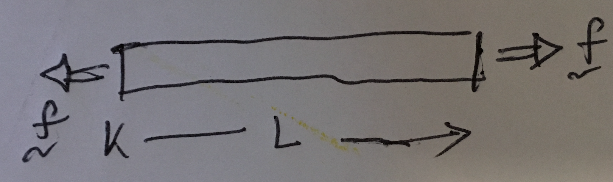




A bar is a mechanical structure whose dimensions in one direction are typically much longer than its other dimensions. The directions of the bar's largest dimension are referred to as the bar's axial's directions, or the bar's axis, $± \hat{\boldsymbol{e}}_{\rm a}$.  The primary mechanical function of a bar is to transmit forces along its length, or in its axis.

__

_Underformed length_: The bar's largest dimension is referred to as its length, $L$. This length is also referred to as the bar's unformed length. Since, that will be the length we will measure when there are no forces acting on the bar.

_Axial force_:  The forces on a bar, by its very definition, are parallel to its axis (see Figure _force_)

_End faces_

_Lateral surface_

_Tensiona and compression_
Let us cut the bar, $\mathcal{B}_0$, into two pieces, $^1\mathcal{B}_{0}$ and $^2\mathcal{B}_{0}$. Specifically, let us cut $\mathcal{B}_0$ with the $A$-$A'$ plane (see Figure), which is normal to the bar's axis $\pm \hat{\boldsymbol{e}}_a$.

We will call the the left piece $^1\mathcal{B}_{0}$ and the right piece  $^2\mathcal{B}_{0}$.

Let us consider two cross-sections of the bar, that are obtained by cutting the bar . The resulting cross-sections will be referred to as $S^1$ and $S^2$. 

The vector $\hat{\boldsymbol{n}}^{1}$ is normal to $S^1$. By normal we mean that $\hat{\boldsymbol{n}}^{1}$ points away from the Bar's material (the atoms and molecules composing the Bar) and into empty space. Similarly,  $\hat{\boldsymbol{n}}^{1}$ is normal to $S^2$. is $\hat{\boldsymbol{n}}^{2}$.

We will write it as $\boldsymbol{f}_{\rm a}=f\hat{\boldsymbol{e}}_{a}$. , and the force's magnitude is $|f|$, i.e., the absolute value of $f$. When $f$ is positive we say that the axial force is  

