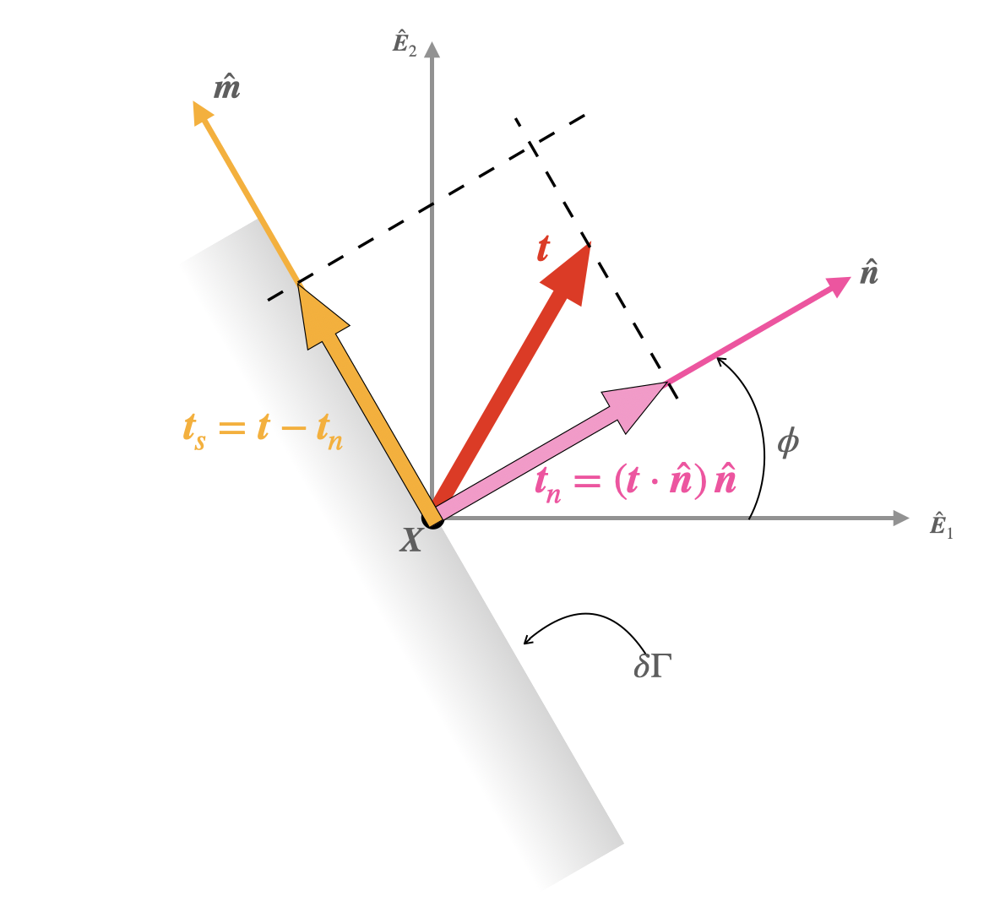



 # Maximum shear stress and its directions.

As usual we will denote the normal to an internal infinitesimal surface plane ($\delta \Gamma$) as $\hat{\boldsymbol{n}}$. Let $\hat{\boldsymbol{n}}$ make an angle $\phi$ with $\hat{\boldsymbol{E}}_1$. The vector $\hat{\boldsymbol{m}}$ is defined such that it is perpendicular to $\hat{\boldsymbol{n}}$, and it $\hat{\boldsymbol{n}}$, and $\hat{\boldsymbol{E}}_3$ form a righ handed basis (see Figure).
 

In component form we can write 
$$
\begin{align}
\hat{\boldsymbol{n}}&=
\begin{bmatrix}
\cos(\phi)\\
\sin(\phi)\\
0
\end{bmatrix}\\
\hat{\boldsymbol{m}}&=
\begin{bmatrix}
-\sin(\phi)\\
\cos(\phi)\\
0
\end{bmatrix}
\end{align}
$$

The traction on the surface $\delta \Gamma$ is $\boldsymbol{t}=\boldsymbol{\sigma}^{\rm T}\boldsymbol{n}$.

$$ 
\begin{align}
\left[\boldsymbol{t}\right]
&=
\begin{bmatrix}
\sigma_{11} \cos (\theta )+\sigma_{12}\sin (\theta )\\
\sigma_{12}\cos(\theta)+\sigma_{22}\sin (\theta)\\0
\end{bmatrix}
\end{align}
$$

The normal component of the traction vector, $\boldsymbol{t}_n$ is $(\boldsymbol{t}\cdot\hat{\boldsymbol{n}})\, \hat{\boldsymbol{n}}$, which in component form reads,

$$ 
\begin{align}
\left[\boldsymbol{t}_n\right]
&=
\left(\sigma_{11} \cos^2 (\theta )+\sigma_{12}\sin (2\theta )+\sigma_{22}\sin^2 (\theta)\right)\begin{bmatrix}
\cos(\phi)\\
\sin(\phi)\\
0
\end{bmatrix}
\end{align}
$$

The quantity $(\boldsymbol{t}\cdot\hat{\boldsymbol{n}})$ in many books is our textbook is referred to as the normal stress. We will denote this quantity as $\sigma$. Thus, the normal traction vector can be expressed as,
$$
\begin{align}
\boldsymbol{t}_n&=
\sigma \hat{\boldsymbol{n}}
\end{align}
$$

Note that  $\sigma$ is distinct from $t_n$, which defined to be the norma of $\boldsymbol{t}_n$. Due to its definition $t_n$ is always positive, while $\sigma$ can be positive or negative.

The shear component of the traction vector, $\boldsymbol{t}_s$ is $\boldsymbol{t}-\boldsymbol{t}_n$, which in component form reads,

$$
\begin{align}
\left[\boldsymbol{t}_n\right]&=
\left(
-\frac{\sigma_{11} - \sigma_{22}}{2} \sin(2 \theta)+\sigma_{12} \cos(2 \theta)\right) \begin{bmatrix}
-\sin(\phi)\\
\cos(\phi)\\
0
\end{bmatrix}
\end{align}
$$

Defining 

$$
\begin{equation}
\tau:=\left(
-\frac{\sigma_{11} - \sigma_{22}}{2} \sin(2 \theta)+\sigma_{12} \cos(2 \theta)\right)
\end{equation}
$$
and recalling the definition of $\hat{\boldsymbol{m}}$ we can express $\boldsymbol{t}_s$ alternately as 
we can write 
$$
\begin{align}
\boldsymbol{t}_n&=\tau \hat{\boldsymbol{m}}
\end{align}
$$