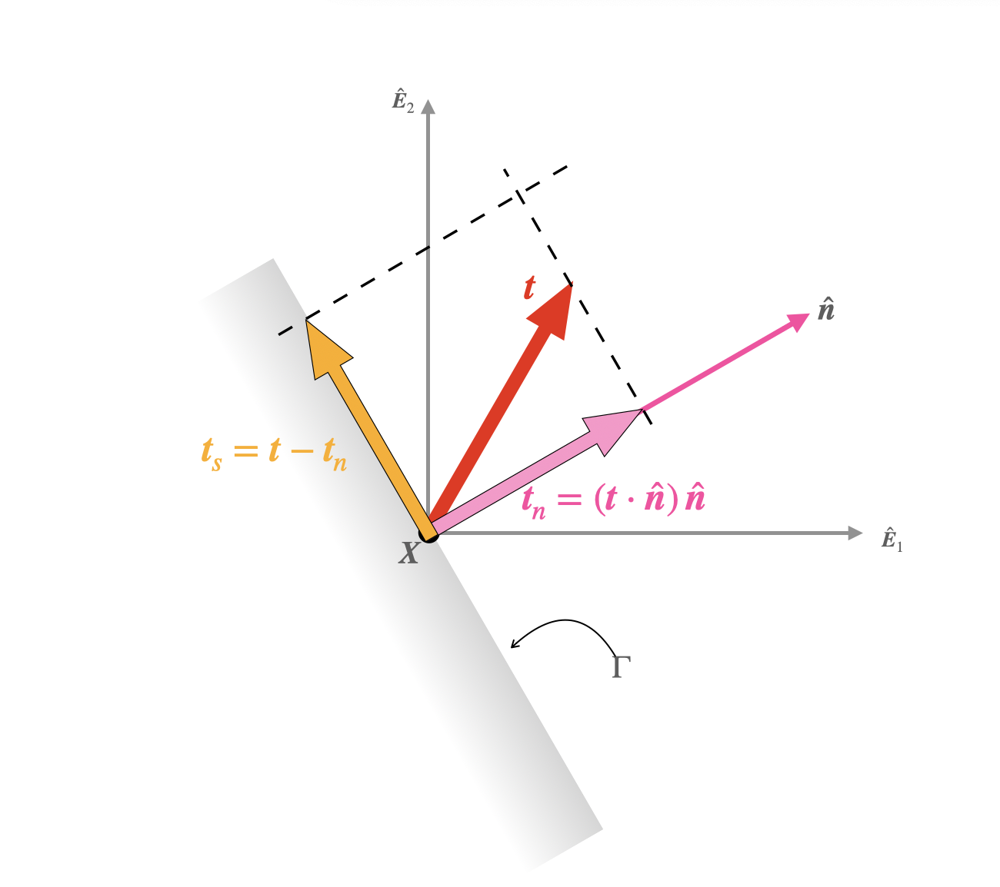




# Normal and shear components of the traction vector 

The normal component of the traction vector $\boldsymbol{t}_n$ is defined such that 

$$
\begin{align}
\boldsymbol{t}_n&=(
\boldsymbol{t}\cdot \hat{\boldsymbol{n}})\, \hat{\boldsymbol{n}}
\end{align}
$$

<!-- $$
\begin{align}
\boldsymbol{t}_n&=(\hat{\boldsymbol{n}}\cdot(
\boldsymbol{\sigma}^{\rm T}\hat{\boldsymbol{n}} )\hat{\boldsymbol{n}}
\\
&=(\hat{\boldsymbol{n}}\cdot(
\boldsymbol{\sigma}\hat{\boldsymbol{n}} ))\, \hat{\boldsymbol{n}}
\end{align}
$$ -->

The shear component of the traction vector is defined as 

$$
\begin{align}
\boldsymbol{t}_s&=
\boldsymbol{t}-\boldsymbol{t}_n
\end{align}
$$

The vectors $\boldsymbol{t}_n$, $\boldsymbol{t}_s$ can be computed directly from the stress tensor. However, it is always better to first compute the traction vector from the stress tensor as $\boldsymbol{t}=\boldsymbol{\sigma}^{\rm T}\hat{\boldsymbol{n}}$ and then compute $\boldsymbol{t}_n$, $\boldsymbol{t}_s$, respectively, from the last two equation.

<!-- $$
\begin{align}
\boldsymbol{t}_s&=
\boldsymbol{\sigma}\hat{\boldsymbol{n}}-(\hat{\boldsymbol{n}}\cdot(
\boldsymbol{\sigma}\hat{\boldsymbol{n}} ))\, \hat{\boldsymbol{n}}\\
&=
(\boldsymbol{\sigma}-\hat{\boldsymbol{n}}\cdot(
\boldsymbol{\sigma}\hat{\boldsymbol{n}} ))\, \hat{\boldsymbol{n}}
\end{align}
$$ -->