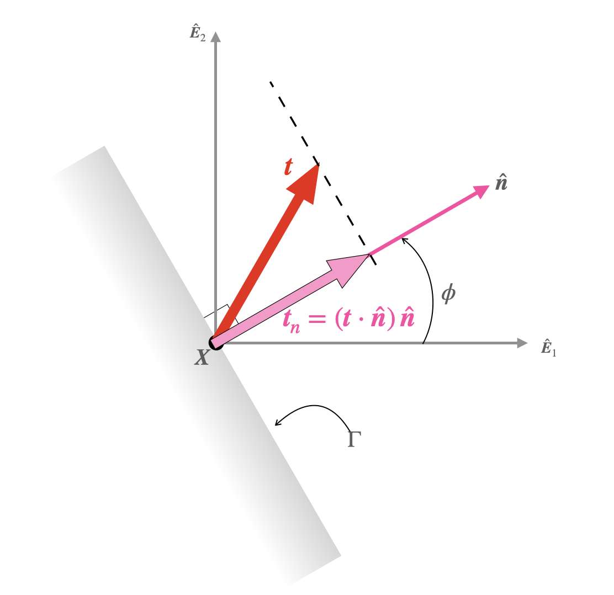




# Matrix representation of the normal component of traction vector in terms of stress components.

Let $\hat{\boldsymbol{n}}$ make an angle $\phi$ with $\hat{\boldsymbol{E}}_1$. The matrix representation of $\hat{\boldsymbol{n}}$ can then be written  as 
$$
\begin{align}
\hat{\boldsymbol{n}}&=
\begin{bmatrix}
\cos(\phi)\\
\sin(\phi)\\
0
\end{bmatrix}
\end{align}
$$

We denote the stress tensor at $\boldsymbol{X}$ as $\boldsymbol{\sigma}$, and denote its components as $\sigma\_{11}$, $\sigma\_{12}$, ...,$\sigma\_{32}$, and $\sigma\_{33}$. The components are defined such that 

$$
\begin{align}
[\boldsymbol{\sigma}]
&=
\begin{bmatrix}
\sigma_{11} & \sigma_{12} & \sigma_{13}\\
\sigma_{21} & \sigma_{22} & \sigma_{23}\\
\sigma_{31} & \sigma_{32} & \sigma_{33}
\end{bmatrix}
\end{align}
$$

For the case of plane stress we have that

$$
\begin{align}
\left.[\boldsymbol{\sigma}]\right|_{\text{plane stress}}
&=
\begin{bmatrix}
\sigma_{11} & \sigma_{12} & 0\\
\sigma_{21} & \sigma_{22} & 0\\
0 & 0 & 0
\end{bmatrix}
\end{align}
$$

The traction on the surface $(\Gamma, \hat{\boldsymbol{n}})$ is, by the definition of $\boldsymbol{\sigma}$, $\boldsymbol{t}=\boldsymbol{\sigma}^{\rm T}\boldsymbol{n}$. Thus, we get from the last two equations that for plane stress,

$$ 
\begin{align}
\left.\left[\boldsymbol{t}\right]\right|_{\text{plane stress}}
&=
\begin{bmatrix}
\sigma_{11} \cos (\phi )+\sigma_{21}\sin (\phi )\\
\sigma_{12}\cos(\phi)+\sigma_{22}\sin (\phi)\\0
\end{bmatrix}
\end{align}
$$

The normal component of the traction vector, $\boldsymbol{t}_n$ is $(\boldsymbol{t}\cdot\hat{\boldsymbol{n}})\, \hat{\boldsymbol{n}}$, which in component form reads,

$$ 
\begin{align}
\left[\boldsymbol{t}_n\right]|_{\text{plane stress}}
&=
\left(\sigma_{11} \cos^2 (\phi )+\sigma_{12}\sin (2\phi )+\sigma_{22}\sin^2 (\phi)\right)\begin{bmatrix}
\cos(\phi)\\
\sin(\phi)\\
0
\end{bmatrix}
\end{align}
$$

Note that in arriving at the last equation, we set $\sigma_{12}=\sigma_{21}$.

Defining 

$$
\begin{equation}
\sigma(\phi):=\left(
\sigma_{11}\cos^2{(\phi)}+\sigma_{12}\sin{(2\phi)}+\sigma_{22} \sin^2{(\phi)}\right),
\end{equation}
$$

we get that

$$ 
\begin{align}
\left[\boldsymbol{t}_n\right]|_{\text{plane stress}}
&=\sigma(\phi)\begin{bmatrix}
\cos(\phi)\\
\sin(\phi)\\
0
\end{bmatrix}\\
&=\sigma(\phi)[\hat{\boldsymbol{n}}]
\end{align}
$$

The last equation in component free-form reads

$$
\begin{align}
\left.\boldsymbol{t}_n\right|_{\text{plane stress}}&=\sigma(\phi) \hat{\boldsymbol{n}}
\end{align}
$$

The quantity $\sigma(\phi)$ is called the normal stress.

