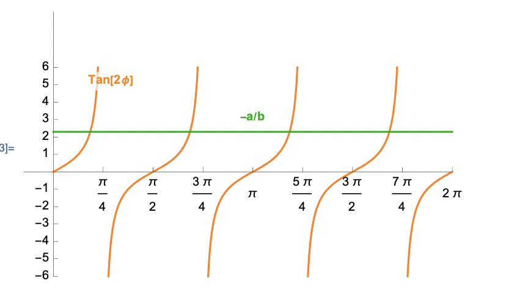




# Maximum and minimum normal stress

In the last section, we derived that

$$
    \begin{align}
    \left.\left[\boldsymbol{t}_n\right]\right|_{\text{plane stress}}&=
    \sigma(\phi) [\hat{\boldsymbol{n}}]
    \end{align}
$$

where

$$
    \begin{align}
    \sigma(\phi)&:=\left(
\sigma_{11}\cos^2{(\phi)}+\sigma_{12}\sin{(2\phi)}+\sigma_{22} \sin^2{(\phi)}\right)
\\
    \end{align}
$$

$$
    \begin{align}
    [\hat{\boldsymbol{n}}]&:=\begin{bmatrix}
    \cos(\phi)\\
    \sin(\phi)\\
    0
    \end{bmatrix}
    \end{align}
$$

<!-- In this section, we will determine the set of $\phi$ at which the magnitude of $\boldsymbol{t}\_{n}$ reaches its maximum/minimum value. The magnitude of $\boldsymbol{t}\_{n}$ is  -->

In this section, we will determine the set of $\phi$ at which $\sigma(\cdot)$ attains its maximum/minimum values. 

$$
    \begin{equation}
    \lVert \boldsymbol{t}_{n}\rVert=|\sigma(\phi)|
    \end{equation}
$$

We begin by writing

$$
\begin{align}
\sigma(\phi)&=c
+
a\cos(2\phi)+
b\sin (2\phi ),\\
a&:=\frac{\sigma_{11}-\sigma_{22}}{2},\\
b&:=\sigma_{12},\\
c&=\frac{\sigma_{11}+\sigma_{22}}{2}.
\end{align}
$$

<!-- The maximum value of $\|\sigma(\phi)\|$ will be the absolute value of the maximum value of $\sigma(\phi)$ and/or the absolute value of the minimum  value of $\sigma(\phi)$. Therefore, we will next determine the maximum and minimum values of  $\sigma(\phi)$. -->

The  maximum and minimum values of $\sigma(\cdot)$ occurs at those $\phi$ at which the derivative of $\sigma(\cdot)$ vanishes. Let us define $\phi\_s$ as those $\phi$ at which the derivative of $\sigma(\cdot)$ vanishes. Differentiating the function $\sigma(\cdot)$, and setting it to be equal to zero at $\phi_s$, we get that 

$$
\begin{equation}
\tan(2\phi_s)=\frac{b}{a}.
\end{equation}
$$

Irrespective of values of $a$ and $b$, the above equation will have four roots (see Figure below)

<!--  -->

We place those four roots into two (disjoint) sets. The first set of $\phi\_s$ are those for which
$$
\begin{align}
\text{Set I}\Rightarrow
\left\{
\begin{array}{c}
\cos(2\phi_s)=\frac{a}{\sqrt{a^2+b^2}}\\
\sin(2\phi_s)=\frac{b}{\sqrt{a^2+b^2}}
\end{array}\right.
\end{align}
$$

and for second set of $\phi$ are those for which values

$$
\begin{align}
\text{Set II}\Rightarrow
\left\{
\begin{array}{c}
\cos(2\phi_s)=-\frac{a}{\sqrt{a^2+b^2}}\\
\sin(2\phi_s)=-\frac{b}{\sqrt{a^2+b^2}}
\end{array}\right.
\end{align}
$$

For the first set (Set-I) of values we have that 
$$
\begin{align}
\sigma(\phi)
% &=\sqrt{a^2+b^2}(\sin(2\phi_s) \sin(2\phi)+\cos(2\phi_s) \cos(2\phi))\\
&=c+\sqrt{a^2+b^2}
\end{align}
$$

Similarly for the second set (Set-I) we get 
$$
\begin{align}
\sigma(\phi)&=c-\sqrt{a^2+b^2}
\end{align}
$$

Thus, for the first set of $\phi\_s$, the function $\sigma(\cdot)$ attains a maximum value and for the second set of $\phi\_s$, the function $\sigma(\cdot)$ attains a minimum value. 

<!-- 
[Here](./WFiles/MaximumShearStressesDirections.nb) is a  mathematica file showing the above equations in action.  -->