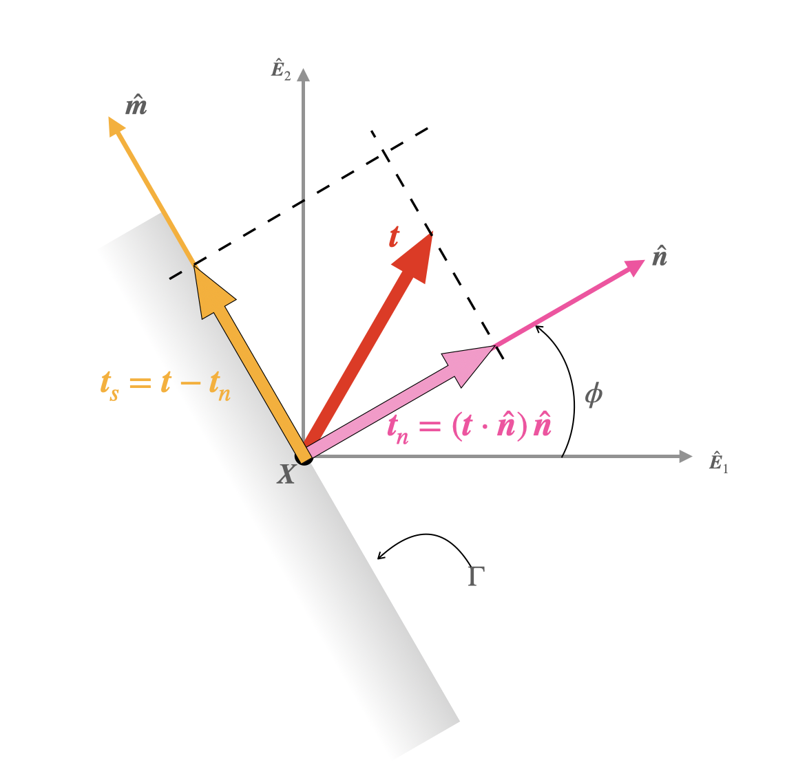




# Matrix representation of the shear component of the traction vector in plane stress

From the last section we have that

$$ 
\begin{align}
\left.\left[\boldsymbol{t}_n\right]\right|_{\text{plane stress}}
&=
\left(\sigma_{11} \cos^2 (\phi )+\sigma_{12}\sin (2\phi )+\sigma_{22}\sin^2 (\phi)\right)\begin{bmatrix}
\cos(\phi)\\
\sin(\phi)\\
0
\end{bmatrix}
\end{align}
$$

$$ 
\begin{align}
\left.\left[\boldsymbol{t}\right]\right|_{\text{plane stress}}
&=
\begin{bmatrix}
\sigma_{11} \cos (\phi )+\sigma_{21}\sin (\phi )\\
\sigma_{12}\cos(\phi)+\sigma_{22}\sin (\phi)\\0
\end{bmatrix}
\end{align}
$$

Recall that 
$$
\begin{align}
\boldsymbol{t}_s&=
\boldsymbol{t}-\boldsymbol{t}_n,
\end{align}
$$
which in matrix form reads
$$
\begin{align}
[\boldsymbol{t}_s]&=
[\boldsymbol{t}]-[\boldsymbol{t}_n],
\end{align}
$$

From the first two equations of this section and the last equation we get that

$$
\begin{align}
\left.\left[\boldsymbol{t}_s\right]\right|_{\text{plane stress}}&=
\left(
-\frac{\sigma_{11} - \sigma_{22}}{2} \sin(2 \theta)+\sigma_{12} \cos(2 \theta)\right) \begin{bmatrix}
-\sin(\phi)\\
\cos(\phi)\\
0
\end{bmatrix}
\end{align}
$$

Defining 

$$
\begin{equation}
\tau(\phi):=\left(
-\frac{\sigma_{11} - \sigma_{22}}{2} \sin(2 \theta)+\sigma_{12} \cos(2 \theta)\right)
\end{equation}
$$
we get that
$$
\begin{align}
\left.\left[\boldsymbol{t}_s\right]\right|_{\text{plane stress}}&=
\tau(\phi) \begin{bmatrix}
-\sin(\phi)\\
\cos(\phi)\\
0
\end{bmatrix}
\end{align}
$$

Note that the column matrix appearing in the above equation, which is $[-\sin(\phi),\cos(\phi),0]^{\sf T}$ is matrix representation of the vector $\hat{\boldsymbol{E}}_3\times \hat{\boldsymbol{n}}$. Denoting the vector $\hat{\boldsymbol{E}}_3\times \hat{\boldsymbol{n}}$ as  $\hat{\boldsymbol{m}}$ we can write the last equation as.
$$
\begin{align}
\left.\left[\boldsymbol{t}_s\right]\right|_{\text{plane stress}}&=
\tau(\phi) [\hat{\boldsymbol{m}}].
\end{align}
$$

The last equation in component free-form reads as
$$
\begin{align}
\left.\boldsymbol{t}_s\right|_{\text{plane stress}}&=\tau(\phi) \hat{\boldsymbol{m}}
\end{align}
$$

The quantity $\tau(\phi)$ is called the shear stress.