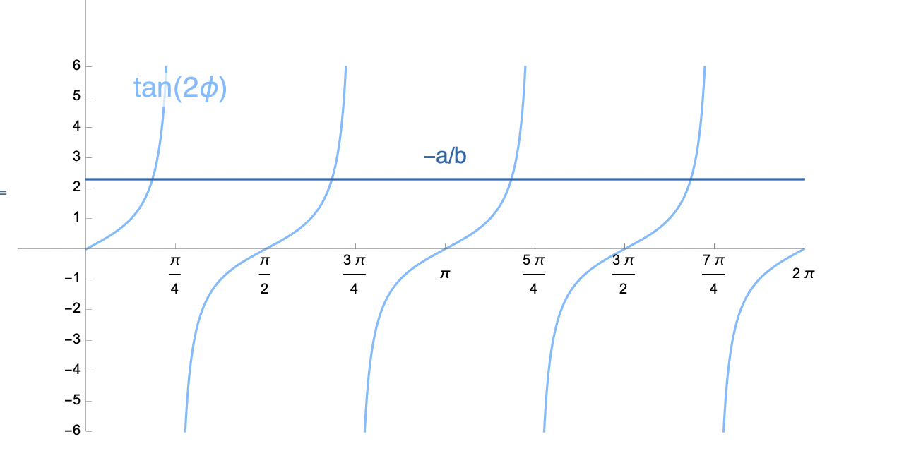
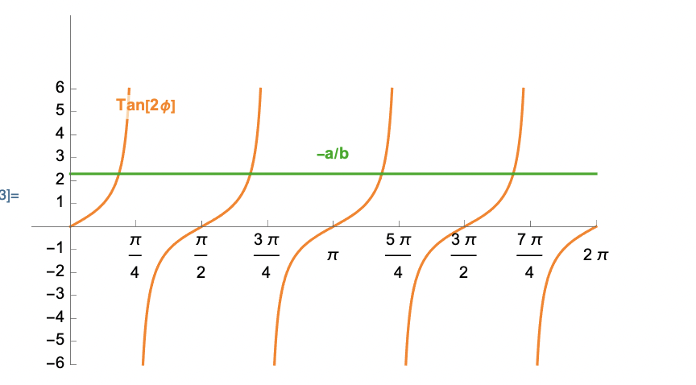




# Maximum shear stress

In the last section, we derived that

$$
    \begin{align}
    \left.\left[\boldsymbol{t}_s\right]\right|_{\text{plane stress}}&=
    \tau(\phi) [\hat{\boldsymbol{m}}]
    \end{align}
$$
where 

$$
    \begin{align}
    \tau(\phi)&:=\left(
    -\frac{\sigma_{11} - \sigma_{22}}{2} \sin(2 \phi)+\sigma_{12} \cos(2 \phi)\right)\\
    [\hat{\boldsymbol{m}}]&:=\begin{bmatrix}
    -\sin(\phi)\\
    \cos(\phi)\\
    0
    \end{bmatrix}
    \end{align}
$$

In this section, we will determine the set of $\phi$ at which the magnitude of $\boldsymbol{t}\_{s}$ reaches its maximum value. The magnitude of $\boldsymbol{t}\_{s}$ is 

$$
    \begin{equation}
    \lVert \boldsymbol{t}_{s}\rVert=|\tau(\phi)|
    \end{equation}
$$

We begin by writing 
$$
    \begin{align}
    \tau(\phi)&=-a \sin(2\phi)+b \cos(2\phi),\\
    a&:=\frac{\sigma_{11}-\sigma_{22}}{2},\\
    b&:=\sigma_{12}.
    \end{align}
$$

The maximum value of $\|\tau(\phi)\|$ will be the absolute value of the maximum value of $\tau(\phi)$ and/or the absolute value of the minimum  value of $\tau(\phi)$. Therefore, we will next determine the maximum and minimum values of  $\tau(\phi)$.

The  maximum and minimum values of $\tau(\cdot)$ occurs at those $\phi$ at which the derivative of $\tau(\cdot)$ vanishes. Let us define $\phi\_s$ as those $\phi$ at which the derivative of $\tau(\cdot)$ vanishes. Differentiating the function $\tau(\cdot)$, and setting it to be equal to zero at $\phi_s$, we get that 

$$
\begin{equation}
\tan(2\phi_s)=-a/b.
\end{equation}
$$

Irrespective of values of $a$ and $b$, the above equation will have four roots (see Figure below)

<!--  -->

We place those four roots into two (disjoint) sets. The first set of $\phi\_s$ are those for which
$$
\begin{align}
\text{Set I}\Rightarrow
\left\{
\begin{array}{c}
\cos(2\phi_s)=+\frac{b}{\sqrt{b^2+a^2}}\\
\sin(2\phi_s)=-\frac{a}{\sqrt{b^2+a^2}}
\end{array}\right.
\end{align}
$$
and for second set of $\phi$ are those for which values
$$
\begin{align}
\text{Set II}\Rightarrow
\left\{
\begin{array}{c}
\cos(2\phi_s)=-\frac{b}{\sqrt{b^2+a^2}}\\
\sin(2\phi_s)=+\frac{a}{\sqrt{b^2+a^2}}
\end{array}\right.
\end{align}
$$

For the first set (Set-I) of values we have that 
$$
\begin{align}
\tau(\phi)
% &=\sqrt{a^2+b^2}(\sin(2\phi_s) \sin(2\phi)+\cos(2\phi_s) \cos(2\phi))\\
&=\sqrt{a^2+b^2}
\end{align}
$$

Similarly for the second set (Set-I) we get 
$$
\begin{align}
\tau(\phi)&=-\sqrt{a^2+b^2}
\end{align}
$$

Thus, for the first set of $\phi\_s$, the function $\tau(\cdot)$ attains a maximum value and for the second set of $\phi\_s$, the function $\tau(\cdot)$ attains a minimum value. Since the absolute value of $\tau(\cdot)$'s maximum and minimum values are equal, the maximum of $|\tau(\cdot)|$ occurs at both sets of $\phi\_s$. 

Since the maximum of $|\tau(\cdot)|$ occurs at both sets, Set-I and II, one might wonder what use there is in partitioning the $\phi\_s$ into the two sets. Distinguishing between the two sets is not without its use. This is because for $\phi\_s$ belonging to the  first set, $\tau(\phi)$ is positive and hence the shear component of the traction vector, $\boldsymbol{t}\_s$,  points in the direction of $\hat{\boldsymbol{m}}$, while for  $\phi\_s$ belonging to the second set, $\boldsymbol{t}\_s$ points in direction $-\hat{\boldsymbol{m}}$. 

[Here](./WFiles/MaximumShearStressesDirections.nb) is a  mathematica file showing the above equations in action. 