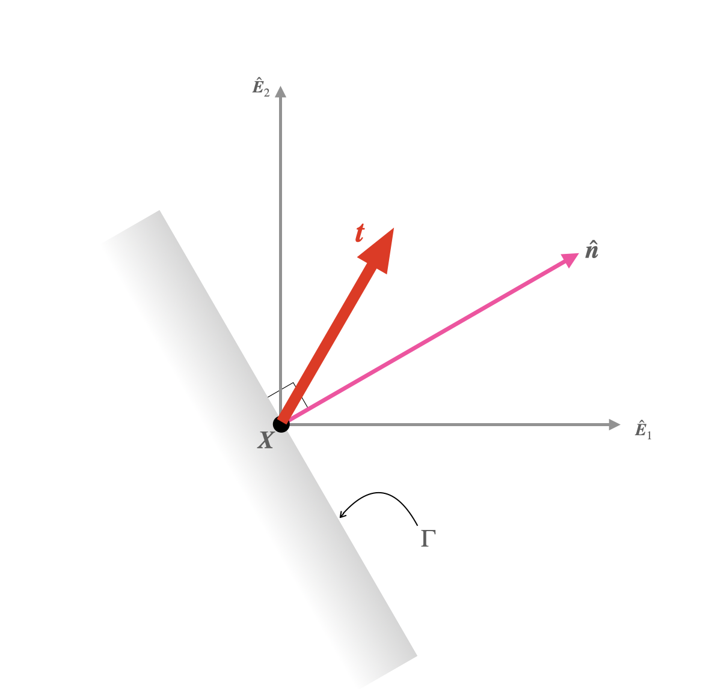




# Traction corresponding to a stress tensor.

Let $\boldsymbol{X}$ be a material particle in the solid. The internal surface $ \Gamma$  contains $\boldsymbol{X}$. Let $\hat{\boldsymbol{n}}$ be a vector normal to $\Gamma$ at $\boldsymbol{X}$.  Let the traction at $\boldsymbol{X}$ on the surface $(\Gamma, \hat{\boldsymbol{n}})$ be $\boldsymbol{t}$.  The stress tensor at $\boldsymbol{X}$, denoted as $\boldsymbol{\sigma}$, is defined such that. 

$$
\begin{align}
\boldsymbol{t} &=\boldsymbol{\sigma}^{\rm T} \boldsymbol{n}
\end{align}
$$

In the above equation the operator $\left(\cdot\right)^{\rm T} $ gives the transpose of a tensor. The transpose of a tensor is defined such that

$$
\begin{align}
\boldsymbol{y}\cdot (\boldsymbol{\sigma}\boldsymbol{x}) &=\boldsymbol{x}\cdot (\boldsymbol{\sigma}^{\rm T} \boldsymbol{y})
\end{align}
$$
for all vector $\boldsymbol{x}$, $\boldsymbol{y}$.

In component form the relation between stress and traction can be written as
$$
\begin{align}
\left[\boldsymbol{t}\right] &=
\left[\boldsymbol{\sigma}^{\rm T} \boldsymbol{n}\right],\\
&=\left[\boldsymbol{\sigma}^{\rm T}\right]
\left[\boldsymbol{n}\right],\\
&=\left[\boldsymbol{\sigma}\right]^{\sf T}
\left[\boldsymbol{n}\right],
\end{align}
$$
where the simplifications in the second and the third step follow from the properties of matrices and tensors. In summary we have that

$$
\begin{align}
\left[\boldsymbol{t}\right]&=\left[\boldsymbol{\sigma}\right]^{\sf T}
\left[\boldsymbol{n}\right]
\end{align}
$$

One further simplification occurs on noting that that $\boldsymbol{\sigma}$ is usually a symmetric tenor, which implies that 

$$\begin{equation}\left[\boldsymbol{\sigma}\right]^{\sf T}=
\left[\boldsymbol{\sigma}\right].
\end{equation}$$

Thus we get that

$$
\begin{align}
\left[\boldsymbol{t}\right]&=\left[\boldsymbol{\sigma}\right]
\left[\boldsymbol{n}\right]
\end{align}
$$

