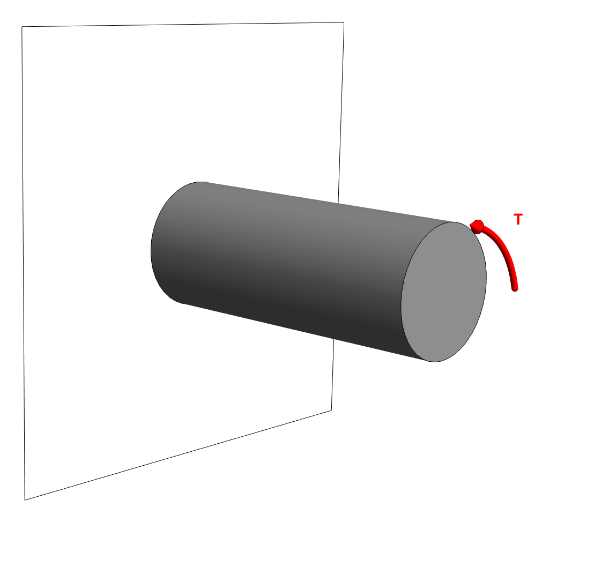




### Problem statement 
A solid cylinder of  diamter 30 mm is made of  steel of G=77 GPa. What is the rotation of the end of the shaft of L=0.4 m length when a torque of T=250 N.m is applied to its end. 

### Solution

Let us begin by computing $J$. The cross-section of the shaft is a circular disk. Thus, 

$$
J=\frac{\pi a^4}{2},
$$
where $a$ is the radius of the cross-section. For the current case we get that

$$
J=7.95216 10^{-8}~\rm m^4
$$

The angle of twist is give as, 

$$
\begin{align}
\theta&=\frac{T L}{GJ} \\
       &=0.0163314
\end{align}
$$

The angle of twist in degree reads $0.93572^{\circ}$. 

The MMA notebook for the above calculation is [here](./WFiles/SP1.nb)