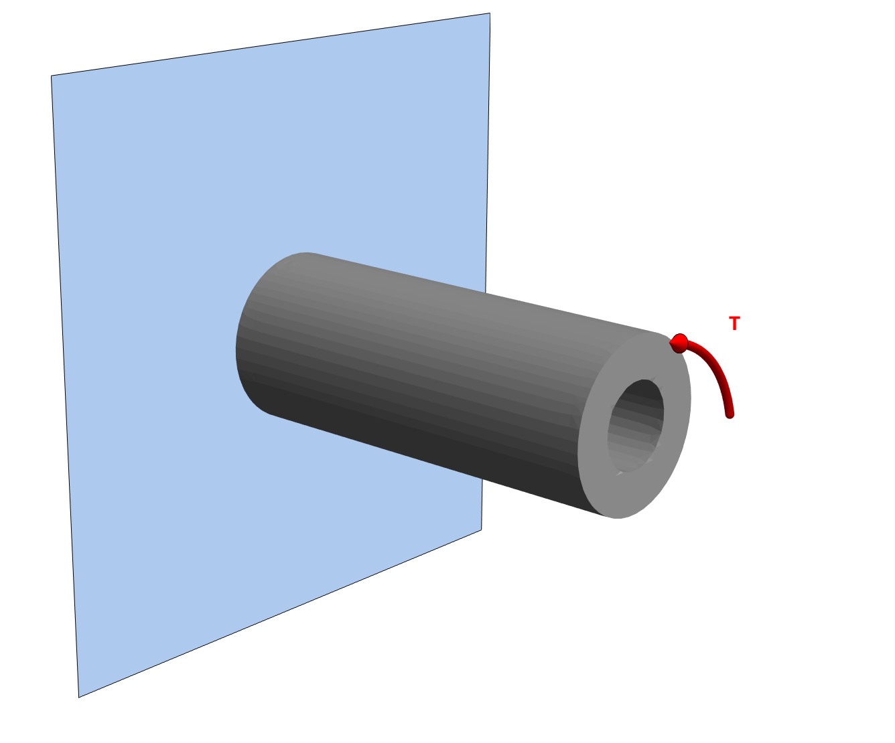




### Problem statement

A hollow cylinder of  outer diameter $600~\rm{mm}$ and inner diameter $44~\rm{mm}$ is made of steel of $G=77~\rm{GPa}$. What is the rotation of the end of the shaft of $L=0.6~\rm{m}$ length when a torque of $T=2250~\rm{N \cdot m}$ is applied to its end. 

### Solution. 

We begin by computing $J$.

$$
\begin{align}
J
&=\frac{\pi}{2}(r_0^4-r_i^4).\\
&=9.04377~\times 10^{-7}~\rm m^4.
\end{align}
$$

> Note that above is a direct result of taking the integration from $r_i$ to $r_o$ in the equation for polar moment in a circular cross-section:
>$$
\begin{align*}
J=\int_{r_i}^{r_o}\int_{0}^{2\pi} r^2 rd\theta dr
\end{align*}
$$

The angle of twist  is

$$
\begin{align}
\theta
&=\frac{T L}{G J}\\
&=0.0193862
\end{align}
$$

In degrees, the angle of twist reads $1.11075^{\circ}$.

The MMA notebook for the above calculation is [here](./WFiles/SP2.nb)

