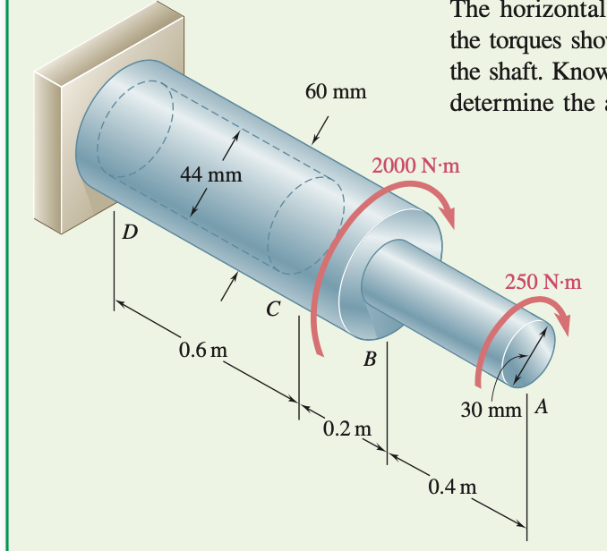







### Problem statement 

Find the twist of the cylinder shown in the figure. 

#### Solution.

For now let us ignore the 2000 N.m torque. That is we only consider the torque at the very end of the shaft. 

From balance of force moments we know that the torque at any cross-section should be the same as the one at the end. 

The condition that the net force on a solid should come from 