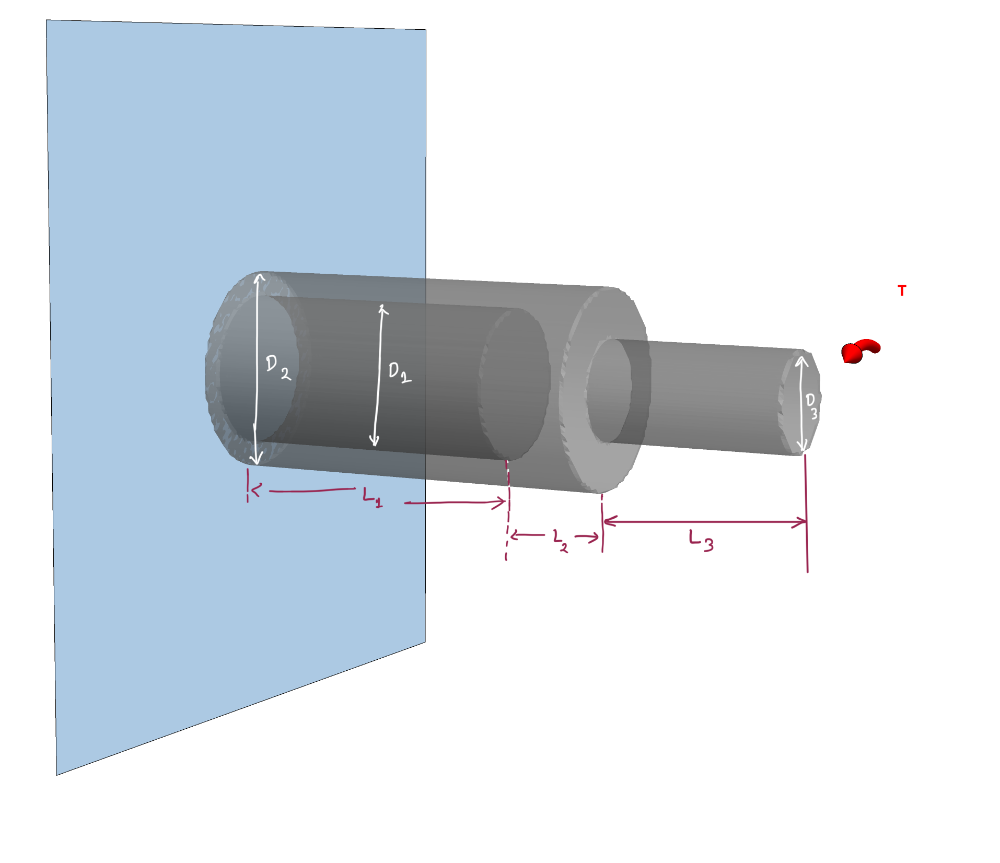




### Problem statement 

Find the twist of the cylinder shown in the figure. 

#### Solution.
<!-- 
For now let us ignore the $2000~\rm{N \cdot m}$ torque. That is, we only consider the torque at the very end of the shaft.  -->

From balance of moment of force, we know that the torque at any cross-section should be the same as the one at the right end ($\Gamma^{\mathscr{h}}$). Start by imagining a small section of the cylinder cut from the right end. The torque on the left end of this piece of the shaft should be equal in magnitude and opposite in direction. So, if the torque on the right end of the shaft is $\u{T}$, then the torque on the left face of the cut piece should bve $-\u{T}$. From Newton's third law, it follows that the torque on the right face of the left piece generated by the cut  is $-(-\u{T})$, i.e., $\u{T}$. 

The condition that the net moment of force should vanish on a solid that is stationary comes from the principle of _balance of angular momentum_. 

<!-- The principle that the net force moment on a solid that is stationary should  vanish comes from the priciple of  _balance of angular momentum_  -->

We compute the twist on the right face of the shaft by using the following equation: 

$$
\begin{align}
\theta(L)
&=
\frac{T}{G}
\int_{0}^{L}\frac{dX}{J(X)}
\end{align}
$$

In the current case, $J$ is a piece-wise function and can be defined as

$$
\begin{dcases}
    \frac{\pi}{2}(r_2^4-r_1^4) & 0\leq x <L_1 \\
    \frac{\pi}{2} r_2^4 & L_1\leq x <L_1+L_2 \\
    \frac{\pi}{2} r_3^4 & L_1+L_2\leq x < L_1+L_2+L_3 \\
\end{dcases}
$$

Putting in the numbers we get that
$$
\begin{align}
J(X)&=
\left\{
\begin{array}{ll}
9.04377~\times 10^{-7}, & 0\le X<0.6\\
1.27235~\times 10^{-6}, & 0.6\le X<0.8\\
7.95216~\times 10^{-8}, & 0.8\le X<1.2.\\ 
\end{array}
\right.
\end{align}
$$

Evaluating the integral we get that 
$$
\begin{align}
\theta(L)&=0.0189958\\
&=1.08838^{\circ}\\
\end{align}
$$

You can find the MMA file for evaluating the above integral [here](./WFiles/SP3.nb).