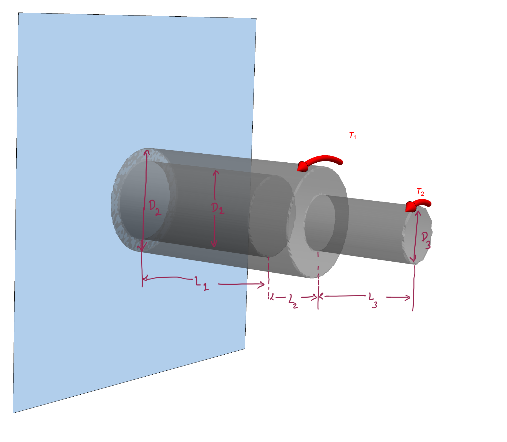




### Problem statement 

Now consider the same problem discussed in [Solved Problem 3](SP3.md) where torque $T_2=250~\rm{N\cdot m}$ was applied at the right end face, but this time with additional torque $T_1=2000~\rm{N \cdot m}$ applied at $x=0.8$.

#### Solution.

We compute the twist on the right face of the shaft by using the following equation

$$
\begin{align*}
\theta(L)
&=
\frac{1}{G}
\int_{0}^{L}\frac{T(X)dX}{J(X)}
\end{align*}
$$

In the [previous problem](SP3.md), torque was constant along the shaft's length. However, in the current case,  $T$ is a piece-wise function and can be defined as

$$
\begin{align*}
T(X)&=
\left\{
\begin{array}{ll}
2250, & 0\le X<0.8,\\
250, & 0.8\le X<1.2.\\
\end{array}
\right.
\end{align*}
$$

As shown in the previous problem, $J$ is a piece-wise function: 

$$
\begin{align*}
J(X)&=
\left\{
\begin{array}{ll}
9.04377~\times 10^{-7}, & 0\le X<0.6\\
1.27235~\times 10^{-6}, & 0.6\le X<0.8\\
7.95216~\times 10^{-8}, & 0.8\le X<1.2.\\ 
\end{array}
\right.
\end{align*}
$$

Evaluating the integral, we get

$$
\begin{align*}
\theta(L)&=0.0403109\\
&=2.30964^{\circ}
\end{align*}
$$

You can find the mathematica file for evaluating the above integral [here](./WFiles/SP4.nb).