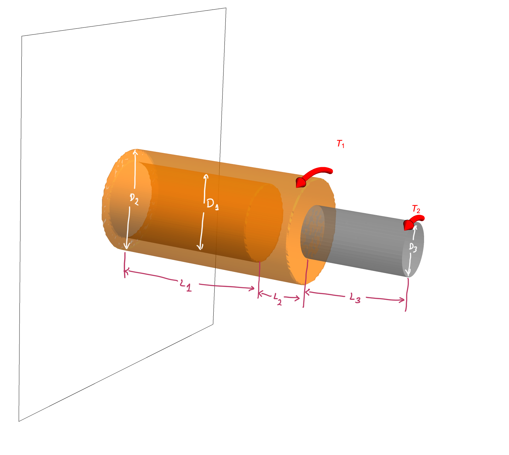




### Problem statement 

Now consider the same problem as that discussed in [Solved Problem 4](SP4.md) but this time with the shear modulus changing along the shaft's length. If the orange-colored section is made of aluminum ($G=27~\rm{GPa}$) and the gray-colored section is made of brass ($G=39~\rm{GPa}$), what is the angle of twist at the right end face?

#### Solution.

We compute the twist on the right face of the shaft by using the following equation

$$
\begin{align*}
\theta(L)
&=
\int_{0}^{L}\frac{T(X)dX}{G(X)J(X)}
\end{align*}
$$

In the previous problems, $G$ was constant along the shaft's length. In the current case, however, it is a piece-wise function defined as

$$
\begin{align*}
G(X)&=
\left\{
\begin{array}{ll}
27\times10^9, & 0\le X<0.8,\\
39\times10^9, & 0.8\le X<1.2.\\
\end{array}
\right.
\end{align*}
$$

We know from previous problems that $T$ and $J$ are piece-wise functions of the form

$$
\begin{align*}
T(X)&=
\left\{
\begin{array}{ll}
2250, & 0\le X<0.8,\\
250, & 0.8\le X<1.2.\\
\end{array}
\right.
\end{align*}
$$

$$
\begin{align*}
J(X)&=
\left\{
\begin{array}{ll}
9.04377~\times 10^{-7}, & 0\le X<0.6\\
1.27235~\times 10^{-6}, & 0.6\le X<0.8\\
7.95216~\times 10^{-8}, & 0.8\le X<1.2.\\ 
\end{array}
\right.
\end{align*}
$$

Evaluating the integral, we get

$$
\begin{align*}
\theta(L)&=0.10063\\
&=5.76567^{\circ}
\end{align*}
$$

The mathematica file for solving the above problem is [here](./WFiles/SP5.nb)