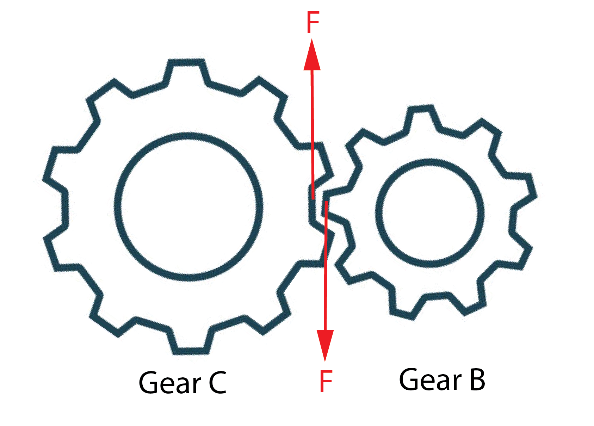
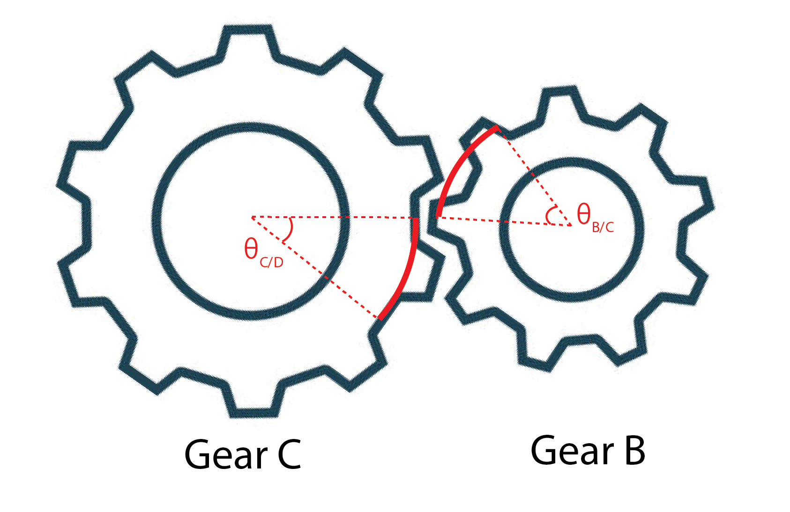

### Problem Statement

Two solid steel shafts are connected by the gears shown. Knowing that for each shaft $G=11.2 \times 10^6 ~\rm{psi}$ and with applied torque of $T_0 = 561~\rm{lb \cdot in}$, determine the corresponding angle through which end $\rm A$ of shaft $\rm AB$ rotates.

 

### Solution.

> The radius and length of shaft $\rm AB$ and $\rm CD$ are denoted as $a_{\rm{AB}}$, $L_{\rm AB}$, and $a_{\rm CD}$, $L_{\rm CD}$ respectively, and the radius of gears $\rm B$ and $\rm C$ as $r_{\rm B}$ and $r_{\rm C}$ respectively. 

We can first can determine the rotation $\theta_{\rm A/B}$ at $\rm A$ with respect to gear $\rm B$ (and vice versa) as

$$
\begin{align}
\theta_{\rm{A/B}}=\frac{T_0 L_{\rm AB}}{G J_{\rm AB}}
\end{align}
$$

where

$$
\begin{align}
J_{\rm{AB}}=\frac{\pi}{2}(a_{\rm AB})^4
\end{align}
$$

Similarly, we can compute the rotation $\theta_{\rm C/D}$ of gear $\rm C$ with respect to $D$ given $T_{\rm CD}$ in shaft $\rm CD$ as:

$$
\begin{align}
\theta_{\rm{C/D}}=\frac{T_{\rm CD} L_{\rm CD}}{G J_{\rm CD}}
\end{align}
$$

where

$$
\begin{align}
J_{\rm{CD}}=\frac{\pi}{2}(a_{\rm CD})^4
\end{align}
$$

$T_{\rm CD}$ can be determined by first noticing that the force $F$ exerted onto gear $\rm B$ by gear $\rm C$ has the relation:

$$
\begin{align}
T_0=F~r_B
\end{align}
$$

Since the force exerted onto gear $\rm C$ by gear $\rm B$ is also $F$, the torque $T_{\rm CD}$ in shaft $\rm CD$ is given by

$$
\begin{align}
T_{\rm{CD}}=F~r_C
\end{align}
$$

From $(3)$ and $(4)$, we have that

$$
\begin{align}
T_{\rm{CD}}=\frac{r_C}{r_B} T_0
\end{align}
$$

Finally, noticing that the distance traveled by the gear $\rm C$ and gear $\rm B$ has to be equal, we have the relationship between $\theta_{\rm C/D}$ and the rotation $\theta_{\rm B/C}$ of gear $\rm B$ with respect to gear $\rm C$ as

$$
\begin{align*}
r_c\theta_{\rm C/D}=r_B\theta_{\rm B/C}
\end{align*}
$$

so that

$$
\begin{align}
\theta_{\rm B/C}=\frac{r_C}{r_B}\theta_{\rm C/D}
\end{align}
$$

With $(1)$, $(2)$, $(5)$ and $(6)$, we can solve for the rotation at $\rm A$ as

$$
\begin{align}
\theta_{\rm A}=\theta_{\rm B/C}+\theta_{\rm A/B}
\end{align}
$$

The mathematica file for solving the above problem is [here](./WFiles/SP6.nb
)