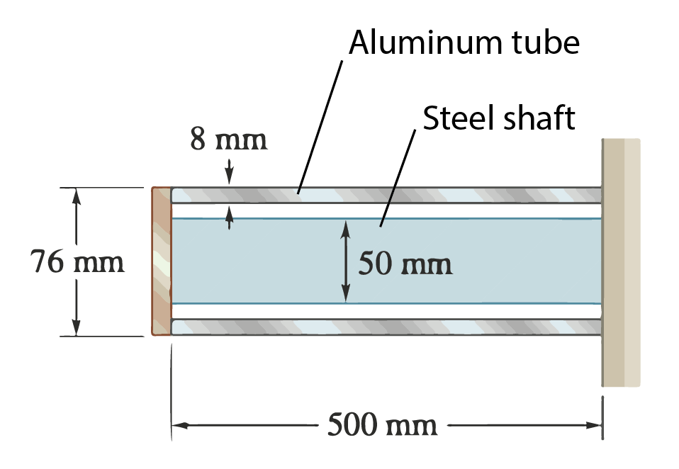




### Problem Statement

An aluminum tube and steel shaft of length $L=500~\rm{mm}$ are connected to a fixed support and to a rigid disk as shown in the cross section. Determine the torque in aluminum tube and steel shaft respectively if $T=6.325~\rm{kN\cdot m}$ is applied to the disk. Use $G_{\rm Al}=27~\rm{GPa}$ for aluminum and $G_{\rm St}=77~\rm{GPa}$ for steel.

### Solution

-------
**Note**

The relationship between the torque $T$ and angle $\theta$ can also be denoted using the rotational stiffness $k$ as

$$
\begin{align*}
 T = k\theta
 \end{align*}
$$

where $k$ is nothing but

$$
 \begin{align*}
 k=\frac{G J}{L}.
 \end{align*}
 $$

 As you solve the problem, note its similarity to springs-in-parallel problems.

------

We begin by computing the rotational stiffness for aluminum tube and steel shaft respectively.

<u>Aluminum tube:</u>

With outer diameter of the tube  $r_o=38~\rm{mm}$ and inner diameter of the tube $r_i=r_o-8~\rm{mm}=30~\rm{mm}$, the polar moment of inertia of the aluminum tube is

$$
\begin{align*}
J_{\rm Al-tb}&=\frac{\pi}{2}((r_o)^4-(r_i)^4)\\
&=2.00298\times10^{-6} \rm m^4
\end{align*}
$$

The rotational stiffness of the aluminum tube can then be computed as

$$
\begin{align*}
k_{\rm Al-tb}&=\frac{G_{\rm Al} J_{\rm Al-tb}}{L}\\
&=108161~\rm{N\cdot m}
\end{align*}
$$

<u>Steel shaft:</u>

The polar moment of inertia of the steel shaft of radius $a=25~\rm{mm}$ is simply

$$
\begin{align*}
J_{\rm St-cyl}&=\frac{\pi}{2}(a)^4\\
&=6.13592\times 10^{-7} \rm m^4
\end{align*}
$$

The rotational stiffness of the aluminum tube can then be computed as

$$
\begin{align*}
k_{\rm St-cyl}&=\frac{G_{\rm St} J_{\rm St-cyl}}{L}\\
&=94493~\rm{N\cdot m}
\end{align*}
$$
-----
Since the angle of twist $\theta$ is the same in both the aluminum tube and the steel shaft, we have that

$$
\begin{align*}
T&=T_{\rm{Al-tb}}+T_{\rm{St-cyl}}\\
&=k_{\rm{Al-tb}}\theta+k_{\rm{St-cyl}}\theta\\
&=(k_{\rm{Al-tb}}+k_{\rm{St-cyl}})\theta\\
&=k_c\theta
\end{align*}
$$

where

$$
k_c=k_{\rm{Al-tb}}+k_{\rm{St-cyl}}
$$

can be thought of as the equivalent rotational stiffness of the system. 
We can then compute $\theta$ as

$$
\begin{align*}
\theta&=\frac{T}{k_c}\\
&=0.0312108~\rm{rad}\\
&=1.78825^{\circ}
\end{align*}
$$

so that the torque in the aluminum tube and the steel shaft are, respectively,

$$
\begin{align*}
T_{\rm{Al-tb}}&=k_{\rm{Al-tb}}\theta\\
&=(108161~\rm{N\cdot m})(0.0312108)\\
&=3375~\rm{N\cdot m}
\end{align*}
$$

and

$$
\begin{align*}
T_{\rm{St-cyl}}&=k_{\rm{St-cyl}}\theta\\
&=(94493~\rm{N\cdot m})(0.0312108)\\
&=2950~\rm{N\cdot m}
\end{align*}
$$

[Here](./WFiles/SP7.nb) is the mathematica file for this problem.

